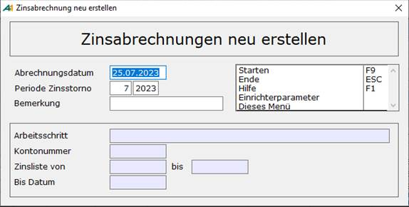

# Rekalkulation Zinsrechnung

<!-- source: https://amic.de/hilfe/rekalkulationzinsrechnung.htm -->

Hauptmenü \> Mahn-/Zahl-/Zinswesen \> Zinswesen \> Zinsabrechnung bearbeiten \> Variante **Rekalkulation Zinsabrechnung**

Direktsprung **[ZIB]**

In der Praxis kommt es nicht selten für zinsmäßig abgeschlossene Zeiträume zu Nachbuchungen und Valutenberichtigungen.

Solche Buchungen bringen das „Zinsgefüge“ durcheinander. Die Kontokorrentzinsen für so betroffene Kundenkonten und Zeiträume müssen gegebenenfalls erneut gerechnet werden.

Im Normalfall sind hier folgende Einzelschritte nötig:

- Zinsbuchung stornieren.
- Stornobelege verbuchen
- Zinsen zurücksetzen
- Zinsabrechnung erneut erstellen  
    

Da bei all diesen Schritten Fehler auftreten können bzw. es doch sehr aufwendig ist und als zu umständlich empfunden wird, wurde eine (versteckte) Variante „**Rekalkulation Zinsabrechnung**“ erstellt. In dieser Variante werden alle Zinsabrechnungen sortiert nach Kontonummer (aufsteigend) und Zinslistennummer (absteigend) ausgegeben. In der F2 Auswahl kann nach folgenden Kriterien eingegrenzt werden:

- Abrechnungsjahr. Dies ist immer wirksam, also nicht mit Hakentechnik abschaltbar.
- Kontonummer : von.. bis
- Zinsliste : von..bis
- Zinsgruppe : von..bis
- Bisdatum : von ... bis
- Abweichung Soll : von ... bis
- Abweichung Haben : von ... bis
- Abweichung saldiert : von ...bis

In der Optionbox zu dieser Variante steht eine weitere Funktion „Zinsen erneut erstellen“ zur Verfügung. Innerhalb dieser Funktion existiert ein Einrichterparameter („Ausgezifferte Zinsbelege stornieren“). Er steuert, ob die Verarbeitung bei bereits ausgezifferten Zinsbelegen für das Konto abgebrochen wird oder nicht. Siehe unten.

  
    

| | Beschreibung |
| --- | --- |
| Abrechnungsdatum | Dies ist der Tag, an dem die Zinsabrechnung erstellt wird. Es wird mit dem Tagesdatum vorbelegt. Dieses Datum wird später das Belegdatum der automatisch generierten Zinsbelege.  |
| Periode Zinsstorno  | Dieser Periode werden eventuell zu erstellende Stornobeleg zugeordnet.  |
| Bemerkung  | Diese Bemerkung wird in der Relation Zinsliste gespeichert.  |

Startet man diese Funktion, so werden folgende Schritte nacheinander abgearbeitet:

- Je Kunde wird das Datum der letzten Abrechnung zwischengespeichert um mit ihm am Ende eine neue Abrechnung zu erstellen.
- Anschließend erfolgt eine Prüfung, ob für den/die markierten Kunden noch ungebuchte Belege in dem Bereich existieren
- Es darf keine Folgeabrechnung existieren, auch nicht im folgenden Jahr.
- Die markierten Abrechnungen müssen lückenlos sein.
- Die markierten Abrechnungen werden in absteigender Reihenfolge bei Bedarf storniert.
- Die Stornobelege werden automatisch gebucht.
- Die Zinsabrechnungen werden zurückgesetzt.
- Es wird pro Konto eine neue Zinsabrechnung erstellt.  
    

Hier auftretende Probleme werden nach Beendigung der Funktion in einem Fehlerbildschirm ausgegeben. Folgende Probleme können auftreten:

- Für Konto ???? existieren noch ungebuchte Belege!
- Zinsabrechnung für Konto ???? nicht neu erstellt. Der Saldo wurde in Zinsliste ???? verwendet.
- Zinsabrechnung für Konto ???? nicht neu erstellt. Auswahl ist nicht Lückenlos (z.B. Zinsliste ??)
- Der Zinsbeleg ???? für Konto ist bereits ausgeziffert! Die Buchung kann nicht storniert werden!  
**Achtung:** Hier existiert ein Einrichterparameter „Ausgezifferte Zinsbelege stornieren“. Steht diese auf „JA“, so erscheint diese Meldung nicht und der Stornobeleg wird erstellt, obwohl der Ursprungsbeleg bereits ausgeziffert worden ist. Die Standardvorbelegung ist „Nein“

- Fehler ??? beim zurücksetzen Konto/Liste ????/????
- Kein Zinssatz für Konto ????, Gruppe ????, Zinsliste ????(Valutadatum? ????)

Tritt einer dieser Fehler auf, wird für das betroffene Konto die Zinsberechnung nicht erneut durchgeführt.
