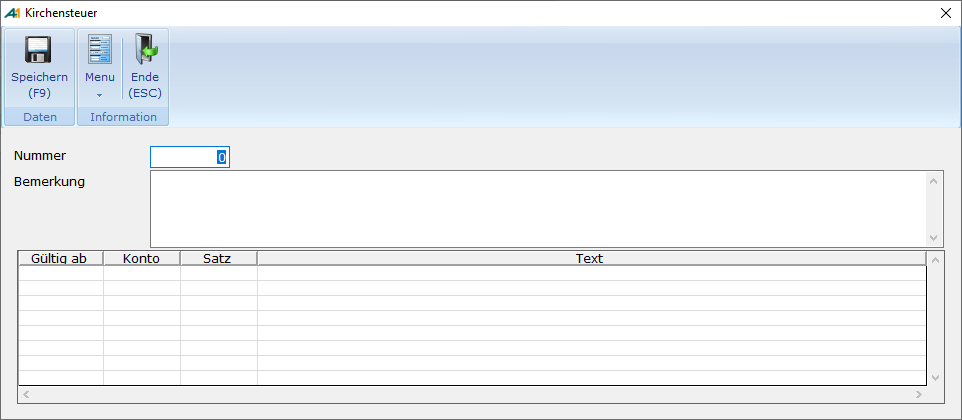

# Kirchensteuer

<!-- source: https://amic.de/hilfe/kirchensteuer1.htm -->

Hauptmenü \> Mahn-/Zahl-/Zinswesen \> Stammdaten \> Kirchensteuer Stammdaten

Direktsprung **[ZKS]**

Beim Buchen des Zinsabschlages muss ggf. auch Kirchensteuer berechnet werden. Diese wird in einem separaten Stammdatenpfleger erfasst.

Damit die Kirchensteuer für bestimmte Kunden berechnet wird, muss in der [Zinsgruppe](./zinsgruppen.md) des Kunden die Zinsabschlagssteuer aktiviert sein, ein Prozentsatz größer 0,0 in der Kirchensteuer hinterlegt sein, im [Kundenstamm](./zinsmerkmale_im_kundenstamm.md) unter Fibu-Merkmale die Kirchensteuer hinterlegt sein.

| | Beschreibung |
| --- | --- |
| Nummer  
 | Die Nummer wird selber vergeben. Sie muss eindeutig sein. Sie wird als Referenz im Kundenstamm unter den Fibumerkmalen hinterlegt.  
 |
| Bemerkung  
 | Hier kann textlich hinterlegt werden, für welches Bundesland oder welche Religionsgemeinschaft diese Kirchensteuer gilt.  
 |
| Gültig ab  
 | Ändert sich der Prozentsatz oder di Kontenzuordnung kann man hier hinterlegen, ab wann die neuen Werte gelten sollen. Alte Datensätze sollten beibehalten werden und neue zu einem neuen Gültigkeitsdatum erfasst werden. |
| Konto  
 | Dies ist das Konto, auf das die Kirchensteuer gebucht wird.  
 |
| Satz  
 | Hier wird der Prozentsatz der Kirchensteuerhinterlegt. Der Kirchensteuersatz beträgt derzeit (2009) in Bayern und Baden-Württemberg 8 %, in den übrigen Bundesländern 9 %. Buchungen bei der Zinsberechnung erflogen nur, wenn hier ein Prozentsatz größer 0,0% eingetragen ist.  
 |
| Text | Dieser Text wird beim Erstellen des Beleges unter „Übernahme in die Primanota“ verwendet. Gemäß § 45a Absatz 2 und 3 EStG muss bei einer Bescheinigung über Kapitalertragsteuer neben dem Kirchensteuerbetrag nach § 51a Abs. 2c Satz 6 EStG die steuererhebende Religionsgemeinschaft im Klartext (z. B. Bistum Essen, Evangelische Landeskirche in Baden) erscheinen.  
   
**HINWEIS:** *Damit dieser Text auf der* [Steuerbescheinigung](../steuerbescheinigung_kapitalertragssteuer.md)*, die als Formularvorlage -1200 zur Verfügung steht, erscheint, darf für das hier verwendete Konto kein Kontotext unter **[FITXT]** hinterlegt sein.*  
 |
