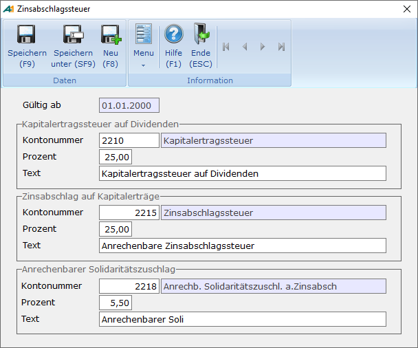

# Zinsabschlag

<!-- source: https://amic.de/hilfe/zinsabschlag.htm -->

Hauptmenü \> Mahn-/Zahl-/Zinswesen \> Stammdaten \> Zinsabschlag Stammdaten

Direktsprung **[ZAS]**

Spezielle Form der Kapitalertragssteuer. Sie gilt mit der Überschreitung der Freibeträge für alle in- und ausländischen Kapitalanleger, die ihren Wohnsitz oder gewöhnlichen Aufenthaltsort in Deutschland haben. Hierbei wird von Zinsen aus verbrieften und nichtverbrieften Kapitalforderungen ein Zinsabschlag von 30%, bei Schaltergeschäften von 35% einbehalten. Er ist auf die Einkommens- bzw. Körperschaftssteuer anrechenbar. Für Personen, die ihren Wohnsitz im Ausland haben, wird keine Zinsabschlagsteuer erhoben.

Ausnahme hier bilden Schaltergeschäfte, die in Deutschland getätigt werden.

Ob Zinsabschlag berechnet wird, ist einerseits von einem Steuerungs-Parameter „Zinsabschlag berechnen“ in der Parametergruppe "Optionen Finanzwesen" abhängig. Andererseits muss in der [Zinsgruppe](./zinsgruppen.md) des Kunden bei „Zinsabschlag berechnen“ ein Haken gesetzt sein.

<strong>Wichtig:</strong> <em>Das Kennzeichen „Zinsabschlag berechnen“ aus der Zinsgruppe wurde in älteren Versionen nicht ausgewertet. Es muss nun gepflegt werden!</em>

**Gültig ab**

Da nicht auszuschließen ist, dass der Steuersatz sich ändern wird, kann man hier angeben, ab wann der entsprechende Prozentsatz gültig ist.

**Kapitalertragssteuer für Dividenden:**

| | Beschreibung |
| --- | --- |
| Kontonummer | Auf dieses Konto wird die errechnetet Kapitalertragssteuer gebucht.  |
| Prozent  | Von den errechneten Zinsen wird mit diesem Prozentsatz die Kapitalertragssteuer errechnet.  |
| Text  | Dieser Text wird bei der ***„Übernahme in die Primanota“*** als Text für die Belegposition verwendet.  |

**Zinsabschlag:**

| | Beschreibung |
| --- | --- |
| Kontonummer | Auf dieses Konto wird der errechnetet Zinsabschlag gebucht.  |
| Prozent  | Von den errechneten Zinsen wird mit diesem Prozentsatz der Zinsabschlag errechnet.  |
| Text  | Dieser Text wird beim ***„Übernahme in die Primanota“*** als Text für die Belegposition verwendet.  |

**Anrechenbarer Solidaritätszuschlag:**

| | Beschreibung |
| --- | --- |
| Kontonummer | Auf dieses Konto wird der errechnetet Solidaritätszuschlag gebucht.  |
| Prozent  | Von dem errechneten Zinsabschlag wird mit diesem Prozentsatz ( zur Zeit 5,5 %) der Solidaritätszuschlag errechnet. |
| Text  | Dieser Text wird beim ***„Übernahme in die Primanota“*** als Text für die Belegposition verwendet.  |

**Kirchensteuer auf Zinsabschlag:**

[Kirchensteuer](./kirchensteuer.md) wird in einem separaten Pfleger erfasst und beim Personenkonto unter Fibumerkmale hinterlegt.

Der Zinsabschlag, der Solidaritätszuschlag und ggf. die Kirchensteuer werden erst bei der ***„Übernahme in die Primanota“*** der Zinsen ermittelt.
