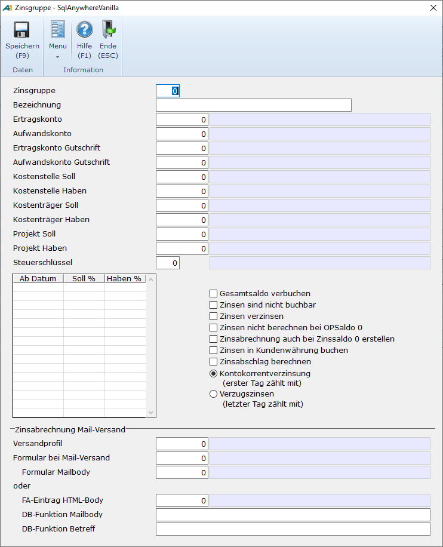

# Zinsgruppen

<!-- source: https://amic.de/hilfe/zinsgruppen.htm -->

Hauptmenü \> Mahn-/Zahl-/Zinswesen \> Stammdaten \> Zinsgruppen

Direktsprung **[ZIG]**

Im Pfleger für Zinsgruppen lassen sich alle weiteren Einstellungen für die Zinsabrechnung vornehmen.

<table class="AMIC-Tabelle" style="WIDTH: 100%; BORDER-COLLAPSE: collapse" cellspacing="0" cellpadding="0" width="100%" border="0"><tbody><tr><td style="WIDTH: 19.8%; BACKGROUND: #005d5b; PADDING-BOTTOM: 0pt; PADDING-TOP: 0pt; PADDING-LEFT: 5.4pt; PADDING-RIGHT: 5.4pt" width="19%"></td><td style="WIDTH: 80.2%; BACKGROUND: #005d5b; PADDING-BOTTOM: 0pt; PADDING-TOP: 0pt; PADDING-LEFT: 5.4pt; PADDING-RIGHT: 5.4pt" width="80%">
Beschreibung
</td></tr><tr><td style="BORDER-TOP: medium none; BORDER-RIGHT: white 1.5pt solid; WIDTH: 19.8%; BACKGROUND: #bad9d9; BORDER-BOTTOM: medium none; PADDING-BOTTOM: 0pt; PADDING-TOP: 0pt; PADDING-LEFT: 5.4pt; BORDER-LEFT: medium none; PADDING-RIGHT: 5.4pt" valign="top" width="19%">
Zinsgruppe  
</td><td style="BORDER-TOP: medium none; BORDER-RIGHT: medium none; WIDTH: 80.2%; BACKGROUND: #bad9d9; BORDER-BOTTOM: medium none; PADDING-BOTTOM: 0pt; PADDING-TOP: 0pt; PADDING-LEFT: 5.4pt; BORDER-LEFT: medium none; PADDING-RIGHT: 5.4pt" valign="top" width="80%">
Nummer der Zinsgruppe, wie sie dann im Kundenstamm, im Mahnstamm oder in den Wechselkosten hinterlegt wird. Die Zinsgruppe 0 bedeutet immer, dass keine Zinsrechnung vorgenommen werden soll. Es ist also nicht nötig hier etwas einzutragen.
</td></tr><tr><td style="BORDER-TOP: medium none; BORDER-RIGHT: white 1.5pt solid; WIDTH: 19.8%; BACKGROUND: #eff7f7; BORDER-BOTTOM: medium none; PADDING-BOTTOM: 0pt; PADDING-TOP: 0pt; PADDING-LEFT: 5.4pt; BORDER-LEFT: medium none; PADDING-RIGHT: 5.4pt" valign="top" width="19%">
Bezeichnung
</td><td style="BORDER-TOP: medium none; BORDER-RIGHT: medium none; WIDTH: 80.2%; BACKGROUND: #eff7f7; BORDER-BOTTOM: medium none; PADDING-BOTTOM: 0pt; PADDING-TOP: 0pt; PADDING-LEFT: 5.4pt; BORDER-LEFT: medium none; PADDING-RIGHT: 5.4pt" valign="top" width="80%">
Text zur Identifikation der Zinsgruppe.

Ist der Steuerungsparameter 34 "Mehrsprachigkeit aktiv“ in A.eins gesetzt, so hat man auf diesem Feld die Möglichkeit mit F3 <a class="topic-link" href="../../../firmenstamm/a_eins_sprache/sprachabhaengige_bezeichnung_in_den_stammdaten.md">sprachabhängige Bezeichnungen</a> zu pflegen.
</td></tr><tr><td style="BORDER-TOP: medium none; BORDER-RIGHT: white 1.5pt solid; WIDTH: 19.8%; BACKGROUND: #bad9d9; BORDER-BOTTOM: medium none; PADDING-BOTTOM: 0pt; PADDING-TOP: 0pt; PADDING-LEFT: 5.4pt; BORDER-LEFT: medium none; PADDING-RIGHT: 5.4pt" valign="top" width="19%">
Ertragskonto  
</td><td style="BORDER-TOP: medium none; BORDER-RIGHT: medium none; WIDTH: 80.2%; BACKGROUND: #bad9d9; BORDER-BOTTOM: medium none; PADDING-BOTTOM: 0pt; PADDING-TOP: 0pt; PADDING-LEFT: 5.4pt; BORDER-LEFT: medium none; PADDING-RIGHT: 5.4pt" valign="top" width="80%">
GuV Konto, auf das vom automatischen Buchungsmodul die Sollzinsen gebucht werden.
</td></tr><tr><td style="BORDER-TOP: medium none; BORDER-RIGHT: white 1.5pt solid; WIDTH: 19.8%; BACKGROUND: #eff7f7; BORDER-BOTTOM: medium none; PADDING-BOTTOM: 0pt; PADDING-TOP: 0pt; PADDING-LEFT: 5.4pt; BORDER-LEFT: medium none; PADDING-RIGHT: 5.4pt" valign="top" width="19%">
Aufwandskonto  
</td><td style="BORDER-TOP: medium none; BORDER-RIGHT: medium none; WIDTH: 80.2%; BACKGROUND: #eff7f7; BORDER-BOTTOM: medium none; PADDING-BOTTOM: 0pt; PADDING-TOP: 0pt; PADDING-LEFT: 5.4pt; BORDER-LEFT: medium none; PADDING-RIGHT: 5.4pt" valign="top" width="80%">
GuV-Konto, auf das vom automatischen Buchungsmodul die Habenzinsen gebucht werden.
</td></tr><tr><td style="BORDER-TOP: medium none; BORDER-RIGHT: white 1.5pt solid; WIDTH: 19.8%; BACKGROUND: #bad9d9; BORDER-BOTTOM: medium none; PADDING-BOTTOM: 0pt; PADDING-TOP: 0pt; PADDING-LEFT: 5.4pt; BORDER-LEFT: medium none; PADDING-RIGHT: 5.4pt" valign="top" width="19%">
Ertragskonto Gutschrift/ Aufwandskonto Gutschrift  
</td><td style="BORDER-TOP: medium none; BORDER-RIGHT: medium none; WIDTH: 80.2%; BACKGROUND: #bad9d9; BORDER-BOTTOM: medium none; PADDING-BOTTOM: 0pt; PADDING-TOP: 0pt; PADDING-LEFT: 5.4pt; BORDER-LEFT: medium none; PADDING-RIGHT: 5.4pt" valign="top" width="80%">
In der Praxis kann es vorkommen, dass für Kunden Zinsen individuell angepasst werden müssen. Dafür existiert das Modul „Individuelle Zinsgutschrift“.&nbsp; Hier werden zu einer Zinsabrechnung Gutschriften erstellt. Dabei wird das hier angegebene Konto anstelle des Ertrags- bzw. Aufwandskontos verwendet.
</td></tr><tr><td style="BORDER-TOP: medium none; BORDER-RIGHT: white 1.5pt solid; WIDTH: 19.8%; BACKGROUND: #eff7f7; BORDER-BOTTOM: medium none; PADDING-BOTTOM: 0pt; PADDING-TOP: 0pt; PADDING-LEFT: 5.4pt; BORDER-LEFT: medium none; PADDING-RIGHT: 5.4pt" valign="top" width="19%">
Kostenstelle Soll/Haben  
</td><td style="BORDER-TOP: medium none; BORDER-RIGHT: medium none; WIDTH: 80.2%; BACKGROUND: #eff7f7; BORDER-BOTTOM: medium none; PADDING-BOTTOM: 0pt; PADDING-TOP: 0pt; PADDING-LEFT: 5.4pt; BORDER-LEFT: medium none; PADDING-RIGHT: 5.4pt" valign="top" width="80%">
Die beim Zinsertrag bzw. Zinsaufwand verwendete <a class="topic-link" href="../../kostenrechnung/kostenstellen.md">Kostenstelle</a>.
</td></tr><tr><td style="BORDER-TOP: medium none; BORDER-RIGHT: white 1.5pt solid; WIDTH: 19.8%; BACKGROUND: #bad9d9; BORDER-BOTTOM: medium none; PADDING-BOTTOM: 0pt; PADDING-TOP: 0pt; PADDING-LEFT: 5.4pt; BORDER-LEFT: medium none; PADDING-RIGHT: 5.4pt" valign="top" width="19%">
Kostenträger Soll/Haben  
</td><td style="BORDER-TOP: medium none; BORDER-RIGHT: medium none; WIDTH: 80.2%; BACKGROUND: #bad9d9; BORDER-BOTTOM: medium none; PADDING-BOTTOM: 0pt; PADDING-TOP: 0pt; PADDING-LEFT: 5.4pt; BORDER-LEFT: medium none; PADDING-RIGHT: 5.4pt" valign="top" width="80%">
Der beim Zinsertrag bzw. Zinsaufwand verwendete <a class="topic-link" href="../../kostenrechnung/kostentraeger.md">Kostenträger</a>.
</td></tr><tr><td style="BORDER-TOP: medium none; BORDER-RIGHT: white 1.5pt solid; WIDTH: 19.8%; BACKGROUND: #eff7f7; BORDER-BOTTOM: medium none; PADDING-BOTTOM: 0pt; PADDING-TOP: 0pt; PADDING-LEFT: 5.4pt; BORDER-LEFT: medium none; PADDING-RIGHT: 5.4pt" valign="top" width="19%">
Kostenobjekt Soll/Haben
</td><td style="BORDER-TOP: medium none; BORDER-RIGHT: medium none; WIDTH: 80.2%; BACKGROUND: #eff7f7; BORDER-BOTTOM: medium none; PADDING-BOTTOM: 0pt; PADDING-TOP: 0pt; PADDING-LEFT: 5.4pt; BORDER-LEFT: medium none; PADDING-RIGHT: 5.4pt" valign="top" width="80%">
Das beim Zinsertrag bzw. Zinsaufwand verwendete <a class="topic-link" href="../../kostenrechnung/kostenobjekte/index.md">Kostenobjekt</a>.
</td></tr><tr><td style="BORDER-TOP: medium none; BORDER-RIGHT: white 1.5pt solid; WIDTH: 19.8%; BACKGROUND: #bad9d9; BORDER-BOTTOM: medium none; PADDING-BOTTOM: 0pt; PADDING-TOP: 0pt; PADDING-LEFT: 5.4pt; BORDER-LEFT: medium none; PADDING-RIGHT: 5.4pt" valign="top" width="19%">
Steuerschlüssel  
</td><td style="BORDER-TOP: medium none; BORDER-RIGHT: medium none; WIDTH: 80.2%; BACKGROUND: #bad9d9; BORDER-BOTTOM: medium none; PADDING-BOTTOM: 0pt; PADDING-TOP: 0pt; PADDING-LEFT: 5.4pt; BORDER-LEFT: medium none; PADDING-RIGHT: 5.4pt" valign="top" width="80%">
Steuerschlüssel, der bei den automatischen Buchungen verwendet werden soll.
</td></tr><tr><td style="BORDER-TOP: medium none; BORDER-RIGHT: white 1.5pt solid; WIDTH: 19.8%; BACKGROUND: #eff7f7; BORDER-BOTTOM: medium none; PADDING-BOTTOM: 0pt; PADDING-TOP: 0pt; PADDING-LEFT: 5.4pt; BORDER-LEFT: medium none; PADDING-RIGHT: 5.4pt" valign="top" width="19%">
Gesamtsaldo verbuchen  
</td><td style="BORDER-TOP: medium none; BORDER-RIGHT: medium none; WIDTH: 80.2%; BACKGROUND: #eff7f7; BORDER-BOTTOM: medium none; PADDING-BOTTOM: 0pt; PADDING-TOP: 0pt; PADDING-LEFT: 5.4pt; BORDER-LEFT: medium none; PADDING-RIGHT: 5.4pt" valign="top" width="80%">
Ist hier ein Haken gesetzt, wird der Saldo aus Soll und Habenzinsen gebildet und es entsteht beim Kunden nur ein Buchungssatz. Die Bagatellzinsen wirken sich dann erst auf den Saldo aus. Ansonsten entstehen zwei getrennte Belege.
</td></tr><tr><td style="BORDER-TOP: medium none; BORDER-RIGHT: white 1.5pt solid; WIDTH: 19.8%; BACKGROUND: #bad9d9; BORDER-BOTTOM: medium none; PADDING-BOTTOM: 0pt; PADDING-TOP: 0pt; PADDING-LEFT: 5.4pt; BORDER-LEFT: medium none; PADDING-RIGHT: 5.4pt" valign="top" width="19%">
Zinsen nicht buchbar  
</td><td style="BORDER-TOP: medium none; BORDER-RIGHT: medium none; WIDTH: 80.2%; BACKGROUND: #bad9d9; BORDER-BOTTOM: medium none; PADDING-BOTTOM: 0pt; PADDING-TOP: 0pt; PADDING-LEFT: 5.4pt; BORDER-LEFT: medium none; PADDING-RIGHT: 5.4pt" valign="top" width="80%">
Ist hier der Haken gesetzt, lassen die Zinsen sich zwar errechnen und stehen auch in der Zinsliste, es wird jedoch bei der Übernahme in die Primanota für diese Zinsen kein Beleg erstellt. Sie sind also nur kalkulatorisch / informatorisch.
</td></tr><tr><td style="BORDER-TOP: medium none; BORDER-RIGHT: white 1.5pt solid; WIDTH: 19.8%; BACKGROUND: #eff7f7; BORDER-BOTTOM: medium none; PADDING-BOTTOM: 0pt; PADDING-TOP: 0pt; PADDING-LEFT: 5.4pt; BORDER-LEFT: medium none; PADDING-RIGHT: 5.4pt" valign="top" width="19%">
Zinsen verzinsen
</td><td style="BORDER-TOP: medium none; BORDER-RIGHT: medium none; WIDTH: 80.2%; BACKGROUND: #eff7f7; BORDER-BOTTOM: medium none; PADDING-BOTTOM: 0pt; PADDING-TOP: 0pt; PADDING-LEFT: 5.4pt; BORDER-LEFT: medium none; PADDING-RIGHT: 5.4pt" valign="top" width="80%">
Ist hier ein Haken gesetzt, werden die automatisch erstellten Belege bei der nächsten Zinsrechnung mit herangezogen und wieder verzinst. Im anderen Fall bekommen diese Belege ein Kennzeichen, dass sie nicht mit verzinst werden. Bei der Bezahlung dieser Belege kommt es zu einer Besonderheit:
<table class="MsoNormalTable" style="BORDER-COLLAPSE: collapse" cellspacing="0" cellpadding="0" border="0"><tbody><tr><th style="WIDTH: 151.1pt; PADDING-BOTTOM: 0pt; PADDING-TOP: 0pt; PADDING-LEFT: 3.5pt; PADDING-RIGHT: 3.5pt" valign="top" width="201"></th><th style="WIDTH: 28.8pt; PADDING-BOTTOM: 0pt; PADDING-TOP: 0pt; PADDING-LEFT: 3.5pt; PADDING-RIGHT: 3.5pt" valign="top" width="38"></th><th style="WIDTH: 70.8pt; PADDING-BOTTOM: 0pt; PADDING-TOP: 0pt; PADDING-LEFT: 3.5pt; PADDING-RIGHT: 3.5pt" valign="top" width="94">OP-Saldo</th><th style="WIDTH: 20.4pt; PADDING-BOTTOM: 0pt; PADDING-TOP: 0pt; PADDING-LEFT: 3.5pt; PADDING-RIGHT: 3.5pt" valign="top" width="27"></th><th style="WIDTH: 61.35pt; PADDING-BOTTOM: 0pt; PADDING-TOP: 0pt; PADDING-LEFT: 3.5pt; PADDING-RIGHT: 3.5pt" valign="top" width="82">Zinssaldo</th></tr><tr><td style="WIDTH: 151.1pt; PADDING-BOTTOM: 0pt; PADDING-TOP: 0pt; PADDING-LEFT: 3.5pt; PADDING-RIGHT: 3.5pt" valign="top" width="201">AR</td><td style="WIDTH: 28.8pt; PADDING-BOTTOM: 0pt; PADDING-TOP: 0pt; PADDING-LEFT: 3.5pt; PADDING-RIGHT: 3.5pt" valign="top" width="38"></td><td style="WIDTH: 70.8pt; PADDING-BOTTOM: 0pt; PADDING-TOP: 0pt; PADDING-LEFT: 3.5pt; PADDING-RIGHT: 3.5pt" valign="top" width="94">1.000,00 S</td><td style="WIDTH: 20.4pt; PADDING-BOTTOM: 0pt; PADDING-TOP: 0pt; PADDING-LEFT: 3.5pt; PADDING-RIGHT: 3.5pt" valign="top" width="27"></td><td style="WIDTH: 61.35pt; PADDING-BOTTOM: 0pt; PADDING-TOP: 0pt; PADDING-LEFT: 3.5pt; PADDING-RIGHT: 3.5pt" valign="top" width="82">1.000,00 S</td></tr><tr><td style="WIDTH: 151.1pt; PADDING-BOTTOM: 0pt; PADDING-TOP: 0pt; PADDING-LEFT: 3.5pt; PADDING-RIGHT: 3.5pt" valign="top" width="201">Zinsen (nicht zu verzinsen)</td><td style="WIDTH: 28.8pt; PADDING-BOTTOM: 0pt; PADDING-TOP: 0pt; PADDING-LEFT: 3.5pt; PADDING-RIGHT: 3.5pt" valign="top" width="38"></td><td style="WIDTH: 70.8pt; PADDING-BOTTOM: 0pt; PADDING-TOP: 0pt; PADDING-LEFT: 3.5pt; PADDING-RIGHT: 3.5pt" valign="top" width="94">15,00 S</td><td style="WIDTH: 20.4pt; PADDING-BOTTOM: 0pt; PADDING-TOP: 0pt; PADDING-LEFT: 3.5pt; PADDING-RIGHT: 3.5pt" valign="top" width="27"></td><td style="WIDTH: 61.35pt; PADDING-BOTTOM: 0pt; PADDING-TOP: 0pt; PADDING-LEFT: 3.5pt; PADDING-RIGHT: 3.5pt" valign="top" width="82">0,00 S</td></tr><tr><td style="WIDTH: 151.1pt; PADDING-BOTTOM: 0pt; PADDING-TOP: 0pt; PADDING-LEFT: 3.5pt; PADDING-RIGHT: 3.5pt" valign="top" width="201">Zahlung hier rauf</td><td style="WIDTH: 28.8pt; PADDING-BOTTOM: 0pt; PADDING-TOP: 0pt; PADDING-LEFT: 3.5pt; PADDING-RIGHT: 3.5pt" valign="top" width="38"></td><td style="WIDTH: 70.8pt; PADDING-BOTTOM: 0pt; PADDING-TOP: 0pt; PADDING-LEFT: 3.5pt; PADDING-RIGHT: 3.5pt" valign="top" width="94">1.015,00 H</td><td style="WIDTH: 20.4pt; PADDING-BOTTOM: 0pt; PADDING-TOP: 0pt; PADDING-LEFT: 3.5pt; PADDING-RIGHT: 3.5pt" valign="top" width="27"></td><td style="WIDTH: 61.35pt; PADDING-BOTTOM: 0pt; PADDING-TOP: 0pt; PADDING-LEFT: 3.5pt; PADDING-RIGHT: 3.5pt" valign="top" width="82">1.015,00 H</td></tr><tr><td style="WIDTH: 151.1pt; PADDING-BOTTOM: 0pt; PADDING-TOP: 0pt; PADDING-LEFT: 3.5pt; PADDING-RIGHT: 3.5pt" valign="top" width="201">Ergibt einen offenen Saldo von:&nbsp;&nbsp;&nbsp;&nbsp;&nbsp;&nbsp;&nbsp;</td><td style="WIDTH: 28.8pt; PADDING-BOTTOM: 0pt; PADDING-TOP: 0pt; PADDING-LEFT: 3.5pt; PADDING-RIGHT: 3.5pt" valign="top" width="38"></td><td style="WIDTH: 70.8pt; PADDING-BOTTOM: 0pt; PADDING-TOP: 0pt; PADDING-LEFT: 3.5pt; PADDING-RIGHT: 3.5pt" valign="top" width="94">0,00 H</td><td style="WIDTH: 20.4pt; PADDING-BOTTOM: 0pt; PADDING-TOP: 0pt; PADDING-LEFT: 3.5pt; PADDING-RIGHT: 3.5pt" valign="top" width="27"></td><td style="WIDTH: 61.35pt; PADDING-BOTTOM: 0pt; PADDING-TOP: 0pt; PADDING-LEFT: 3.5pt; PADDING-RIGHT: 3.5pt" valign="top" width="82">15,00 H</td></tr></tbody></table>
Da hier ungewollt ein Zinssaldo von 15,00 Euro bleiben würde, wird ein interner Beleg erzeugt.
<table class="MsoNormalTable" style="BORDER-COLLAPSE: collapse" cellspacing="0" cellpadding="0" border="0"><tbody><tr><th style="WIDTH: 151.1pt; PADDING-BOTTOM: 0pt; PADDING-TOP: 0pt; PADDING-LEFT: 3.5pt; PADDING-RIGHT: 3.5pt" valign="top" width="201"></th><th style="WIDTH: 27.6pt; PADDING-BOTTOM: 0pt; PADDING-TOP: 0pt; PADDING-LEFT: 3.5pt; PADDING-RIGHT: 3.5pt" valign="top" width="37"></th><th style="WIDTH: 70.8pt; PADDING-BOTTOM: 0pt; PADDING-TOP: 0pt; PADDING-LEFT: 3.5pt; PADDING-RIGHT: 3.5pt" valign="top" width="94">OP-Saldo</th><th style="WIDTH: 20.4pt; PADDING-BOTTOM: 0pt; PADDING-TOP: 0pt; PADDING-LEFT: 3.5pt; PADDING-RIGHT: 3.5pt" valign="top" width="27"></th><th style="WIDTH: 62.55pt; PADDING-BOTTOM: 0pt; PADDING-TOP: 0pt; PADDING-LEFT: 3.5pt; PADDING-RIGHT: 3.5pt" valign="top" width="83">Zinssaldo</th></tr><tr><td style="WIDTH: 151.1pt; PADDING-BOTTOM: 0pt; PADDING-TOP: 0pt; PADDING-LEFT: 3.5pt; PADDING-RIGHT: 3.5pt" valign="top" width="201">Ergibt einen offenen Saldo von:</td><td style="WIDTH: 27.6pt; PADDING-BOTTOM: 0pt; PADDING-TOP: 0pt; PADDING-LEFT: 3.5pt; PADDING-RIGHT: 3.5pt" valign="top" width="37"></td><td style="WIDTH: 70.8pt; PADDING-BOTTOM: 0pt; PADDING-TOP: 0pt; PADDING-LEFT: 3.5pt; PADDING-RIGHT: 3.5pt" valign="top" width="94">0.00€</td><td style="WIDTH: 20.4pt; PADDING-BOTTOM: 0pt; PADDING-TOP: 0pt; PADDING-LEFT: 3.5pt; PADDING-RIGHT: 3.5pt" valign="top" width="27"></td><td style="WIDTH: 62.55pt; PADDING-BOTTOM: 0pt; PADDING-TOP: 0pt; PADDING-LEFT: 3.5pt; PADDING-RIGHT: 3.5pt" valign="top" width="83">15,00 H</td></tr><tr><td style="WIDTH: 151.1pt; PADDING-BOTTOM: 0pt; PADDING-TOP: 0pt; PADDING-LEFT: 3.5pt; PADDING-RIGHT: 3.5pt" valign="top" width="201">Zinsumbuchung (nicht zu verzinsen)</td><td style="WIDTH: 27.6pt; PADDING-BOTTOM: 0pt; PADDING-TOP: 0pt; PADDING-LEFT: 3.5pt; PADDING-RIGHT: 3.5pt" valign="top" width="37"></td><td style="WIDTH: 70.8pt; PADDING-BOTTOM: 0pt; PADDING-TOP: 0pt; PADDING-LEFT: 3.5pt; PADDING-RIGHT: 3.5pt" valign="top" width="94">-15,00 S</td><td style="WIDTH: 20.4pt; PADDING-BOTTOM: 0pt; PADDING-TOP: 0pt; PADDING-LEFT: 3.5pt; PADDING-RIGHT: 3.5pt" valign="top" width="27"></td><td style="WIDTH: 62.55pt; PADDING-BOTTOM: 0pt; PADDING-TOP: 0pt; PADDING-LEFT: 3.5pt; PADDING-RIGHT: 3.5pt" valign="top" width="83">0,00 S</td></tr><tr><td style="WIDTH: 151.1pt; PADDING-BOTTOM: 0pt; PADDING-TOP: 0pt; PADDING-LEFT: 3.5pt; PADDING-RIGHT: 3.5pt" valign="top" width="201">Zinsumbuchung</td><td style="WIDTH: 27.6pt; PADDING-BOTTOM: 0pt; PADDING-TOP: 0pt; PADDING-LEFT: 3.5pt; PADDING-RIGHT: 3.5pt" valign="top" width="37"></td><td style="WIDTH: 70.8pt; PADDING-BOTTOM: 0pt; PADDING-TOP: 0pt; PADDING-LEFT: 3.5pt; PADDING-RIGHT: 3.5pt" valign="top" width="94">15,00 S</td><td style="WIDTH: 20.4pt; PADDING-BOTTOM: 0pt; PADDING-TOP: 0pt; PADDING-LEFT: 3.5pt; PADDING-RIGHT: 3.5pt" valign="top" width="27"></td><td style="WIDTH: 62.55pt; PADDING-BOTTOM: 0pt; PADDING-TOP: 0pt; PADDING-LEFT: 3.5pt; PADDING-RIGHT: 3.5pt" valign="top" width="83">15,00 S</td></tr><tr><td style="WIDTH: 151.1pt; PADDING-BOTTOM: 0pt; PADDING-TOP: 0pt; PADDING-LEFT: 3.5pt; PADDING-RIGHT: 3.5pt" valign="top" width="201">Ergibt einen offenen Saldo von:&nbsp;&nbsp;&nbsp;&nbsp;&nbsp;&nbsp;&nbsp;</td><td style="WIDTH: 27.6pt; PADDING-BOTTOM: 0pt; PADDING-TOP: 0pt; PADDING-LEFT: 3.5pt; PADDING-RIGHT: 3.5pt" valign="top" width="37"></td><td style="WIDTH: 70.8pt; PADDING-BOTTOM: 0pt; PADDING-TOP: 0pt; PADDING-LEFT: 3.5pt; PADDING-RIGHT: 3.5pt" valign="top" width="94">0,00 H</td><td style="WIDTH: 20.4pt; PADDING-BOTTOM: 0pt; PADDING-TOP: 0pt; PADDING-LEFT: 3.5pt; PADDING-RIGHT: 3.5pt" valign="top" width="27"></td><td style="WIDTH: 62.55pt; PADDING-BOTTOM: 0pt; PADDING-TOP: 0pt; PADDING-LEFT: 3.5pt; PADDING-RIGHT: 3.5pt" valign="top" width="83">0,00 H</td></tr></tbody></table></td></tr><tr><td style="BORDER-TOP: medium none; BORDER-RIGHT: white 1.5pt solid; WIDTH: 19.8%; BACKGROUND: #bad9d9; BORDER-BOTTOM: medium none; PADDING-BOTTOM: 0pt; PADDING-TOP: 0pt; PADDING-LEFT: 5.4pt; BORDER-LEFT: medium none; PADDING-RIGHT: 5.4pt" valign="top" width="19%">
Zinsen nicht berechnen bei OPSaldo 0
</td><td style="BORDER-TOP: medium none; BORDER-RIGHT: medium none; WIDTH: 80.2%; BACKGROUND: #bad9d9; BORDER-BOTTOM: medium none; PADDING-BOTTOM: 0pt; PADDING-TOP: 0pt; PADDING-LEFT: 5.4pt; BORDER-LEFT: medium none; PADDING-RIGHT: 5.4pt" valign="top" width="80%">
Hat der Kunde einen aktuellen OP-Saldo von 0 Euro, so wird die Zinsabrechnung für dieses Konto nicht durchgeführt. Die Belege werden dann bei der nächsten Zinsabrechnung berücksichtig. Am Ende des Zinslaufes erscheint dann ggf. folgende Meldung:

Hinweis: Zinsliste für Konto nnnnn nicht erstellt, da OP-Saldo gleich 0.
</td></tr><tr><td style="BORDER-TOP: medium none; BORDER-RIGHT: white 1.5pt solid; WIDTH: 19.8%; BACKGROUND: #eff7f7; BORDER-BOTTOM: medium none; PADDING-BOTTOM: 0pt; PADDING-TOP: 0pt; PADDING-LEFT: 5.4pt; BORDER-LEFT: medium none; PADDING-RIGHT: 5.4pt" valign="top" width="19%">
Zinsabrechnung auch bei Zinssaldo 0 erstellen
</td><td style="BORDER-TOP: medium none; BORDER-RIGHT: medium none; WIDTH: 80.2%; BACKGROUND: #eff7f7; BORDER-BOTTOM: medium none; PADDING-BOTTOM: 0pt; PADDING-TOP: 0pt; PADDING-LEFT: 5.4pt; BORDER-LEFT: medium none; PADDING-RIGHT: 5.4pt" valign="top" width="80%">
Wenn in einer Zinsperiode zwar Belege zur Verzinsung anstehen, aber der errechnete Soll- und Habenzins 0 ist, dann wird keine Zinsabrechnung erstellt. Alle Belege erscheinen dann in der folgenden Abrechnung. Will man die Belege den Abrechnungen periodengerecht zuweisen, so muss man hier den Haken setzen.

<b>Achtung:</b> <i>Diese Einstellung wirkt nicht, wenn der Schalter für „<b>Zinsen nicht berechnen bei OPSaldo 0</b>“ gesetzt ist und der OP-Saldo 0 ist.</i>
</td></tr><tr><td style="BORDER-TOP: medium none; BORDER-RIGHT: white 1.5pt solid; WIDTH: 19.8%; BACKGROUND: #bad9d9; BORDER-BOTTOM: medium none; PADDING-BOTTOM: 0pt; PADDING-TOP: 0pt; PADDING-LEFT: 5.4pt; BORDER-LEFT: medium none; PADDING-RIGHT: 5.4pt" valign="top" width="19%">
Zinsen in Kundenwährung buchen
</td><td style="BORDER-TOP: medium none; BORDER-RIGHT: medium none; WIDTH: 80.2%; BACKGROUND: #bad9d9; BORDER-BOTTOM: medium none; PADDING-BOTTOM: 0pt; PADDING-TOP: 0pt; PADDING-LEFT: 5.4pt; BORDER-LEFT: medium none; PADDING-RIGHT: 5.4pt" valign="top" width="80%">
Grundsätzlich werden Zinsen in der Buchwährung errechnet und gebucht. Ist hier jedoch ein Haken gesetzt, werden beim Erstellen des Beleges die Zinsen zusätzlich in die Währung des Kunden umgerechnet und als Fremdwährungsbeleg gebucht.
</td></tr><tr><td style="BORDER-TOP: medium none; BORDER-RIGHT: white 1.5pt solid; WIDTH: 19.8%; BACKGROUND: #eff7f7; BORDER-BOTTOM: medium none; PADDING-BOTTOM: 0pt; PADDING-TOP: 0pt; PADDING-LEFT: 5.4pt; BORDER-LEFT: medium none; PADDING-RIGHT: 5.4pt" valign="top" width="19%">
Zinsabschlag berechnen
</td><td style="BORDER-TOP: medium none; BORDER-RIGHT: medium none; WIDTH: 80.2%; BACKGROUND: #eff7f7; BORDER-BOTTOM: medium none; PADDING-BOTTOM: 0pt; PADDING-TOP: 0pt; PADDING-LEFT: 5.4pt; BORDER-LEFT: medium none; PADDING-RIGHT: 5.4pt" valign="top" width="80%">
Hiermit wird festgelegt, ob beim Buchen <a class="topic-link" href="./zinsabschlag.md">Zinsabschlagsteuer</a> berechnet werden soll oder nicht.<b><u></u></b>

<b><u>Wichtig:</u></b><b> </b><i>Das Kennzeichen „Zinsabschlag berechnen“ aus der Zinsgruppe wurde in älteren Versionen nicht ausgewertet. Es muss nun gepflegt werden!</i><b></b>
</td></tr><tr><td style="BORDER-TOP: medium none; BORDER-RIGHT: white 1.5pt solid; WIDTH: 19.8%; BACKGROUND: #bad9d9; BORDER-BOTTOM: medium none; PADDING-BOTTOM: 0pt; PADDING-TOP: 0pt; PADDING-LEFT: 5.4pt; BORDER-LEFT: medium none; PADDING-RIGHT: 5.4pt" valign="top" width="19%">
Kontokorrentverzinsung oder Verzugszinsen:
</td><td style="BORDER-TOP: medium none; BORDER-RIGHT: medium none; WIDTH: 80.2%; BACKGROUND: #bad9d9; BORDER-BOTTOM: medium none; PADDING-BOTTOM: 0pt; PADDING-TOP: 0pt; PADDING-LEFT: 5.4pt; BORDER-LEFT: medium none; PADDING-RIGHT: 5.4pt" valign="top" width="80%">
Hiermit wird lediglich festgelegt, ob der erste Tag oder der letzte Tag mitzählt. Für den gesamten Zinssaldo macht das keinen Unterschied, jedoch dann, wenn ein Beleg über den Zeitraum von mehreren Perioden verzinst wird. AR fällig am 24.01. Zinsliste läuft bis zum 31.01. Bei Kontokorrentverzinsung sind dies 7 Tage bei Verzugszinsen jedoch nur 6 Tage. Wenn dann die Rechnung am 15.02 bezahlt wird, werden bei der Kontokorrentverzinsung 14 Tage und bei den Verzugszinsen 15 Tage gerechnet. Bei beiden Arten ergibt sich eine Dauer von 21 Tagen, nur das in den Zinsperioden unterschiedliche Werte ankommen.
</td></tr><tr><td style="BORDER-TOP: medium none; BORDER-RIGHT: white 1.5pt solid; WIDTH: 19.8%; BACKGROUND: #eff7f7; BORDER-BOTTOM: medium none; PADDING-BOTTOM: 0pt; PADDING-TOP: 0pt; PADDING-LEFT: 5.4pt; BORDER-LEFT: medium none; PADDING-RIGHT: 5.4pt" valign="top" width="19%">
Ab Datum Soll% Haben%:  
</td><td style="BORDER-TOP: medium none; BORDER-RIGHT: medium none; WIDTH: 80.2%; BACKGROUND: #eff7f7; BORDER-BOTTOM: medium none; PADDING-BOTTOM: 0pt; PADDING-TOP: 0pt; PADDING-LEFT: 5.4pt; BORDER-LEFT: medium none; PADDING-RIGHT: 5.4pt" valign="top" width="80%">
In dieser Tabelle werden die Zinssätze Periodengerecht getrennt nach Soll und Haben hinterlegt. In ihr werden somit die Entwicklung der Zinssätze archiviert. Aus diesem Grund sollte man hier nie nur den Zinssatz ändern, sondern immer einen neuen Zeitraum angeben.
</td></tr><tr><td style="WIDTH: 100%; BACKGROUND: #bad9d9; PADDING-BOTTOM: 0pt; PADDING-TOP: 0pt; PADDING-LEFT: 5.4pt; PADDING-RIGHT: 5.4pt" valign="top" width="100%" colspan="2">
<a name="ZinsGruppenMailversand" id="ZinsGruppenMailversand"><b>Folgende Felder erscheinen nur bei aktiver Belegversand-Lizenz</b></a><b></b>
</td></tr><tr><td style="BORDER-TOP: medium none; BORDER-RIGHT: white 1.5pt solid; WIDTH: 19.8%; BACKGROUND: #eff7f7; BORDER-BOTTOM: medium none; PADDING-BOTTOM: 0pt; PADDING-TOP: 0pt; PADDING-LEFT: 5.4pt; BORDER-LEFT: medium none; PADDING-RIGHT: 5.4pt" valign="top" width="19%">
Versandprofil
</td><td style="BORDER-TOP: medium none; BORDER-RIGHT: medium none; WIDTH: 80.2%; BACKGROUND: #eff7f7; BORDER-BOTTOM: medium none; PADDING-BOTTOM: 0pt; PADDING-TOP: 0pt; PADDING-LEFT: 5.4pt; BORDER-LEFT: medium none; PADDING-RIGHT: 5.4pt" valign="top" width="80%">
Versandprofil aus dem <a class="topic-link" href="../../../zusatzprogramme/mailversand_allgemein/einrichtung_mailversand/versandprofilstamm.md">Versandprofilstamm</a>, das zur Versendung dieser Belege verwendet werden soll. Wird hier nichts angegeben, so wird auch keine Avise versendet.
</td></tr><tr><td style="BORDER-TOP: medium none; BORDER-RIGHT: white 1.5pt solid; WIDTH: 19.8%; BACKGROUND: #bad9d9; BORDER-BOTTOM: medium none; PADDING-BOTTOM: 0pt; PADDING-TOP: 0pt; PADDING-LEFT: 5.4pt; BORDER-LEFT: medium none; PADDING-RIGHT: 5.4pt" valign="top" width="19%">
Formular bei Mail-Versand
</td><td style="BORDER-TOP: medium none; BORDER-RIGHT: medium none; WIDTH: 80.2%; BACKGROUND: #bad9d9; BORDER-BOTTOM: medium none; PADDING-BOTTOM: 0pt; PADDING-TOP: 0pt; PADDING-LEFT: 5.4pt; BORDER-LEFT: medium none; PADDING-RIGHT: 5.4pt" valign="top" width="80%">
Optional. Hier kann ein vom Druckformular abweichendes Formular eingerichtet werden. In der F3-Auswahl werden nur Formulare angeboten, bei denen die Archivierung aktiviert ist. Ist kein Formular angegeben, wird das vor dem Druck angegebene Formular verwendet.
</td></tr><tr><td style="BORDER-TOP: medium none; BORDER-RIGHT: white 1.5pt solid; WIDTH: 19.8%; BACKGROUND: #eff7f7; BORDER-BOTTOM: medium none; PADDING-BOTTOM: 0pt; PADDING-TOP: 0pt; PADDING-LEFT: 5.4pt; BORDER-LEFT: medium none; PADDING-RIGHT: 5.4pt" valign="top" width="19%">
Formular Mailbody
</td><td style="BORDER-TOP: medium none; BORDER-RIGHT: medium none; WIDTH: 80.2%; BACKGROUND: #eff7f7; BORDER-BOTTOM: medium none; PADDING-BOTTOM: 0pt; PADDING-TOP: 0pt; PADDING-LEFT: 5.4pt; BORDER-LEFT: medium none; PADDING-RIGHT: 5.4pt" valign="top" width="80%">
Zinsabrechnungen werden als Anhang versendet. Die eigentliche Mail kann hier als Formular definiert werden. Es stehen alle auch in der Zinsabrechnung vorhandenen Druckpositionen zu Verfügung. Es müssen mindestens der Kopfbereich(Bereichsnummer= 311) und eine Positionszeile (Bereichsnummer 314) eingerichtet sein. Die Betreffzeile der Mail kann in diesem Formular im Formularbereich „Zinsabrechnung Betreffzeile“ definiert werden.

Ein Beispielformular ist unter der Nummer -1140 zu finden.

<b><u>HINWEIS:</u></b> <i>Um Grafiken in das Formular mit einzubinden, kann man den bekannten HTML-Syntax &lt;img src="cid:XXXXXX" alt="mein bild" /&gt; verwenden. Für XXXXXX muss die GUID aus dem Formulararchiv, in dem die Grafik hinterlegt sein muss, angegeben werden.</i>
</td></tr><tr><td style="WIDTH: 100%; BACKGROUND: #bad9d9; PADDING-BOTTOM: 0pt; PADDING-TOP: 0pt; PADDING-LEFT: 5.4pt; PADDING-RIGHT: 5.4pt" valign="top" width="100%" colspan="2">
Anstelle des Formulars für den Mailbody können auch Datenbankprozeduren verwendet werden. Ist in dem Feld „DB-Funktion Mailbody“ etwas eingetragen, dann werden die Prozeduren verwendet und das „Formular Mailbody“ wird ignoriert
</td></tr><tr><td style="BORDER-TOP: medium none; BORDER-RIGHT: white 1.5pt solid; WIDTH: 19.8%; BACKGROUND: #eff7f7; BORDER-BOTTOM: medium none; PADDING-BOTTOM: 0pt; PADDING-TOP: 0pt; PADDING-LEFT: 5.4pt; BORDER-LEFT: medium none; PADDING-RIGHT: 5.4pt" valign="top" width="19%">
FA-Eintrag Mailbody
</td><td style="BORDER-TOP: medium none; BORDER-RIGHT: medium none; WIDTH: 80.2%; BACKGROUND: #eff7f7; BORDER-BOTTOM: medium none; PADDING-BOTTOM: 0pt; PADDING-TOP: 0pt; PADDING-LEFT: 5.4pt; BORDER-LEFT: medium none; PADDING-RIGHT: 5.4pt" valign="top" width="80%">
FA-ID des Formulararchiv-Eintrags eines Mailbody-Templates, das mit Hilfe der Body-Funktion zu einem HTML-Body verarbeitet werden kann.

Der Eintrag hier ist optional, jedoch muss, wenn kein Template verwendet werden soll, die DB-Funktion das Dokument komplett aufbauen.
</td></tr><tr><td style="BORDER-TOP: medium none; BORDER-RIGHT: white 1.5pt solid; WIDTH: 19.8%; BACKGROUND: #bad9d9; BORDER-BOTTOM: medium none; PADDING-BOTTOM: 0pt; PADDING-TOP: 0pt; PADDING-LEFT: 5.4pt; BORDER-LEFT: medium none; PADDING-RIGHT: 5.4pt" valign="top" width="19%">
DB-Funktion Mailbody
</td><td style="BORDER-TOP: medium none; BORDER-RIGHT: medium none; WIDTH: 80.2%; BACKGROUND: #bad9d9; BORDER-BOTTOM: medium none; PADDING-BOTTOM: 0pt; PADDING-TOP: 0pt; PADDING-LEFT: 5.4pt; BORDER-LEFT: medium none; PADDING-RIGHT: 5.4pt" valign="top" width="80%">
Wird hier eine Funktion hinterlegt, dann wird das „<b>Formular Mailbody</b>“ ignoriert und die Funktion liefert den Text der Mail. Sie erhält als Parameter die Zinslistnummer, Kontonummer, Adressid und das Wertstellungsdatum, welches in der Druckmaske angegeben wurde. Die Funktion muss einen Wert vom Typen long varchar zurückgeben. In der F3-Auswahl werden nur Funktionen angeboten, die in der Datenbank angelegt sind und die entsprechenden Parameter haben.

Trägt man in dem Feld den Namen einer Prozedur ein, die noch nicht existiert, dann wird ein Template mit den korrekten Parametern angelegt und zum Bearbeiten geöffnet.

Beispiel:

--

-- Funktion zum Erzeugen der MailbBodys für Mailversand Zinsabrechnung

--

&nbsp;CREATE FUNCTION p_Zinsabrechnung_htmlbody(in in_zinslistnummer integer, in in_kontonummer integer, in in_adressid integer, in in_Wertstellung date)

&nbsp;returns long varchar

&nbsp;BEGIN

&nbsp;&nbsp; declare dc_return long varchar;

&nbsp;&nbsp; declare dc_statustext long varchar;

&nbsp;&nbsp; declare dc_fa_id integer;

&nbsp;-- hier dc_return mit Inhalt füllen. Auslesen des Mailbodys aus dem Formulararchiv

&nbsp;&nbsp; set dc_fa_id = (select VersandBodyFaId from zinsabrechnung b

&nbsp;&nbsp;&nbsp;&nbsp;&nbsp;&nbsp;&nbsp;&nbsp;&nbsp;&nbsp;&nbsp;&nbsp;&nbsp;&nbsp;&nbsp;&nbsp;&nbsp;&nbsp; join zinsgruppe a on a.zinsgrupnummer=b.ZinsGrupNummer

&nbsp;&nbsp;&nbsp;&nbsp;&nbsp;&nbsp;&nbsp;&nbsp;&nbsp;&nbsp;&nbsp;&nbsp;&nbsp;&nbsp;&nbsp;&nbsp;&nbsp;&nbsp; where b.zinslistnummer = in_zinslistnummer

&nbsp;&nbsp;&nbsp;&nbsp;&nbsp;&nbsp;&nbsp;&nbsp;&nbsp;&nbsp;&nbsp;&nbsp;&nbsp;&nbsp;&nbsp;&nbsp;&nbsp;&nbsp; and b.KontoNummer = in_kontoNummer);

&nbsp;&nbsp; if (dc_fa_id !=0) then

&nbsp;&nbsp;&nbsp;&nbsp; set dc_return = (select cast(AMICBLOB as long varchar) from amic_fa_get_from_key(dc_fa_id));

&nbsp;&nbsp; endif;

&nbsp;-- hier ggf. Platzhalter ersetzen

&nbsp;&nbsp; return dc_return;

&nbsp;exception when others then

&nbsp;&nbsp; set dc_statustext = errormsg()||' '||traceback();

&nbsp;&nbsp; call fehlerprotokoll(in_text = 'p_zig1' || dc_statustext);

&nbsp;-- WICHTIG: Dem System mitteilen, dass ein Fehler aufgereten ist;

&nbsp;&nbsp; resignal;

&nbsp;END

<b><u>Wichtig:</u></b> Wenn die Funktion für den Mailbody einen Fehler liefert, wird kein Maildokument versendet. Bei Verwendung des Formulars für den Mailbody wurde bei Fehlern ein Standard-Body „&lt;h1&gt;Zinsabrechnung&lt;/h1&gt;“ verwendet.
</td></tr><tr><td style="BORDER-TOP: medium none; BORDER-RIGHT: white 1.5pt solid; WIDTH: 19.8%; BACKGROUND: #eff7f7; BORDER-BOTTOM: medium none; PADDING-BOTTOM: 0pt; PADDING-TOP: 0pt; PADDING-LEFT: 5.4pt; BORDER-LEFT: medium none; PADDING-RIGHT: 5.4pt" valign="top" width="19%">
DB-Funktion Betreff
</td><td style="BORDER-TOP: medium none; BORDER-RIGHT: medium none; WIDTH: 80.2%; BACKGROUND: #eff7f7; BORDER-BOTTOM: medium none; PADDING-BOTTOM: 0pt; PADDING-TOP: 0pt; PADDING-LEFT: 5.4pt; BORDER-LEFT: medium none; PADDING-RIGHT: 5.4pt" valign="top" width="80%">
Diese Funktion wird nur ausgeführt, wenn auch die Funktion für den Mailbody angegeben wurde. Sie erhält als Parameter die Zinslistnummer, Kontonummer, Adressid und das Wertstellungsdatum, welches in der Druckmaske angegeben wurde. Die Funktion muss einen Wert vom Typen „long varchar“ zurückgeben. Auch wenn der Rückgabewert ein long Varchar ist, werden nur die ersten 255 Zeichen ausgewertet. In der F3-Auswahl werden nur Funktionen angeboten, die in der Datenbank angelegt sind und die entsprechenden Parameter haben.

Gibt man den Namen einer nichtexistierenden Funktion an, um eine neue Funktion zu erstellen, dann wird ein Template mit den korrekten Parametern angelegt und zum Bearbeiten geöffnet.

Beispiel:

--

-- Funktion zum Erzeugen der Betreffzeile für Mailversand Zinsabrechnung.

--

&nbsp;CREATE FUNCTION p_Zinsabrechnung_betreff(in in_zinslistnummer integer, in in_kontonummer integer, in in_AdressId integer, in in_Wertstellung date)

&nbsp;returns long varchar

&nbsp;BEGIN

&nbsp;&nbsp; declare dc_return long varchar;

&nbsp;&nbsp; declare dc_statustext long varchar;

&nbsp;&nbsp; declare dc_fa_id integer;

&nbsp;-- hier dc_return mit Inhalt füllen.

&nbsp;&nbsp; set dc_return = (select 'Zinsabrechnung vom ' || dateformat(in_Wertstellung, 'dd.mm.yyyy') || ' für ' || kundbezeich || ' Konto ' || b.Kontonummer from zinsabrechnung b

&nbsp;&nbsp;&nbsp;&nbsp;&nbsp;&nbsp;&nbsp;&nbsp;&nbsp;&nbsp;&nbsp;&nbsp;&nbsp;&nbsp;&nbsp;&nbsp;&nbsp;&nbsp;&nbsp; join kundenstamm k on k.kontonummer=b.kontonummer

&nbsp;&nbsp;&nbsp;&nbsp;&nbsp;&nbsp;&nbsp;&nbsp;&nbsp;&nbsp;&nbsp;&nbsp;&nbsp;&nbsp;&nbsp;&nbsp;&nbsp;&nbsp;&nbsp; where b.zinslistnummer = in_zinslistnummer

&nbsp;&nbsp;&nbsp;&nbsp;&nbsp;&nbsp;&nbsp;&nbsp;&nbsp;&nbsp;&nbsp;&nbsp;&nbsp;&nbsp;&nbsp;&nbsp;&nbsp;&nbsp;&nbsp;&nbsp;&nbsp; and b.KontoNummer = in_kontoNummer);

&nbsp;&nbsp; return dc_return;

&nbsp;exception when others then

&nbsp;&nbsp; set dc_statustext = errormsg()||' '||traceback();

&nbsp;&nbsp; call fehlerprotokoll(in_text = 'p_zig2' || dc_statustext);

&nbsp;&nbsp; return dc_return;

&nbsp;END

Fehler in der Datenbankfunktion für die Betreffzeile führen <u>nicht</u> dazu, dass kein Mailversand stattfindet.
</td></tr></tbody></table>
