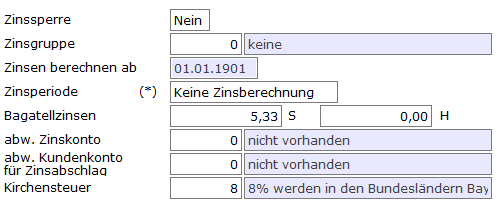

# Zinsmerkmale im Kundenstamm

<!-- source: https://amic.de/hilfe/zinsmerkmaleimkundenstamm.htm -->

Hauptmenü > Stammdatenpflege > Kunden / Lieferanten > Kundenstamm / Lieferantenstamm / Kontokorrent-Kunden

Direktsprung **[KU] / [LF] / [KUKO]**

Im Pfleger für Personenkonten (Lieferantenstamm/Kundenstamm) lassen sich unter ***Fibumerkmale*** **F11** die kundenspezifischen Merkmale hinterlegen.

| | Beschreibung |
| --- | --- |
| Zinssperre  
    
 | Steht dieses Feld auf nein, werden für diesen Kunden keine Zinsen berechnet. |
| Zinsgruppe | Hier wird die Nummer der Zinsgruppe hinterlegt, die steuert wie die Zinsen berechnet werden. Ist hier eine 0 hinterlegt, werden keine Zinsen berechnet, da 0 keine gültige Zinsgruppe ist.  
Man kann per Einrichterparameter einstellen, dass beim Setzen der Zinsgruppe geprüft wird, ob bereits Belege, die Verzinst werden müssen, existieren. Es wird dann eine Meldung auf dem Bildschirm ausgegeben. Zusätzlich erfolgt ein Eintrag ins Fehlerprotokoll.  
 |
| Zinsen berechnen ab | Es gibt diverse Gründe, warum für einen Kunden erst ab einem bestimmten Datum Zinsen berechnet werden sollen (z.B. Kunde wurde aus Fremdsystem importiert und soll erst ab Datum nn.nn.nnnn in A.eins mit Zinsen belastet werden oder es ist erst zum nn.nn.nnnn Verzinsung mit dem Kunden vereinbart worden). Ist hier ein Datum eingetragen, wird zu allen Belegen die vor diesem Datum fällig sind, der Zinssaldo ermittelt und auf diesem setzt dann die Zinsabrechnung auf. Ist einmal eine Zinsabrechnung erstellt worden, ist dieses Datum nicht mehr änderbar. |
| Zinsperiode  
    
 | Dieses Feld wird bisher nicht von A.eins ausgewertet und ist für zukünftige Entwicklungen vorgesehen.  
 |
| Bagatellzinsen | Wenn man Zinsen bis zu einer gewissen Höhe dem Kunden nicht belasten/gutschreiben will, so kann man hier den Wert dafür eintragen. Es werden dann für diesen Kunden/Lieferanten trotzdem die Zinsen berechnet und er erscheint auch in der Zinsabrechnung. Diese berechneten Zinsen werden jedoch nicht gebucht. Man kann dann entscheiden, ob man in der nächsten Zinsabrechnung diese Zinsbeträge zum aktuellen Zinssaldo hinzurechnet (nicht gebuchte Zinsabrechnung "***zurücksetzten***") oder ob man sie unter den Tisch fallen lässt (nicht gebuchte Zinsabrechnung "***löschen***").  
 |
| abw. Zinskonto  
 | sollen die Zinsen nicht diesem Konto zugeschrieben werden sondern einem anderen Personenkonto, so kann man hier eine abweichende Kontonummer hinterlegen. Achtung: ist sowohl das abweichende Zinskonto als auch das abweichende Zinsabschlagskonto gesetzt, so wird für Zinsgutschriften das Abschlagskonto gezogen, für Rechnungen das abweichende Zinskonto.  
 |
| abw.Kundenkonto für Zinsabschlag | hier kann ein Kundenkonto hinterlegt werden, dem die Zinsen gutgeschrieben/belastet werden. Die Abfrage dieses Kontos erscheint nur, wenn der Steuerparameter „**Zinsabschlag berechnen**“ auf JA steht.  
 |
| Kirchensteuer  
 | Wenn bei der Berechnung der Zinsabschlagssteuer Kirchensteuer berücksichtigt werden soll, so muss hier hinterlegt werden, welcher Prozentsatz Kirchensteuer gezogen werden soll. Die [Kirchensteuer](./kirchensteuer.md) wird in einem separaten Pfleger hinterlegt.  
Die Abfrage der Kirchensteuer erscheint nur, wenn der Steuerparameter „**Zinsabschlag berechnen**“ auf JA steht.  
 |
