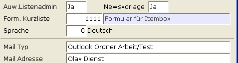
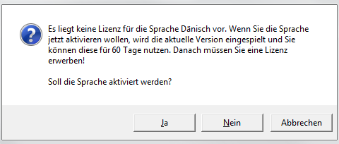

# A.eins Sprache

<!-- source: https://amic.de/hilfe/_aeinssprache.htm -->

Hauptmenü > Administration > Werkzeuge > Fremdsprache pflegen

Direktsprung **[SPRA]**

In A.eins existieren verschiedene Sichten der Sprachdarstellung.

- Die Sprache in der A.eins dargestellt wird.
- Die Sprache in der [die Bezeichnung der Stammdaten](./sprachabhaengige_bezeichnung_in_den_stammdaten.md) dargestellt wird.
- Die Sprache, in der Kunden angeschrieben werden (Mahnungen, Rechnungen, usw...).  
    

Grundsätzlich wird A.eins in Deutsch - immer Sprachnummer 0 - entwickelt. Diese Sprachnummer hat nichts mit der Sprachnummer im Sprachestamm zu tun, sondern wird separat im Stammdatenpfleger Sprachtexte in der Variante „A.eins Sprache“ gepflegt. Die hier vorhandenen Sprachen werden nur von AMIC festgelegt. Bisher sind folgende Sprachen vorgesehen:

| Nummer | Bezeichnung | ISO 639-1 | ISO 639-2 | Lizenz |
| --- | --- | --- | --- | --- |
| 0 | Deutsch | de | deu | Nein |
| 1 | Englisch | en | eng | Ja |
| 2 | Dänisch | da | dan | Ja |
| 3 | Polnisch | pl | pol | Nein |
| 4 | Niederländisch | nl | nld | Ja |
| 5 | Französisch | fr | fre | Ja |
| 6 | Ungarisch | hu | hun | Nein |
| 7 | Italienisch | it | ita | Nein |
| 8 | Spanisch | es | spa | Nein |
| 9 | Portugiesisch | pt | por | Nein |
| 10 | Tschechisch | cs | ces | Nein |
| 11 | Slowakisch | sk | slk | Nein |

Bisher kann für die Sprachen Englisch, Dänisch, Niederländisch und Französisch eine Lizenz erworben werden. Bei der ersten Verwendung der Sprache kann eine 60-Tage Lizenz freigeschaltet werden. Spätestens nach 60 Tagen muss dann die echte Lizenz erworben werden.

**Hinweis:**

*7 Tage vor Ablauf der 60-Tage Lizenz erscheint beim Start von A.eins ein Hinweis auf dem Informationsbildschirm.*

Um A.eins in einer anderen Sprache als Deutsch darzustellen sind zwei Einstellungen notwendig.

- Der Steuerparameter (Direktsprung **[SPA]**) „**Mehrsprachigkeit aktiv**“ muss auf **Ja** stehen.
- Im [Bedienerstamm](../firmenkonstanten/bedienerwesen_bediener_bedienerklassen_und_erfasser/bedienerstamm/index.md) (Direktsprung ****[BD]****) muss die Sprache, in der A.eins ausgeführt werden soll, für den einzelnen Bediener hinterlegt werden.  
  
    

Das Erscheinungsbild von A.eins ist also Bedienerabhängig, d.h. auf einer Datenbank kann gleichzeitig in unterschiedlichen Sprachvarianten gearbeitet werden. Wenn man im Bedienerstamm das erste Mal eine der Lizenzabhängigen Sprachen in A.eins auswählt, wird geprüft, ob eine Lizenz vorliegt und die Sprache bereits eingespielt wurde. Es erscheint dann ggf. folgende Meldung.

Erst wenn man hier einmal mit Ja geantwortet hat oder eine Lizenz für die Sprache erworben wurde, wird von A.eins die Sprache freigeschaltet und beim nächsten Programmstart werden alle Bildschirme und Listen in der Fremdsprache angezeigt. Ansonsten läuft A.eins weiterhin in der Standardsprache Deutsch.

**Hinweis:**

*Wurde vor der Lizenzeinführung bereits mit unterschiedlichen Sprachen gearbeitet, werden beim Versionsupdate automatisch die aktuellen Sprachen eingespielt und die 60-Tage Lizenz freigeschaltet. Beim Start von A.eins wird dann auf dem Hinweisbildschirm darauf hingewiesen, dass die Sprache automatisch aktiviert wurde.*

Siehe auch:

- [Sprachabhängige Bezeichnung in den Stammdaten](./sprachabhaengige_bezeichnung_in_den_stammdaten.md)
