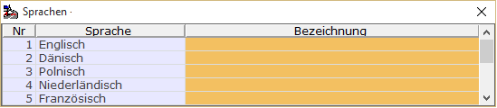

# Sprachabhängige Bezeichnung in den Stammdaten

<!-- source: https://amic.de/hilfe/_spracheabhaengigebezeichnung.htm -->

Wenn man in einer Datenbank Anwender mit unterschiedlichen Sprachen führt, so ist es Sinnvoll, dass diese Anwender die Bezeichnungen der Stammdaten auch in Ihrer Sprache sehen können. Dazu muss man im Stammdatenpfleger, wenn man auf dem Bezeichnungsfeld steht, die Taste F3 drücken und gelang dann in einen Dialog zur Pflege der sprachabhängigen Texte:



Die deutschen Texte werden weiterhin direkt auf der Maske gepflegt. Wobei es hier folgendes zu beachten gibt: Wenn ein Anwender, der **nicht** mit der Sprache Deutsch arbeitet, den Text direkt auf dem Stammdatenpfleger ändert, so ändert er ihn direkt für sein Sprache und nicht für die Sprache Deutsch. Dieses Verhalten erleichtert die Pflege der fremdsprachigen Texte erheblich. Gleichzeitig folgt daraus jedoch, dass nur Anwender, die mit der Sprache Deutsch arbeiten auch deutsche Texte ändern können.

Die hier gepflegten Texte werden dann in allen Auswahllisten und F3-Auswahlen für fremdsprachige Anwender angezeigt. Will man die Funktionalität in eigenen privaten F3-Auswahlen (Itemboxen) verwenden, so muss man die Bezeichnung mit der Funktion AMIC_FUNC_SPRACHBEZEICH bestimmen. Hier ein Beispiel, wie man die Sprachbezeichnung für den Sachkontenstamm bestimmen kann:

```sql
select Kontonummer,
  AMIC_FUNC_SPRACHBEZEICH('SachKontStamm',
trim(cast(KontoNummer as char(10))),
SachKontBezeich ) as SachKontBezeich,
from SachKontstamm
```

Der erste Parameter ist - meistens – der Tabellenname. Er kann auch einen anderern Wert haben, wenn z.B. in einer Tabelle mehrere pflegbare Bezeichnungsfelder existieren.

Der zweite Parameter ist der eindeutige Schlüssel.

Der dritte Parameter ist der Originalwert. Wenn als Sprache Deutsch verwendet wird, wird erst gar nicht in der Datenbank nach einer anderen Bezeichnung gesucht, sondern sofort dieser Wert zurückgeliefert.
