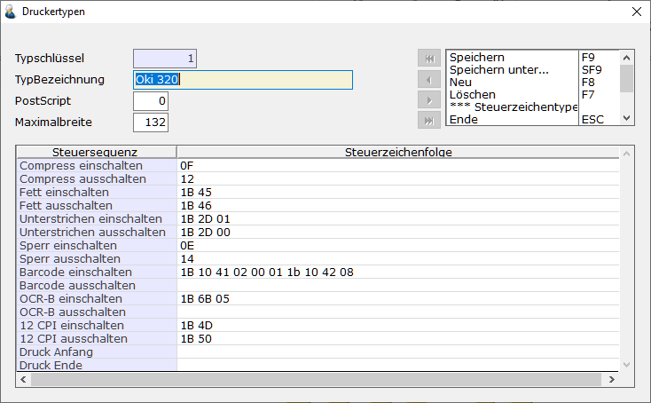

# Druckertypen

Hauptmenü > Administration > Druckertypen

oder Direktsprung **[DRT]**

Beim Druckertyp werden die Steuerzeichen für die ASCII – Ansteuerung der Drucker hinterlegt.

In der Basis-DB sind folgende Typen eingerichtet:

- OKI 320 Nadeldrucker
- HP- Laser

