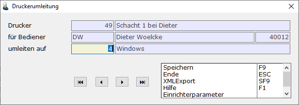

# Druckumleitung

Hauptmenü > Administration > Drucker > Druckerumleitung

oder Direktsprung **[DRM]**

Im Standardfall wird je Bediener und Arbeitsplatz die Einrichtung der dort zu verwendenden Drucker ausreichen. Sollen Bediener aber häufig von verschiedenen Plätzen arbeiten, kann das mit virtuellen Druckern (direkte Ansprache einer Queue) erreicht werden, die mittels Bediener spezifischen Umleitungen zugeordnet werden können.

