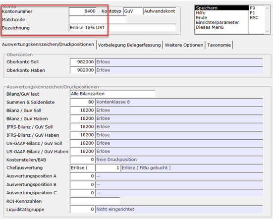
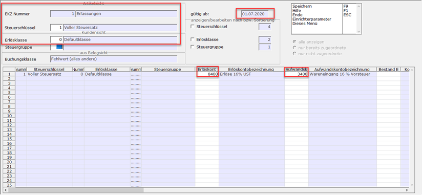

# Erlöskennziffer Kontozuordnung bei Steuersatzänderung

<!-- source: https://amic.de/hilfe/ekzzaenderung.htm -->

Die zum 01.07.2020 anstehende Änderung des Steuersatzes von 19% auf 16% (bzw. 7% auf 5%) hat zur Folge, dass auch die Erlöskennziffer Kontozuordnungen in A.eins geändert werden müssen.

Schritt 1: Konten Anlegen:

Wenn die nötigen Sachkontennummern (i.d.R. Erlöskonto 16% und 5% und Wareneingangskonto 16% und 5%) vorliegen:

Mit dem Direktsprung [SKS] mit dem in die Sachkonten. In diesen sucht man nun nach den Konten, welche angepasst werden müssen (in diesem Fall 19% Erlöskonto). Mit F5 bearbeitet man diesen Datensatz nun. Mit der Funktion „Speichern unter…“ (Shift + F9) legt man nun eine Kopie des Datensatzes an. Hier muss lediglich die Kontonummer und die Bezeichnung angepasst werden. Am Ende speichert man dann mit F9.

Schritt 2: Erlöskennziffer Kontozuordnung anlegen

Nachdem die Konten angelegt wurden navigiert man in die Erlöskennziffer Kontozuordnung mit dem Direktsprung [EKZZ]. Hier wird nun ein neuer Datensatz angelegt (F8). Wichtig hierbei ist, die Erlöskennziffer Kontozuordnung so anzulegen, wie es auch bei den (in diesem Fall) 19% war. Anders als bei dem Datensatz mit 19% müssen hier das Datum (01.07.2020) und die in Schritt 1 angelegten Sachkonten hinterlegt werden. Am Ende speichert man den Datensatz mit Speichern (F9) ab.

Schritt 3: Wiederholung

Die Schritte 1-2 sind für alle existierenden Erlösklassen Kontozuordnungen, welche aktualisiert (bzw. neu angelegt) werden müssen zu wiederholen.

