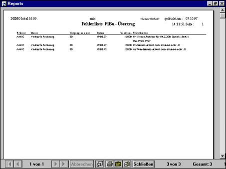

# FiBu-Übertrag und EKZ

<!-- source: https://amic.de/hilfe/_fibubertragundekz.htm -->

Der Programmteil FiBu-Übertrag **[FIB]** trägt die selektierten Vorgänge in die Rela­­­tion Datenstrom ein. In der AW-Box erscheint bei **[FIB]** der Status **„i.B.“** für in Bear­beitung.

Die Verbuchung wird aus den folgenden Elementen zusammengestellt:

• Erlösklasse aus dem Kundenstamm

• Erlöskennziffer aus Artikel / Artikelstamm

• Steuerschlüssel aus Artikelstamm

• Steuergruppe

• Buchklasse aus Vorgang

• Datum aus Vorgang

• Typ Erlös oder Aufwand aus Vorgangsklasse

Findet der Mandantenserver — evtl. unter Ausnutzung der DEFAULT Mechanismen — einen gültigen Eintrag aus **[EKZZ]**, so erfolgt der Eintrag in die FiBu. Der Vorgang ist nun in der Auswahl-Box bei **[FIB]** mit JA gekennzeichnet. Findet der Mandanten­ser­ver keinen gültigen Eintrag unter **[EKZZ]**, so schreibt er den Beleg in das Fehler­pro­to­­koll. Der Status FiBu-Übertrag steht auf NEIN.

Fehler-Handling nach dem Fibu-Übertrag

Je nach sachlicher Fehlerursache sind verschiedene Maßnahmen denkbar:

Fehlende Einträge in **[EKZZ]** nachholen.

Richtige Erlösklasse, Erlöskennziffer oder Steuerschlüssel im jeweiligen Stammpfleger eintragen.

A.eins verlassen (bis Startsymbol), erneut starten und den FiBu-Über­trag wiederholen.

