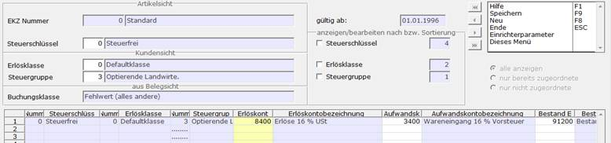

# Erlöskennziffer / Kontozuordnung

Hauptmenü > Administration > Erlöskennziffern > Erlöskennziffer/Kontozuordnung

oder Direktsprung **[EKZZ]**

Hier erfolgt die Verknüpfung der Elemente

- Erlöskennziffer
- Gültigkeit der Eintragungen
- Steuerschlüssel
- Erlösklasse
- Steuergruppe
- Buchungsklasse

mit den Konten der Finanzbuchhaltung. Hier kann man die Bearbeitung wie bei der normalen Stammdatenpflege Datensatz für Datensatz vornehmen oder aber ganze Gruppen von Datensätzen gleichzeitig ändern. Für die gleichzeitige Bearbeitung der Datensätze kann man unter „gültig ab“ in den Feldern Steuerschlüssel, Erlösklasse bzw. Steuergruppe einen Haken setzen.

Setzt man z.B. beim Steuerschlüssel den Haken, so werden in der Datentabelle alle möglichen Kombinationen für Erlösklasse und Steuergruppe angezeigt. In der so entsehenden Übersicht kann man schnell erkennen, wenn Konten falsch zugeordnet sind. Die Felder rechts von den Haken geben die Sortierungsreihenfolge an. Sie wird immer in der Reihenfolge gesetzt, in der man die Haken setzt.

Die Schlüsselfelder Steuerschlüssel, Erlösklasse und Steuergruppe links sind auch im Ändern-Fall aktiv, wobei man jedoch nicht die Werte ändert, sondern die anzuzeigenden Daten auswählen kann.

  
Felder der Erlöskennziffer / Kontozuordnung:

  |  | Felder |
  | :--- | :--- |
  | EKZ Nummer | Die Erlöskennziffer, die im Artikel hinterlegt ist. |
  | Gültig ab | Mit Hilfe der Angabe eines Datums hat man die Möglichkeit zukünftige Änderungen der Konten für die Kombination aus EKZ Nummer, Erlösklasse, Steuerschlüssel und Buchklasse vorab in die Datenbank einzupflegen um dann zum entsprechenden Datum Buchungen auf den richtigen Konten zu erhalten. |
  | Steuerschlüssel | Es ist möglich, Erlöse nach steuerlichen Gesichtspunkten zu differenzieren (Verprobung Umsatzsteuervoranmeldung). Die Definition der Steuerschlüssel erfolgt bekannt­lich im Rahmen der Firmenkonstanten unter dem Punkt Steuerschlüssel. Der Steuerschlüssel wird im Artikelstamm hinterlegt. Der Steuerschlüssel 0 (Null) hat für das Erlöskennzifferwesen DEFAULT-Funktion. Daher sollte er nicht als 0,00 % Steuer definiert werden. |
  | Erlösklasse | Kundenspezifische Zuordnung. |
  | Steuergruppe | |
  | Buchklasse | 
Per Buchklasse werden unterschiedliche Buchungstypen auf verschiedene Erlös- und Aufwandskonten gelenkt. Buchklassen sind in A.eins festgelegt und können nicht geändert oder erweitert werden.

Bedeutung der Buchklasse:
<table><tbody><tr><td>0</td><td>DEFAULT Fehlwert (alles andere)</td></tr><tr><td>1</td><td>Normal-Buchungen (Waren-Ein- oder -Verkauf)</td></tr><tr><td>2</td><td>Erlös-/Aufwandsschmälerungen Hierunter laufen folgende Warenpositionsmechanismen:<ul><li>sämtliche Zu- / Abschläge</li><li>sämtliche Rabatte</li></ul></td></tr><tr><td>3</td><td>Frachten</td></tr><tr><td>5</td><td>Gutschriften
Hierunter fallen die Vorgangsklassen 800 und 1800

Gutschriften lassen sich somit buchungstechnisch anders behandeln als Storno-Belege.
</td></tr></tbody></table>
Die Buchungsmaschine arbeitet bzgl. der Buchungsklasse nach folgender Logik:

`5 -> 1 -> 0`

`3 -> 1 -> 0`

`2 -> 1 -> 0`

`1 -> 0`

`0`

Beispiel:

Ist für die Buchklasse 5 (Gutschrift) eine explizite Kontenzuordnung definiert, so wird diese verwendet. Falls nicht, wird eine solche in Buchklasse 1 gesucht. Endet auch dort die Suche ohne Erfolg, so findet die Fehlwerteinstellung 0 Anwendung.
 |
  | Erlöskonto | Erlöskonto, auf dem die Verkäufe verbucht werden sollen. |
  | Aufwandskonto | Aufwandskonto, auf dem die Einkäufe verbucht werden sollen |

  
Felder des Kontoregister

  Diese Felder werden nur angezeigt, wenn der Steuerparameter (Steuerparameter 720 „Mengenbuchung bei dem Übertrag in die Finanzbuchhaltung“) entsprechend gesetzt ist. Das Bestands-Erlöskonto und das Bestands-Aufwandskonto kann im Sachkontenstamm fest einem zugehörigen Erlös, oder Aufwandskonto zugewiesen werden. Es ist dann hier nicht mehr änderbar, sondern nur im Sachkontenstamm.

  

    <table>
      <thead>
        <tr>
          <th style="text-align: center" colspan="2">Bestandskonten für Mengenbuchung beim Übertrag in die Finanzbuchhaltung</th>
        </tr>
      </thead>
      <tbody>
        <tr>
          <td>Erlöskonto</td>
          <td>Konto auf dem die Mengen für den Verkauf gebucht werden sollen</td>
        </tr>
        <tr>
          <td>Aufwandskonto</td>
          <td>Konto auf dem die Mengen für den Einkauf gebucht werden sollen</td>
        </tr>
        <tr>
          <td>Erlössammelkonto</td>
          <td>Gegenkonto zum Erlöskonto</td>
        </tr>
        <tr>
          <td>Aufwandssammelkonto</td>
          <td>Gegenkonto zum Aufwandskonto</td>
        </tr>
      </tbody>
    </table>
  

Die Bestandsbewertungskonten werden auf der Maske nur angezeigt, wenn der zugehörige Einrichterparameter auf Ja steht.

Diese Konten werden für Buchungen von Werten aus der permanenten Inventur verwendet.

  <table>
    <thead>
      <tr>
        <th style="text-align: center" colspan="2">Bestandsbewertungskonten</th>
      </tr>
    </thead>
    <tbody>
      <tr>
        <td style="text-align: left">Zugangskonto</td>
        <td style="text-align: left">Konto für die Buchung des SOLL-Bestandes</td>
      </tr>
      <tr>
        <td style="text-align: left">Abgangskonto</td>
        <td style="text-align: left">Konto für die Buchung des IST-Bestandes</td>
      </tr>
      <tr>
        <td style="text-align: left">Inventurkonto</td>
        <td style="text-align: left">Konto für die Buchung der Bestandsdifferenz</td>
      </tr>
    </tbody>
  </table>

Einrichterparameter

| Einrichterparameter | Beschreibung | Vorbelegung |
| :--- | :--- | :--- |
| Sollen die Bestandsbewertungskonten auch angezeigt werden? | Bei ‚Ja‘ werden die Felder auf der Maske eingeblendet. | Nein |

Siehe auch:

- [Erlöskennziffer Kontozuordnung bei Steuersatzänderung](steuersatzaenderung.md)