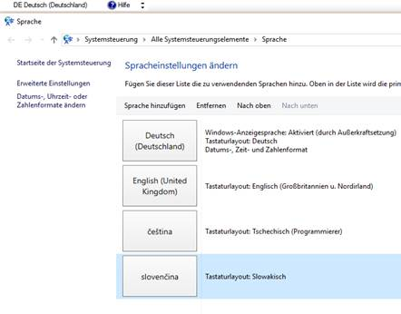

# Bediener - Codepage

Es ist möglich, einem einzelnen Bediener im System eine andere Codepage als die Westeuropäische Codepage zuzuordnen. Es sind momentan einige wenige Codepagezuordnungen vorbereitet, wichtig hierbei ist, dass die Mitteleuropäische Codepage zur Verfügung steht. Dadurch werden die Sonderzeichen z.B. der polnischen Zeichensatztabelle auch korrekt im A.eins System dargestellt und auf den Ausdrucken (Crystal Report und Formulareinrichter (NICHT im AMIC Etikettendruck)) gedruckt.

Wichtig ist dabei, dass A.eins NUR im ASCII Mode (also ein-byte pro Zeichen) arbeitet, ein ausschneiden und einfügen von Zeichen aus Unicode getriebenen Programmen ist NICHT möglich.

Der Bediener muss seine Zeichensatztabelle auf dem Windows Zeichensatzselector eingestellt haben, um auch die passenden Zeichen eingeben und anschließend sehen zu können.

Beispiel:

Es muss im Falle von Crystal Report darauf geachtet werden, dass die Umwandlung der Zeichensätze in die von CRW genutzte UTF8 Tabelle vorgenommen wird, es ist also in jedem Falle eine Privatisierung des Reports notwendig (der Kontraktdruck per CRW ist im Standard schon entsprechend angepasst).