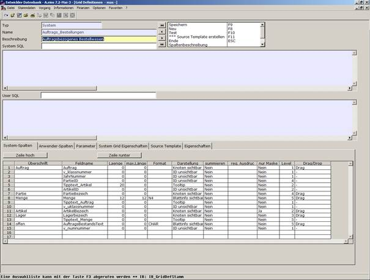

# Bearbeitungsmaske Kopfdaten

<!-- source: https://amic.de/hilfe/_bearbeitungsmaskekop.htm -->



Die im Kopf der Maske stehenden Felder im Einzelnen:

<p class="just-emphasize">Typ</p>

Der Typ gibt die Herkunft der Griddefinition an. Mögliche Konfigurationen:

- System (vom Entwickler vorgegeben) – Diese Einstellungen sind vom Anwender nicht zu ändern.
- Anwender – Diese Einstellungen/Konfigurationen sind vom Anwender selbst erstellt worden

<p class="just-emphasize">Name</p>

Der Name der Griddefinition. Bei der Erstellung wählen Sie bitte einen Namen, anhand dessen sich die Definition leicht identifizieren und von anderen unterscheiden lässt.

<p class="just-emphasize">Beschreibung</p>

Hier ist der Platz für eine genauere Beschreibung für den Verwendungszweck der Griddefinition

<p class="just-emphasize">SystemSQL</p>

Das System-SQL beschreibt den Aufbau der Daten in dem Grid mit einem vom Entwickler vorgegebenen SQL-Befehl. Der Name des hinterlegten SQL-Befehls muss mit „g_“ beginnen.

Dieses SQL ist vom Anwender nicht editierbar.

**Beispiel:**

```sql
// SQLK TEXT für Griddefinition
wohnung_jdb
select w.*,k.kundnummer, a.AdressVorname || ' ' ||
a.Adressname as Name
:USER_FIELDS
from wohnungjdb as w
left outer join kundenstamm k on (k.kundid = w.kundid
)
left outer join AnschriftStamm a on (k.AdressIdHauptAdr
= a.AdressId)
:USER_JOINS
where w.Hausident =
:HAUSIDENT
```

<p class="just-emphasize">UserSQL</p>

Das User-SQL erweitert das vorgegebene System-SQL um weitere vom Anwender gewünschte Felder. Der Name des SQL-Befehls muss mit „g_“ beginnen und auf „_p“ enden. Das System-SQL muss die Variablen „:USER_FIELDS“ und „:USER_JOINS“ enthalten, damit die Einträge des UserSQL berücksichtigt werden können.
