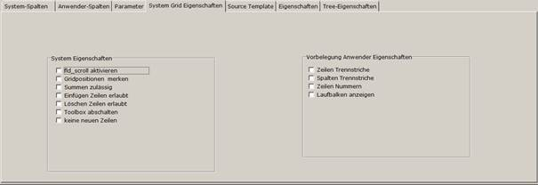

# System-Grid Eigenschaften

<!-- source: https://amic.de/hilfe/_systemgrideigenschaf.htm -->

In den System-Grid-Eigenschaften werden Eigenschaften der Griddefinition vom Entwickler vorgegeben, die vom Anwender nicht änderbar sind:

| System Eigenschaftsfelder |
| --- |
| fld_scroll aktivieren | Fügt eine neue Zeile ein, wenn man am Ende der letzten Zeile ist und Enter drückt. |
| Gridpositionen merken | Bei Aktivieren dieser CheckBox merkt sich das Grid die Positionen seiner Felder und deren Größen. |
| Summen zulässig | Bei Aktivierung dieser CheckBox lässt man die Möglichkeit zu, dass man über bestimmten Spalten eine Summenbildung laufen lassen kann. |
| Einfügen Zeilen erlauben | Einfügen einer Zeile wird mit **Strg**+**Umschalten**+**Einfg** ausgelöst. Die Speicherung der Daten in die Datenbank erfolgt jedoch nicht automatisch. Es ist eine manuelle Speicherung notwendig |
| Löschen Zeilen erlauben | Lässt das Zeilen Löschen mit **Strg**+**Umschalten**+**Entf** zu. Die Daten werden jedoch nur im Grid gelöscht. Eine Löschung in der Datenbank findet nicht statt! |
| Toolbox abschalten | Bei setzen dieser CheckBox wir das Icon links über dem Grid deaktiviert. |
| keine neuen Zeilen | Ein Setzen dieser CheckBox lässt den Benutzer keine neue Zeilen in das Grid einfügen. |

Vorbelegung Anwender Eigenschaften

Dies sind Vorbelegungen von Eigenschaften, die der Anwender selbst ändern kann. Die Bedeutung dazu siehe Tabreiter Eigenschaften.
