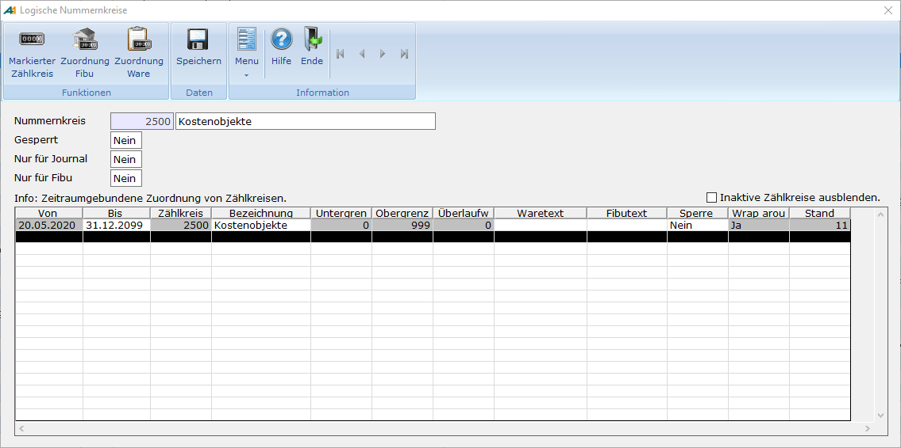
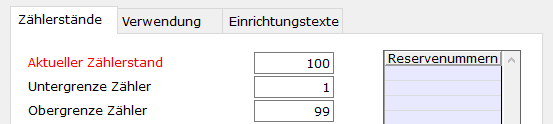
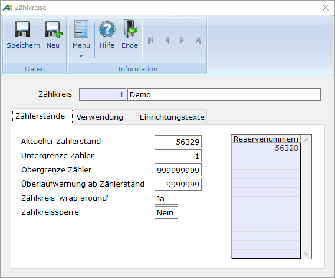
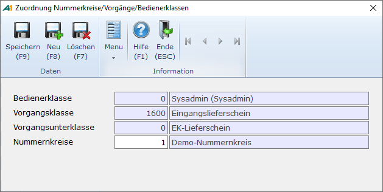

# Einrichtung von Nummernkreisen

<!-- source: https://amic.de/hilfe/_einrichtungvonnummer.htm -->

Zur allgemeinen Einrichtung der Nummernkreise gehört die Einrichtung von Nummernkreisen und ihren Zählkreisen. Anschließend können die Nummernkreise verschiedenen Vorgängen oder Stammdaten zugeordnet werden. Bei einer Neueinrichtung bzw. Erweiterung der Nummernkreise empfiehlt sich folgende Einrichtungsreihenfolge:

| **Direktsprung** | **Beschreibung** |
| --- | --- |
| **[NKZ]** | Unter **[NKZ]** können Zählkreise gepflegt werden.  |
| **[NKS]** | Unter **[NKS]** gibt es die Möglichkeit Nummernkreise zu pflegen. Hier können Zählkreise über einen Gültigkeitszeitraum zu einem Nummernkreis zugeordnet werden. Außerdem können hier neue Zählkreise angelegt werden.  |
| **[NKV]** | Vorgangszuordnung  |
| **[NKF]** | Unter **[NKF]** werden Nummernkreise zu FiBu-Vorgängen zugeordnet (siehe [Nummernkreiszuordnung Finanzbuchhaltung](../../finanzbuchhaltung/stammdaten_der_fibu/nummernkreise/nummernkreiszuordnung_finanzbuchhaltung.md)).  |
| **[MND]** und **[MNDNK]** | Festlegung der Nummernkreise bei Personenkonten im Mandantenstamm  |

Nummernkreis

Hauptmenü > Administration > Nummernkreise > Nummernkreise

oder Direktsprung **[NKS]**

Kopfdaten

| **Feld** | **Beschreibung** |
| --- | --- |
| Nummernkreis | Hier wird eine eindeutige Nummer für den Nummernkreis festgelegt. Neben der Nummer kann hier eine Bezeichnung für den Nummernkreis vergeben werden.  |
| Gesperrt | Mit diesem Kennzeichen können Nummernkreise gesperrt werden. Aus gesperrten Nummernkreisen kann keine Nummer bereitgestellt werden. Der Standardwert ist „Nein“.  |
| Nur für Journal | Kennzeichen, ob es sich um ein Nummernkreis handelt, der nur für das Journal verwendet werden soll. Der Standardwert ist „Nein“.  |
| Nur für FiBu | Kennzeichen, ob es sich um ein Nummernkreis handelt, der nur für die FiBu verwendet werden soll. Der Standardwert ist „Nein“.  |

Datentabelle

Über die Datentabelle können Zählkreise zu einen Nummernkreis zugeordnet werden. Des Weiteren besteht die Möglichkeit hier direkt neue Zählkreise anzulegen.

Einige Felder sind mit dem Hinweis „Eingabe ist nur bei Neu-Anlage eines Zählkreises möglich“ versehen. Sollen diese Felder nachträglich geändert werden, so ist die Funktion ***Markierter Zählkreis*** zu verwenden. Über den Zählkreis-Pfleger können die Felder angepasst werden.

| **Feld** | **Beschreibung** |
| --- | --- |
| Von | Mit dem „Von“ - und „Bis“-Feld wird ein Zeitraum festgelegt, in dem der Zählkreis für den Nummernkreis gültig ist. In dem Feld „Von“ wird angegeben, ab wann ein Zählkreis für den Nummernkreis aktiv ist. Sobald ein Zählkreis einem Nummernkreis zugeordnet wurde, kann das von-Datum nicht mehr geändert werden.  |
| Bis | Mit dem „Von“ - und „Bis“-Feld wird ein Zeitraum festgelegt, in dem der Zählkreis für den Nummernkreis gültig ist. In dem Feld „Bis“ wird angegeben, bis einschließlich wann ein Zählkreis für den Nummernkreis aktiv ist.  |
| Zählkreis | Hier können Zählkreise einem Nummernkreis zugeordnet werden. Dabei kann die Nummer eines vorhandenen oder eines neuanzulegenden Zählerkreises angegeben werden. Welcher Zählkreis aktiv ist, hängt von dem Gültigkeitszeitraum ab. Existieren mehrere Zählkreise, die gültig sind, dann wird der Zählkreis gewählt, der über das aktuellere „Von“-Datum verfügt. Alle zugeordneten Zählerkreise, die nicht mehr in dem Gültigkeitsbereich liegen oder die von einem anderen Zählerkreis abgelöst worden sind, werden nicht mehr gezogen und können mit dem Schalter „Inaktive Zählerkreise ausblenden“ in der Datentabelle ausgeblendet werden.  |
| Bezeichnung | Bezeichnung des Zählkreises.  |
| Untergrenze | Mit dem Setzen der Unter- und Obergrenze, wird ein Bereich festgelegt, aus dem die Nummern fortlaufend gezogen werden. Die Untergrenze bildet hierbei den Startwert. Eingabe ist nur bei Neu-Anlage eines Zählkreises möglich.  |
| Obergrenze | Mit dem Setzen der Unter- und Obergrenze, wird ein Bereich festgelegt, aus dem die Nummern fortlaufend gezogen werden. Die Obergrenze stellt die maximale Nummer dar, die bereitgestellt werden kann. Eingabe ist nur bei Neu-Anlage eines Zählkreises möglich.  |
| Überlaufwarnung | Siehe [Überlaufwarnung](./einrichtung_von_nummernkreisen.md#Zaehlkreis_Ueberlaufwarnung). Eingabe ist nur bei Neu-Anlage eines Zählkreises möglich.  |
| Waretext | Siehe [Einrichtungstexte](./einrichtung_von_nummernkreisen.md#Zaehlkreis_Einrichtungstexte).  |
| Fibutext | Siehe [Einrichtungstexte](./einrichtung_von_nummernkreisen.md#Zaehlkreis_Einrichtungstexte).  |
| Sperre | Siehe [Zählkreissperre](./einrichtung_von_nummernkreisen.md#Zaehlkreissperre).  |
| Wrap around | Siehe [Wrap around](./einrichtung_von_nummernkreisen.md#Zaehlkreis_Wrap_Around). Eingabe ist nur bei Neu-Anlage eines Zählkreises möglich.  |
| Stand | Hier wird der aktuelle Stand des Zählkreises angezeigt. Eingabe ist nur bei Neu-Anlage eines Zählkreises möglich.  |

 

Zählkreis

Hauptmenü > Administration > Nummernkreise > Zählkreise

oder Direktsprung **[NKZ]**

| **Feld** | **Beschreibung** |
| --- | --- |
| Zählkreis | Hier wird eine eindeutige Nummer für den Zählkreis festgelegt. Neben der Nummer kann hier eine Bezeichnung für den Zählkreis vergeben werden.  |

Register „Zählerstände“

| **Feld** | **Beschreibung** |
| --- | --- |
| Aktueller Zählerstand | Hier wird der aktuelle Zählerstand des Zählkreises angezeigt. Der aktuelle Zählerstand stellt die nächste Nummer dar, die gezogen wird. Sobald eine Nummer aus dem Zählkreis gezogen wird, wird der Zählerstand automatisch um 1 hochgezählt. Ausnahme: Befinden sich Nummern in der [Reserveliste](./einrichtung_von_nummernkreisen.md#Zaehlkreis_Reservenummern), so werden diese zuerst gezogen.   **Hinweis** Ist der Zählerstand übergelaufen, so wird in dem Feld „Aktueller Zählerstand“ eine Nummer angezeigt, die um 1 größer als die Obergrenze ist. Außerdem wird das Label zum aktuellen Zählerkreis rot eingefärbt. Die „übergelaufene“ Nummer wird nicht gezogen! Sie dient nur zu Darstellungszwecken, um anzuzeigen, dass der Zählkreis übergelaufen ist.   |
| Untergrenze Zähler | Mit dem Setzen der Unter- und Obergrenze, wird ein Bereich festgelegt, aus dem die Nummern fortlaufend gezogen werden. Die Untergrenze bildet hierbei den Startwert. Beim Ändern der Untergrenze ist zu beachten, dass ggf. der aktuelle Zählerstand angepasst werden muss (siehe [aktueller Zählerstand](./einrichtung_von_nummernkreisen.md#Zaehlkreis_Zaehlerstand)). Außerdem werden Reservenummern, die nicht mehr in den Nummernbereich des Zählkreises passen, gelöscht.  |
| Obergrenze Zähler | Mit dem Setzen der Unter- und Obergrenze, wird ein Bereich festgelegt, aus dem die Nummern fortlaufend gezogen werden. Die Obergrenze stellt die maximale Nummer dar, die bereitgestellt werden kann. Beim Ändern der Obergrenze ist zu beachten, dass ggf. der aktuelle Zählerstand angepasst werden muss (siehe [aktueller Zählerstand](./einrichtung_von_nummernkreisen.md#Zaehlkreis_Zaehlerstand)). Außerdem werden Reservenummern, die nicht mehr in den Nummernbereich des Zählkreises passen, gelöscht.  |
| Überlaufwarnung ab Zählerstand | Hier wird der Zählerstand eingetragen, ab dem eine Überlaufwarnung angezeigt soll. Mit der Überlaufwarnung soll der Anwender informiert werden, dass die Obergrenze des Zählkreises fast erreicht ist.  |
| Zählkreis „wrap around“ | Steht dieses Kennzeichen auf „Ja“, so fängt der Zählkreis beim Überlaufen der Obergrenze automatisch wieder bei der Untergrenze an. Steht das Kennzeichen auf „Nein“ führt das Überlaufen des Zählkreises dazu, dass keine Nummer gezogen werden kann. Der Standardwert ist „Ja“.  |
| Zählkreissperre | Steht die Zählkreissperre auf „Ja“, so wird der Zählkreis gesperrt. Dadurch können keine weiteren Nummern aus dem Zählkreis gezogen werden. Der Standardwert ist „Nein“.   **Hinweis** Beim Setzen der Zählkreissperre ist zu beachten, dass alle Nummernkreise, die diesen Zählkreis aktiv verwenden, blockiert werden können. Das kann dazu führen, dass aus diesen Nummernkreisen keine Nummer bereitgestellt werden kann!  |
| Reservenummern | Nicht (mehr) genutzte Nummern können in eine Reserveliste geschrieben und damit wieder freigegeben werden. Wird eine Nummer aus dem Zählkreis gezogen, so werden zuerst die Nummern aus der Reserveliste genommen. Beim Ziehen einer Nummer aus der Reserveliste, wird der Zählerstand nicht hochgezählt.  |

Register „Verwendung“

| **Feld** | **Beschreibung** |
| --- | --- |
| Verwendung | Hier werden alle Nummernkreise aufgelistet, in denen der Zählkreis verwendet wird.  |

Register „Einrichtungstexte“

  <table>
    <tbody>
      <tr>
        <td>
          
<b>Feld</b>

        </td>
        <td>
          
<b>Beschreibung</b>

        </td>
      </tr>
      <tr>
        <td>
          
Ware

        </td>
        <td>
          
Hier kann eine alphanumerische Belegnummer für die Warenwirtschaft eingerichtet werden (siehe Syntax).

        </td>
      </tr>
      <tr>
        <td>
          
FiBu

        </td>
        <td>
          
Hier kann eine alphanumerische Belegnummer für die Finanzbuchhaltung eingerichtet werden (siehe Syntax).

        </td>
      </tr>
      <tr>
        <td>
          
Syntax

        </td>
        <td>
          
[{Nr,Länge}][Festtext]

          <table>
            <tbody>
              <tr>
                <th><b>Nr</b>.</th>
                <th><b>Bedeutung</b></th>
              </tr>
              <tr>
                <td>1</td>
                <td>Belegnummer ohne führende Nullen</td>
              </tr>
              <tr>
                <td>2</td>
                <td>Belegnummer mit führenden Nullen</td>
              </tr>
              <tr>
                <td>3</td>
                <td>Nummernkreis ohne führende Nullen</td>
              </tr>
              <tr>
                <td>4</td>
                <td>Nummernkreis mit führenden Nullen</td>
              </tr>
              <tr>
                <td>5</td>
                <td>Rechter Nummernanteil ohne führende Nullen</td>
              </tr>
              <tr>
                <td>6</td>
                <td>Rechter Nummernanteil mit führenden Nullen</td>
              </tr>
              <tr>
                <td>11</td>
                <td>Bediener Identifikation</td>
              </tr>
              <tr>
                <td>12</td>
                <td>Bediener Kurzbezeichnung</td>
              </tr>
            </tbody>
          </table>
          
<u>Beispiel:</u>

          
Beleg-Nummer 97/000100 Einrichtungstext = 97/{2,6}

          
<b>Achtung:</b> Obiges Beispiel kann zu Problemen bei der Anzeige in Listen, Auswertungen wegen der Länge führen!

        </td>
      </tr>
    </tbody>
  </table>

Vorgangszuordnung

Hauptmenü > Administration > Nummernkreise > Vorgangszuordnung

oder Direktsprung **[NKV]**

Hier werden pro Bedienerklasse und Vorgang bzw. Vorgangsunterklasse die entsprechenden Nummernkreise zugeordnet. In der Basis-DB sind die vorhandenen Bedienerklassen zugeordnet.

Der Eintrag von **Bedienerklasse 0** führt zur generellen Gültigkeit des Nummernkreises für diesen Vorgangstyp (z.B. Nummer Lieferscheine).

Prinzipiell können verschiedene Bedienerklassen auch mit getrennten Nummernkreisen arbeiten.

FiBu-Vorgangszuordnung

Hauptmenü > Administration > Nummernkreise > Fibu-Vorgangszuordnung

oder Direktsprung **[NKF]**

Hier werden Nummernkreise zu FiBu-Vorgängen zugeordnet (siehe [Nummernkreiszuordnung Finanzbuchhaltung](../../finanzbuchhaltung/stammdaten_der_fibu/nummernkreise/nummernkreiszuordnung_finanzbuchhaltung.md)).

