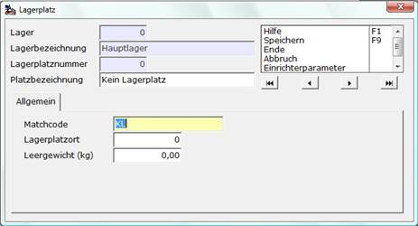

# Lagerplatz (LGP)

<!-- source: https://amic.de/hilfe/_lagerplatzlgp.htm -->

Hauptmenü > Stammdatenpflege > Allgemeine Stammdaten > Lagerplätze

Direktsprung [LGP]

Lagerplätze sind Lagern direkt zugeordnet; nicht jedoch Artikeln. Die Artikel legen sich also quasi durch das Buchen auf einen Lagerplatz an. Aus der Artikelbestandsanzeige [ARB] heraus kann auf den Lagerplatznachweis verzweigt werden.

Fürs Boxmanagement können über den SPA „Lagerplatzort aktiv“ die Felder Lagerplatzort und Leergewicht freigeschaltet werden. Die Lagerplatzorte können nicht nur an dieser Stelle geändert werden, sondern auch an anderen Stellen.

Siehe auch:

- [Lagerplatzorte ändern](./lagerplatzorte_aendern.md)
