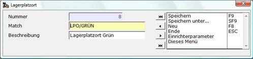

# Lagerplatzort (LGPO)

<!-- source: https://amic.de/hilfe/_lagerplatzortlgpo.htm -->

Direktsprung [LGPO]

Der Stammdatenpfleger für den Lagerplatzort ist durch den SPA „Lagerplatzort aktiv“ geschützt. In dem Pfleger können die einzelnen Lagerplatzorte fürs Boxmanagement gepflegt werden.

 
