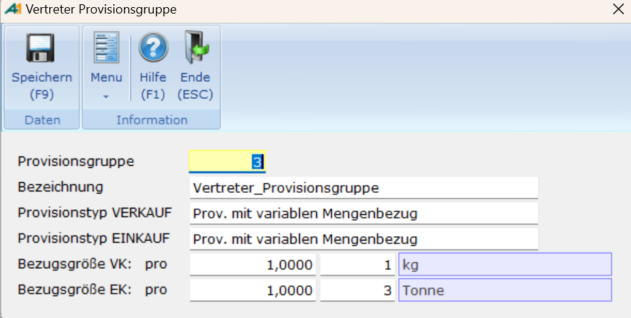

# Vertreterprovisionsgruppen: Pfleger

<!-- source: https://amic.de/hilfe/_vertreterprovisionsgpfleger.htm -->

| Kopfdaten |
| --- |
| Provisionsgruppe | Nummer der Provisionsgruppe |
| Bezeichnung | Bezeichnung der Provisionsgruppe |
| Provisionstyp VERKAUF | Mittels F3 kann dort aus dem Format **VERTPROVFORM** ein Provisionstyp für den Verkauf eingerichtet werden |
| Provisionstyp EINKAUF | Mittels F3 kann dort aus dem Format **VERTPROVFORM** ein Provisionstyp für den Einkauf eingerichtet werden |
| Bezugsgröße VK: pro | Wenn man den Provisionstyp im Verkauf **Prov. Mit variablen Mengenbezeug** auswählt, dann ist dieses Feld bearbeitbar. Dort kann man einrichten bei welcher Menge in welcher Mengeneinheit die Provisionsgruppe die Provision bestimmt. |
| Bezugsgröße EK: pro | Wenn man den Provisionstyp im Einkauf **Prov. Mit variablen Mengenbezeug** auswählt, dann ist dieses Feld bearbeitbar. Dort kann man einrichten bei welcher Menge in welcher Mengeneinheit die Provisionsgruppe die Provision bestimmt. |

Funktionen:

| Funktion | Beschreibung |
| --- | --- |
| Speichern (F9) | Versucht den Datensatz zu speichern |
| Provisionsgruppenstaffel bearbeiten | Wenn man im Einkauf oder im Verkauf den Provisionstyp <strong>Staffelprovision (OPT-Preis)</strong> oder <strong>Staffelprovision (Preis+ZuAB)</strong> dann kann man diese Funktion aufrufen, um in der Auswahlliste der zum Bearbeiten der Vertreterprovisionsstaffeln. |

