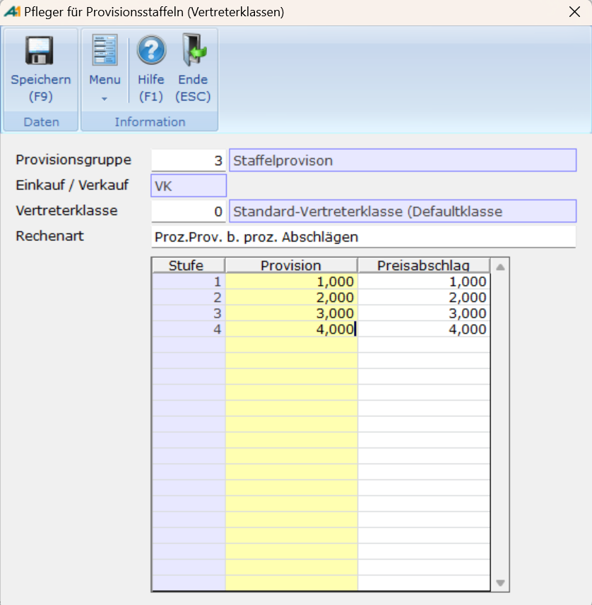

# Vertreterprovisionsstaffeln: Pfleger

  <table>
    <thead>
      <tr>
        <th style="text-align: center" colspan="2">Kopfdaten</th>
      </tr>
    </thead>
    <tbody>
      <tr>
        <td style="text-align: left">Provisionsgruppe</td>
        <td style="text-align: left">Nummer der Provisionsgruppe</td>
      </tr>
      <tr>
        <td style="text-align: left">Einkauf / Verkauf</td>
        <td style="text-align: left">Gibt an, ob die Provisionsstaffel für den Einkauf oder Verkauf gültig sein soll.</td>
      </tr>
      <tr>
        <td style="text-align: left">Vertreterklasse</td>
        <td style="text-align: left">Nummer der Vertreterklasse</td>
      </tr>
      <tr>
        <td style="text-align: left">Rechenart</td>
        <td style="text-align: left">Mittels F3 kann dort aus dem Format <strong>VERTPR_RECH</strong> eine Rechenart auswählen.</td>
      </tr>
      <tr>
        <td style="text-align: left">Stufe</td>
        <td style="text-align: left">Nicht pflegbarer Wert. Zeigt einem auf welcher Stufe welche Provision bei welchem Preisabschlag gilt.</td>
      </tr>
      <tr>
        <td style="text-align: left">Provision</td>
        <td style="text-align: left">Provisionswert der Staffel</td>
      </tr>
      <tr>
        <td style="text-align: left">Preisabschlag</td>
        <td style="text-align: left">Preisabschlag der Staffel</td>
      </tr>
    </tbody>
  </table>

  
Funktionen:

  | Funktion | Beschreibung |
  | :--- | :--- |
  | Speichern **(F9)** | Versucht den Datensatz zu speichern |

