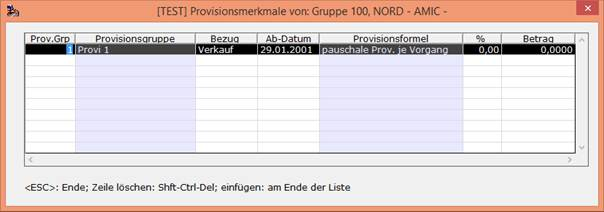

# Vertreterprovisionstabellen

Bei der Einrichtung der Provisionstabellen im Vertreterstamm bzw. Vertretergruppen muss Folgendes bedacht werden.
Es gibt grundsätzlich zwei unterschiedliche Ansätze:

Wenn ein stimmiger Abgleich der Vertreterabrechnung mit z.B. der Verkaufsauswertung gewünscht wird, müssen alle Provisionsgruppen in den Provisionstabellen eingerichtet sein, also auch solche, die z.Zt. für den entsprechenden Vertreter/-gruppe nicht angesprochen werden. (mit Satz/Wert 0.00 einrichten!). Nur dann ist gewährleistet, dass Umsätze ohne Provision (Provision: 0.00) mit gedruckt werden.
Die Umsatzsummen müssen dann mit einer analogen Selektion in der Verkaufsauswertung übereinstimmen.

Sollen in der Vertreterabrechnung nur Umsätze mit tatsächlicher Provision gedruckt werden, so dürfen nur Provisionsgruppen in den Provisionstabellen eingerichtet werden, die eine effektive Provision vorsehen (mit Satz/Wert > 0.00). Umsatzsummen können dann allerdings nicht mehr mit anderen Auswertungen übereinstimmen, da nicht provisionierte Umsätze ausgeblendet sind! (Hinweis: Im Fehlerprotokoll **[FEHLP]** werden für jeden neuen Vertreterabrechnungslauf nicht eingerichtete Provisionsgruppen als Warnung vermerkt.)