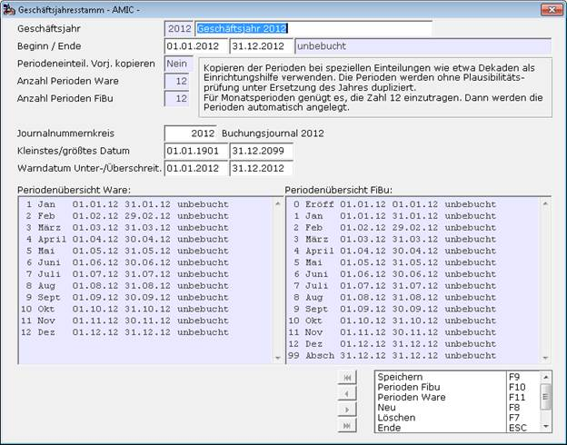

# Anlegen eines neuen Wirtschaftsjahres (WJ) am Beispiel 2012:

Zur Einrichtung eines Geschäftsjahres sind folgende Eintragungen erforderlich:

- sinnvolle Bezeichnung, z.B. Wirtschaftsjahr 20xx
- Datumsvorgaben zum Abprüfen der Gültigkeit eines Datums in der DB
- Nr.-Kreis des Buchungsjournals für dieses Wirtschaftsjahr
- Periodeneinteilung Ware = 12 Normalperioden
- Periodeneinteilung Fibu = 12 (12 Normalperioden + Eröffnung + Abschluss)

Direktsprung **[JAHR]**, dann ***Neu*** **F8**

Geschäftsjahr = 2012

Ausführliche Bezeichnung = Geschäftsjahr 2012

Datum Beginn - Datum Ende = 01.01.2012 / 31.12.2012

Periodeneinteilung Vorjahr kopieren = Nein (nur in Spezialfällen auf Ja setzen; siehe dazu ‚Hinweis zum Feld Periodeneinteilung Vorjahr kopieren‘)

Anzahl Perioden Ware = 12

Anzahl Perioden FiBu = 12

Journalnummernkreis = das entsprechende Buchungsjournal mit F3 auswählen

Kleinstes / größtes Datum = möglichst weit fassen für die Stammdatenerfassung, da hiergegen die Eingabe von Gültigkeitszeiträumen etc. geprüft wird. Eine Eingabe außerhalb dieses Datumsbereichs ist nicht zugelassen und wird mit einer Fehlermeldung abgewiesen.

Warndatum = dies kann z.B. das laufende Jahr sein; bei Eingabe eines Datums außerhalb dieses Bereichs wird eine Warnmeldung ausgegeben und man muss diese mit Ja bestätigen, wenn man dieses Datum wirklich eingeben möchte.

**F10** ***Perioden Fibu***

**F11** ***Perioden Ware***

**ESC** und ***Speichern*** **F9**

Hinweis zum Feld Periodeneinteilung Vorjahr kopieren

Das Kopieren der Perioden ist nur bei speziellen Einteilungen wie etwa Dekaden als Einrichtungshilfe zu verwenden. Die Perioden werden ***ohne Plausibilitätsprüfung*** unter Ersetzung des Jahres dupliziert (Achtung für diesen Fall auch bei Schaltjahren).
Für Monatsperioden (was sehr häufig der Fall ist) genügt es in den Feldern ‚Anzahl Perioden‘ die Zahl 12 einzutragen. Dann werden die Perioden automatisch angelegt.
Das Feld Periodeneinteilung Vorjahr kopieren bleibt dafür auf ‚Nein‘ stehen.

