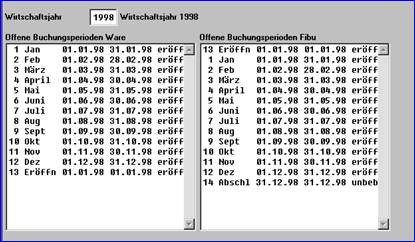

# Perioden

Hauptmenü > Administration > Geschäftsjahr / Perioden

Hinweis: Nur geöffnete Perioden können bebucht werden.

  
a) Perioden eröffnen:

  Hauptmenü > Administration > Geschäftsjahr / Perioden > Periodeneröffnung

  Oder Direktsprung: **[PERER]**

  Grundsätzlich stehen alle Perioden nach dem Anlegen eines neuen Wirtschaftsjahres erst dann zur Verfügung, wenn diese eröffnet sind. Eine nicht eröffnete Periode kann nicht bebucht werden.

  Um in der Startphase nicht ständig eine Warnmeldung zu erhalten, sollten alle zulässigen Perioden eröffnet werden.

  
b) Perioden schließen:

  Hauptmenü  Administration  Geschäftsjahr / Perioden  Buchungsschluss

  Oder Direktsprung: **[PERBS]**

  Hier können die Perioden für die Erfassung neuer Belege geschlossen werden.

  Die schon in der Periode erfassten Belege müssen noch nicht gebucht sein. Skontobelege oder Restposten werden nur auf Nachfrage in diesen Perioden erstellt. Der Reorganisator greift noch auf diese Perioden zu.

  
c) Periode wiedereröffnen:

  Hauptmenü > Administration > Geschäftsjahr / Perioden > Wiedereröffnung

  Oder Direktsprung: **[PERWE]**

  Eine Wiedereröffnung der Periode, die über Buchungsschluss **[PERBS]** geschlossen wurde, ist jederzeit möglich  
  

  
d) Perioden Abstimmmprotokoll:

  Hauptmenü > Administration > Geschäftsjahr / Perioden > Perioden Abstimmprotokoll

  Oder Direktsprung: **[PERAP]**

  In dem Perioden Abstimmprotokoll sieht man alle relevanten Einträge, welche für den Periodenabschluss der Ware notwendig sind:

  - Belege, welche nicht an die Fibu übertragen wurde
  - Abweichungen von dem Wirtschaftsjahr zum Lieferdatum
  - Sonderperioden für die Ware, welche falsch eingerichtet wurden
  - Perioden mit Datumslücken/Überlappungen
  - nicht abgeschlossene Perioden aus Vorjahren
  - Statusfehler in der Inventurperiode
  - Belege, welche den Inventurabgrenzung verletzen
  - nicht erhobene Artikel

  
e) Periodenabschluss in der Ware

  Hauptmenü > Administration > Geschäftsjahr / Perioden > Periodenabschluss Ware

  Oder Direktsprung: **[PERAW]**

  Für die Inventureinspielung / den Inventurabschluss ist ein endgültiger Periodenabschluss bis zur Vorperiode der Inventurperiode (z.B. 11 / 99) in der Ware erforderlich.

  Für die Inventurperiode selber (z.B. 12 / 99) muss ein Buchungsschluss gesetzt sein.

  Ablauf:

  1. Hinweise zum Periodenabschluss beachten!
  2. Auswahl der Periode (es können nur die Perioden ausgewählt werden, die vorher per Buchungsschluss [PERBS] geschlossen wurden).
  3. Einstellen der Optionen:
      - Nur Probelauf (Periode wird nicht als geschlossen gekennzeichnet)
      - Vorperioden automatisch abschließen (falls Vorperioden noch nicht abgeschlossen wurden, können mit dieser Automatik alle Perioden geschlossen werden)
      - Lieferscheine prüfen (werden LS nicht umgewandelt, besteht die Gefahr, dass sie in eine falsche Periode laufen)
      - Ausgangsbelege mit Nullsummen und Fibusperre nicht prüfen
      - Produktions-/Umbuchungsbelege mit Nullsummen und Fibusperre nicht prüfen
  
  4. Statusmeldung nach dem Probelauf beachten!

  > [!NOTE]
  > Alle Belege wie Lieferscheine, Rechnungen, E-Lieferscheine, E-Rechnungen, Lagerumbuchungen, Artikelumbuchungen usw. müssen erledigt sein, d.h. gedruckt und es muss ein Fibu-Übertrag erfolgt sein.

  
f) Periodenabschluss in der Finanzbuchhaltung

  Hauptmenü > Administration > Geschäftsjahr / Perioden > Periodenabschluss Fibu
  
  Oder Direktsprung: **[PERAF]**

  Soll eine Periode geschlossen werden, so ist die entsprechende Periode mit der Maus (Doppelklick) zu markieren und mit der **F9** Taste den Abschluss durchzuführen.

  Die Periode wird endgültig geschlossen. Erfassen und Buchen in diesen Perioden ist nicht mehr möglich. Auch greift der Reorganisator nicht mehr auf diese Perioden zu.

  Eine Wiedereröffnung mit **[PERWE]** ist **nicht** möglich.

