# Grundlegende Programmelemente

<!-- source: https://amic.de/hilfe/grundlegendeprogrammelemente.htm -->

Zu Beginn der Einrichtung sind die SPA einzugeben:

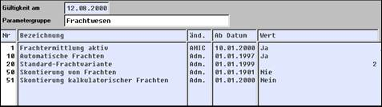

Mit Frachtermittlung aktiv wird die Frachtermittlung eingeschaltet

Die automatische Frachtermittlung wird hiermit aktiviert; ansonsten ist nur eine manuelle im Vorgang möglich, hierauf wird später eingegangen

Als Default Frachtvariante wird hier die gewünschte eingetragen; auf die Bedeutung wird später eingegangen

Frachten werden häufig im Vorgang nicht skontiert, dann ist „Nie“ einzutragen. Alternativ erfolgt die Skontierung entsprechend der Ware oder immer

Obige Möglichkeiten bestehen auch bei kalkulatorischen Frachten

Die Einrichtung der erforderlichen Parameter erfolgt im Abschnitt **Frachtverwaltung**:

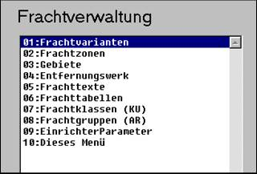

Zur Lösung des Frachtproblems sind alle Programmpunkte erforderlich. Darüber hinaus sind folgende Stammdaten betroffen:

Versandarten

Kundenstamm

Artikel

Lagerstamm

Eine **Frachtvariante** ist quasi eine Überschrift für eine Frachtenabwicklung und besteht aus Nummer und Text:

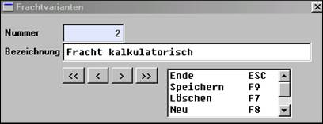

Es sind die (Fracht-) **Gebiete** festzulegen, für die später Frachten ermittelt werden sollen. Auch hier sind lediglich Nummer und Bezeichnung erforderlich. Die GTB Nummer spielt mittlerweile keine Rolle mehr:

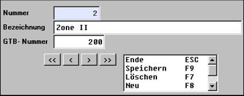

Über **Frachtzonen** werden später Frachtbelastungen zugeordnet:

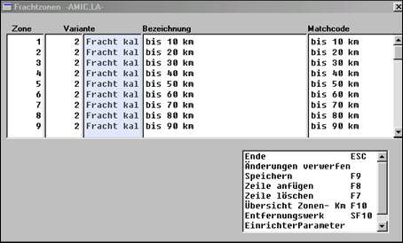

Es wird eingegeben:

Die (frei wählbare) Nummer der Frachtzone, eine Bezeichnung und der Matchcode

Die Frachtzone wird mit der (Fracht-) Variante (s.o.) verknüpft. In unserem Beispiel wird davon ausgegangen, dass immer die gleiche Variante eingesetzt wird!

Für die Fahrt von einem Gebiet zum anderen fallen Frachten an. Im **Entfernungswerk** wird eingetragen:

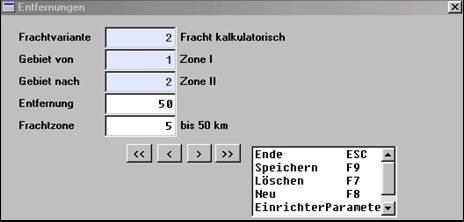

Entfernung und Frachtzone sind später entscheidende Faktoren für die Kosten­er­mitt­lung. Auch hier wird die gleiche Variante für alle Relationen eingesetzt.

**Frachttexte** werden bei der Zuordnung der Frachttabellen verwendet:

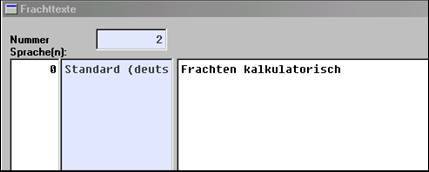

In den **Frachttabellen** werden die entscheidenden Parameter der Frachtkosten­ermitt­lung abgelegt:

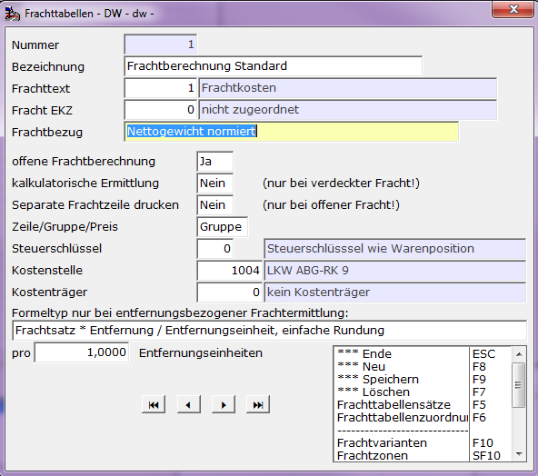

| Nummer | Numerische Identifikation der Tabelle |
| --- | --- |
| Bezeichnung | Inhaltliche Bezeichnung |
| Frachttext | Text zu Darstellung auf dem Formular |
| Fracht EKZ | Bei verschieden von 0 handelt es sich hier um eine abweichende Erlöskennziffer von der Erlöskennziffer der betroffenen Warenposition |
| Frachtbezug | Hier wird festgelegt, welche Größe zur Auffindung des Frachtsatzes herangezogen wird. Die hier ausgewählte Größe erscheint im Pfleger für Frachtsätze unter der Spalte Bezug = … |
| Offene Frachtberechnung | Soll die errechnete Fracht ausgewiesen oder verdeckt in den Wert der Warenposition eingerechnet werden |
| Kalkulatorische Fracht | |
| Separate Frachtzeile drucken | |
| Zeile/Gruppe/Preis | |
| Separate Frachtzeile drucken | |
| Zeile/Gruppe/Preis | |
| Steuerschlüssel | |
| Kostenstelle | |
| Kostenträger | |
| Formeltyp bei Entfernung | |
| Pro Entfernungseinheiten | |

Verschiedene Frachtbezüge:

| Übersicht Frachtbezug  
Der Frachtbezug gibt an, welche Größe zum Suchen in den Frachtsätzen (Bezug) herangezogen wird. |
| --- |
| 1 | Warenwert | Ein Prozentsatz des Warenwertes wird als Fracht berechnet |
| 2 | Positionsanzahl | Ein pauschaler Satz wird pro Lieferung berechnet |
| 3 | Entfernung | Ein pauschaler Satz wird pro Position berechnet |
| 4 | Liefermenge | Ein pauschaler Satz wird pro Kilometer berechnet |
| 5 | Nettogewicht | Satz wird pro Mengeneinheit (z.B. Sack) berechnet |
| 6 | Bruttogewicht | Satz wird pro Mengeneinheit und Kilometer berechnet |
| 7 | Nettogewicht normiert | Satz wird pro Nettogewichtseinheit berechnet |
| 8 | Bruttogewicht normiert | Satz wird pro Nettogewichtseinheit und Kilometer berechnet |
| 9 | Verpackung | Satz wird pro Nettogewichtseinheit berechnet |

Von oben dargestellten sind derzeit die entfernungsabhängigen nicht aktiv (4,16,26,36). Für das weitere Vorgehen wird „Satz pro Mengeneinheit“ ausgewählt.

Bei „offener Frachtberechnung“ wird im Beleg die Fracht zusätzlich zum Warenwert ermittelt und ausgedruckt. Bei kalkulatorischer Fracht, die wir ermitteln wollen, handelt es sich um eine verdeckte Ermittlung, die den Rechnungsbetrag nicht erhöht.

Je nach Frachtermittlung ist im Feld „kalkulatorisch“ Ja oder Nein einzugeben

Bei Gruppenfracht erfolgt ein Frachtnachweis für den gesamten Beleg. Hier soll jedoch eine zeilenweise Ermittlung erfolgen.

Nur bei echter und offener Frachtermittlung können Frachten steuerlich anders als die Ware behandelt werden. Wenn Artikel mit unterschiedlichen Steuersätzen berücksichtigt werden müssen, sind entsprechende Frachttabellen anzulegen!

Formeltyp bei entfernungsbezogener Ermittlung: Z.Z. nicht aktiv!

Mit F5 werden die Frachtsätze eingegeben:

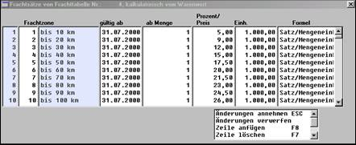

| Frachtformel  
Die Frachtformel gibt an, wie die Fracht berechnet wird |
| --- |
| 1 | % vom Warenwert | Ein Prozentsatz des Warenwertes wird als Fracht berechnet |
| 2 | Pausch. / Lieferung | Ein pauschaler Satz wird pro Lieferung berechnet |
| 3 | Pausch. / Position | Ein pauschaler Satz wird pro Position berechnet |
| 4 | Pausch. / km | Ein pauschaler Satz wird pro Kilometer berechnet |
| 15 | Satz / Mengeneinheiten | Satz wird pro Mengeneinheit (z.B. Sack) berechnet |
| 16 | Satz / ME + km | Satz wird pro Mengeneinheit und Kilometer berechnet |
| 25 | Satz / Gewicht | Satz wird pro Nettogewichtseinheit berechnet |
| 26 | Satz / Gewicht + km | Satz wird pro Nettogewichtseinheit und Kilometer berechnet |
| 27 | Satz / Bruttogewicht | Satz wird pro Bruttogewichtseinheit berechnet |
| 28 | Satz / Bruttogewicht + km | Satz wird pro Bruttogewichtseinheit und Kilometer berechnet |
| 29 | Satz / normiertes Gewicht | Satz wird pro Bruttogewichtseinheit berechnet |
| 30 | Satz / normiertes Gewicht + km | Satz wird pro Bruttogewichtseinheit und Kilometer berechnet |
| 31 | Satz / normiertes Bruttogewicht | Satz wird pro Bruttogewichtseinheit berechnet |
| 32 | Satz / norm. Bruttogewicht + km | Satz wird pro Bruttogewichtseinheit und Kilometer berechnet |
| 35 | Satz / Verpackung | Satz wird pro Verpackungseinheit berechnet |
| 36 | Satz / Verpackung + km | Satz wird pro Verpackungseinheit und Kilometer berechnet |

Je Frachtzone erfolgt die Eingabe des Satzes mit dem Beginn der Gültigkeit, der Menge, ab dem der Satz gültig ist: In obigem Beispiel gilt für Frachtzone 1 ab dem 31.7.2000 ab 1 Mengeneinheit ein Frachtsatz von –5,00 je 1000 Mengen­einheiten. In einer Tabelle können somit auch unterschiedliche Zeiträume und Men­genstaffeln mit unterschiedlichen Sätzen versehen werden.

Jetzt erfolgt die Zuordnung der Frachttabelle zu Kunden, Artikeln und Versandarten:

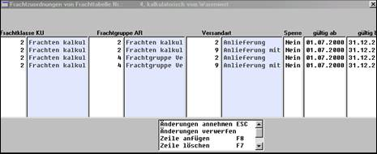

Hierzu werden die Frachtklasse Kunden, die Frachtgruppe Artikel und eine Versandart in Beziehung gesetzt. Diese sollten natürlich vorher vorbereitet sein.

Die **Frachtklasse Kunden** werden bei allen Kunden eingetragen, die nach dem gleichen Verfahren abgewickelt werden sollen:

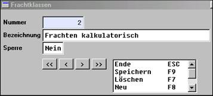

Entsprechend erfolgt die Eintragung für die **Frachtgruppe Artikel**:

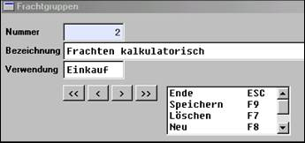

Hier ist es erforderlich, für Einkauf und Verkauf jeweils eine Frachtgruppe zu definieren.

Im Vorgang wird die Frachtkostenermittlung (auch) durch die Wahl der **Versandart** ausgelöst:

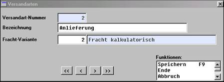

In diesem Fall wird mit der Versandart 2 die oben beschriebene Frachtvariante aktiviert. Eine andere Versandart kann dann also auch zu einer völlig anderen Frachtermittlung führen.

Zur automatischen Frachtermittlung fehlen jetzt noch die Eintragungen im Kunden- und Artikelstamm:

Für den Artikel ist die Zuordnung der Frachtgruppe im Bereich Gruppen­zuordnungen erforderlich. Alle Artikel gleicher Artikelgruppe werden dann bei Einsatz obiger Systematik gleich behandelt. Für den Verkauf ist es in diesem Beispiel die Frachtgruppe 4, für den Einkauf die Frachtgruppe 2.

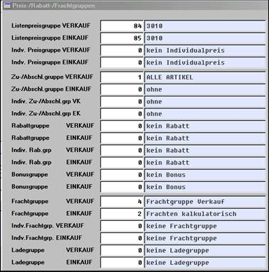

Bei den Kunden ist die Eintragung der Frachtklasse (in den Stammdaten in Gruppen / Klassen) erforderlich:

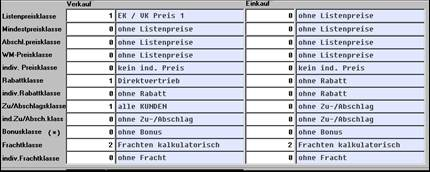

In diesem Beispiel wird Einkauf und Verkauf gleich abgewickelt.

Zusätzlich muss der Kunde einem Gebiet zugeordnet werden, da der Transport die Kosten von Gebiet zu Gebiet berücksichtigt. Dies erfolgt im Anschriftenstamm im Feld Gebietsnummer:

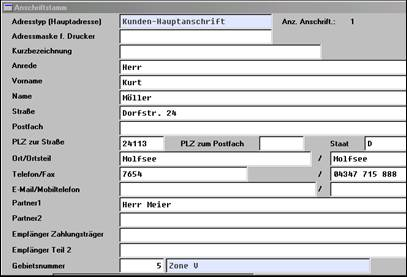

Genauso erfolgt die Eintragung im Lagerstamm, denn der Vorgang beginnt ja in der Regel beim Ausgangslager.

Mit diesen Eintragungen sind die Stammdaten vollständig; der automatischen kalkulatorischen Ermittlung von Frachten steht nichts mehr im Weg.
