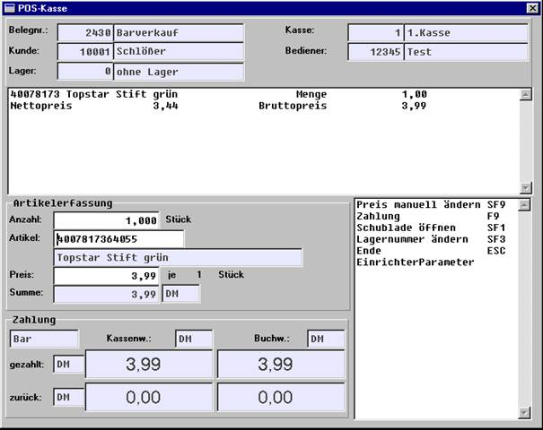
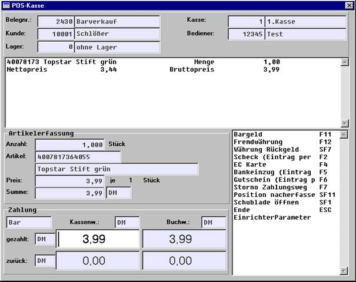
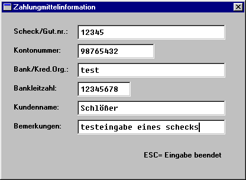
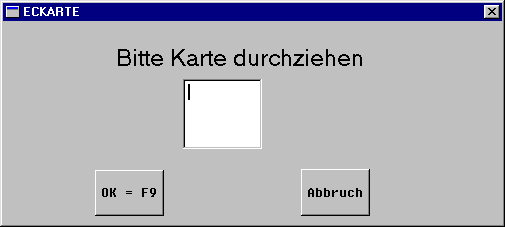
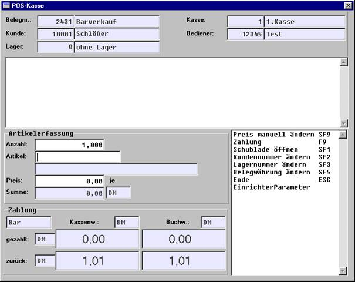
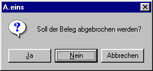
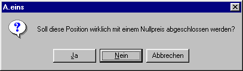
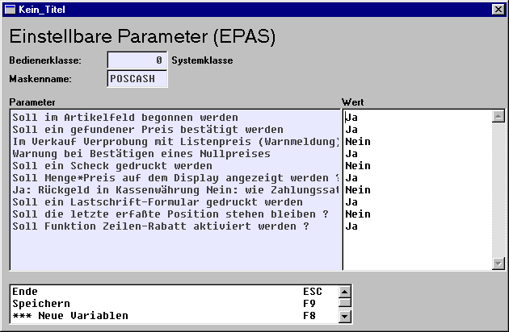
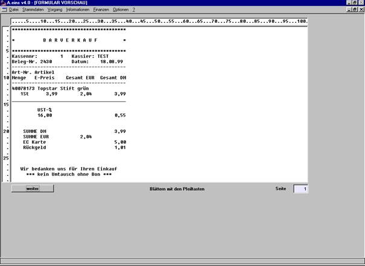
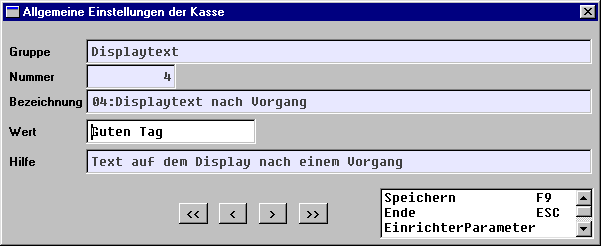

# Beschreibung eines POS-Vorgangs

<!-- source: https://amic.de/hilfe/beschreibungeinesposvorgangs.htm -->

Innerhalb jedes Vorgangs stehen folgende Funktionen zur Verfügung, die allerdings nur zu gewissen Zeitpunkten innerhalb des Vorgangs gelten und deshalb teilweise „verschwinden“:

Kundennummer ändern (SF2), d.h. es ist zu Beginn eines Vorgangs möglich, diesen Vorgang verschiedenen Kunden zuzuordnen. Standardmäßig wird der Barverkaufskunde vorbelegt.

Belegwährung ändern (SF5), d.h. es ist möglich, zu Beginn eines Vorgangs die Währung festzulegen, in der die Positionen erfasst werden sollen. Diese ist standardmäßig mit der Währung des Kunden identisch.

Die Belegnummer wird automatisch aus dem Barverkaufsnummernkreis vorbelegt und kann nicht manuell geändert werden.

Lagernummer ändern (SF3), d.h. es kann vor der Erfassung eines Artikels festgelegt werden, aus welchem Lager er stammen soll, dabei wird zu Beginn eines Vorgangs die Lagernummer gemäß Eintrag in den Vorgangskonstanten (VKONS) genommen. Diese Vorbelegung gilt auch für den nächsten Vorgang, wenn die Lagernummer während des letzten Vorgangs über SF3 geändert wurde, d.h. diese Lagernummeränderung ist nur temporär, eine ständige Änderung sollte über die Vorgangskonstanten eingetragen werden.

Preis manuell ändern (SF9), siehe 2b).

Die Menge ist standardmäßig mit 1 vorbelegt, sie muss nur verändert werden, wenn größere Einheiten eines Artikels verkauft werden (um in dieses Feld zu kommen, muss vor der Erfassung des Artikels die Richtungstaste nach oben betätigt werden). Auch Gebinde werden standardmäßig mit 1 gemäß Einheit der Grundmengeneinheit vorbelegt.

Um den letzten erfassten Artikel noch mal zu erfassen, muss nur durch Return der sich noch im Artikeleingabefenster befindliche Artikel bestätigt werden (wenn der EPA zur Bestätigung des Preises eingeschaltet ist, ist auch noch der Preis durch Return zu bestätigen).

Mit CF11 kann man dem System mitteilen, dass der nächste Artikel als Wertartikel erfasst werden soll, d.h. der Artikel, der als nächstes erfasst wird. Diese Eigenschaft gilt für jeweils einen Artikel, d.h. beim Erfassen des nächsten Artikels handelt es sich standardmäßig um keinen Wertartikel.

Über SF6 kann man für den letzten erfassten Artikel einen Zeilen-Rabatt gewähren. Diese Funktion ist nur nach abgeschlossener Erfassung eines Artikels aktiv und kann über EPA abgeschaltet werden. Zurzeit ist dann nur die Eingabe eines Prozentsatzes möglich.

Das Löschen/Stornieren einer erfassten Position ist nur möglich, indem man die Erfassung des zu stornierenden Artikels mit negativer Menge wiederholt; es wird dann dieser Artikel dementsprechend gedruckt.

Zahlung (F9), d.h. durch Betätigen dieser Taste wird dem System mitgeteilt, dass die Artikelerfassung abgeschlossen ist. Es wird dann automatisch in den Bezahlmodus umgeschaltet. In diesem Modus kann man den Betrag in dem dann frei geschalteten Feld eingeben. Standardmäßig befindet man sich in der Zahlungsart bar, wo auch der vom Kunden noch zu zahlende Betrag in Kassenwährung eingetragen ist. Diese Funktion ist nur dann aktiv, wenn die letzte Position komplett erfasst ist (z.B. ist sie inaktiv, wenn man sich im Preisfeld befindet, um einen gefundenen Preis manuell nachzubearbeiten).

Schublade öffnen (SF1), d.h. durch Betätigen dieser Taste kann zu jeder Zeit die Schublade geöffnet werden, wenn man sich auf dieser Maske befindet. Standardmäßig wird sie beim Umschalten von der Artikelerfassung in den Bezahlmodus über F9 geöffnet.

Bargeld (F11), d.h. man schaltet die Zahlungsart bar ein, die beim Wechsel in den Bezahlmodus ja automatisch vorbelegt ist.

Fremdwährung (F12), d.h. durch Betätigung dieser Taste kann man sich die Währung auswählen, in der der folgende Zahlungsverkehr durchgeführt werden soll.

Position nacherfassen (SF11), d.h. durch die Betätigung dieser Taste gelangt man ohne den Vorgang abzuschließen in den Artikelerfassungsbereich zurück, so dass man die Möglichkeit besitzt, nach Bekanntgabe des Zahlungsbetrages Artikel zurückzugeben bzw. weitere Artikel nachzuerfassen, solange nicht der vollständige Betrag validiert wurde.

Scheck (F2), d.h. wenn man sich im Feld zur Eingabe des Zahlungsbetrages befindet, kann man durch F2 eine Maske aufrufen, in der zusätzliche Information über den Scheck erfasst werden kann, die nach Fertigstellen des Paralleldrucks auf einem Scheckformular ausgedruckt werden kann. Wenn die draufgeladene Maske mit den Zusatzinformationen über ESC verlassen wurde, ist der Betrag des Schecks im Bezahlfeld einzugeben.

Kreditkarte (F4), diese Funktion verhält sich wie unter m), es kann Kreditkarteninformation erfasst werden.

Zu diesem Zeitpunkt kann eine EC-Karte durch das der Tastatur vorgeschaltete Lesegerät durchgezogen werden. Dabei wird die EC-Karten-Information ausgelesen und automatisch im System abgelegt. Dabei wird der gesamte Restzahlungsbetrag als bezahlt angesehen. Wenn diese Maske ohne Eingabe durch ESC verlassen wurde, gelangt man in dieselbe Maske wie bei der Scheckerfassung, wo man manuelle Information eingeben kann. Die erste Maske fürs Einlesen kann in den Kasseneinstellungen Allgemein, 1 „EC-Karte manuell erfassen“ an- bzw. ausgestellt werden. Wenn die Einstellung dort auf „Ja“ gestellt ist, gelangt man sofort in den manuellen Erfassungsmodus für die Kreditkarteninformation.

Bankeinzug (F5), diese Funktion verhält sich wie unter m), es kann Information über den Bankeinzug eingegeben werden.

Gutschein (F6), diese Funktion verhält sich wie unter m), es kann Gutscheininformation eingegeben werden.

Storno Zahlungsweg (F7), diese Funktion setzt den letzten eingegebenen Zahlungsweg zurück.

Währung Rückgeld (SF7), durch diese Funktion besitzt man die Möglichkeit, die Währung, in der das Rückgeld angezeigt werden soll, zu bestimmen. Die Voreinstellung ist über EPA wählbar (siehe auch unter EPAs, g)).

Bei Überzahlung/ausreichender Zahlung des Zahlungsbetrages wird der Rückgeldbetrag errechnet und neben zurück angezeigt. Außerdem wird der Vorgang abgeschlossen, die Rückgeldanzeige bleibt noch bis zur Erfassung der ersten Position des nächsten Vorgangs stehen. Ebenso wird der Anzeigebildschirm auf der Maske gelöscht

Wenn innerhalb eines Vorgangs schon Positionen erfasst und damit auch parallel gedruckt worden sind, wird durch Betätigen von ESC eine Abfrage bzgl. Belegabbruch geschaltet, dessen Bestätigung das Verlassen der Maske auslöst und den bisher erfassten Vorgang verwirft.

Außerdem wird auf dem parallel gedruckten Beleg ein Text ausgegeben, der diesen Beleg als Stornobeleg kennzeichnet. Außerdem wird dieser Abbruch des Vorgangs auch auf dem Display angezeigt. Wenn innerhalb der Zahlungsroutine abgebrochen wird, werden die erfassten Zahlungssätze ebenfalls zurückgesetzt. In beiden Fällen wird die Anzahl der Abbrüche innerhalb dieser Sitzung dieser Kasse in KsiAbbruchAnz in der Relation AcashBelgKsiz erhöht. Wenn der letzte Vorgang ordnungsgemäß abgeschlossen wurde, kann man ohne obigen Nachlauf über ESC aus der Maske aussteigen. (Bei der Tresenkasse wird die Anzahl der Abbrüche in KsiStornoAnz der Relation AcashBelgKsiz pro Sitzung und Kasse erhöht, wenn nach Bestätigen des Zahlungsbetrages der laufende Vorgang z.B. über F10 abgebrochen wird oder wenn nach Bestätigen des Zahlungsbetrages noch Positionen nacherfasst werden, so dass die Zahlungsroutine ein zweites Mal durchlaufen wird. Wenn allerdings der Zahlungsbetrag nicht bestätigt wurde, wird KsiStornoAnz nicht verändert).

2\. Einrichtungsanweisungen

Folgende bedienerabhängige EPAS existieren auf der POS-Maske:

Soll im Artikelfeld begonnen werden (wie auf der bisher bekannten Maske für Positionserfassungen): Wenn er auf „Ja“ steht, wird bei der Erfassung der einzelnen Positionen im Artikelfeld begonnen – die Menge kann dann nur noch durch Richtungspfeil nach oben geändert werden. Wenn er auf „Nein“ steht, wird im Eingabefeld der Menge begonnen.

Soll ein gefundener Preis bestätigt werden (wie auf der bisher bekannten Maske für Positionserfassungen): Wenn er auf „Ja“ steht, gelangt man nach Bestätigen des Artikels generell in das Preisfeld, wo dieser evtl. korrigiert werden kann. Wenn er auf „Nein“ steht, wird der Artikel nach gefundenem Preis sofort weg geschrieben. Allerdings hat man in diesem Fall noch die Möglichkeit, durch Auslösen der Funktion „Preis manuell ändern“ vor Bestätigung des Artikels dennoch in das Preisfeld zu gelangen, um so eine Preisänderung durchzuführen. Diese Funktion ist aber nur aktiv, wenn in der Parametergruppe ‚Kasse/Barverkauf‘ der SPA „Manuelle Preiseingabe bei Kasse möglich“ auf „Ja“ gesetzt ist. Wenn kein Preis bzw. ein Nullpreis durch die Aeins-Preisfindung gefunden wurde, gelangt man automatisch ins Preisfeld.

Im Verkauf Verprobung mit Listenpreis (wie auf der bisher bekannten Maske für Positionserfassungen): Wenn er auf „Ja“ steht, gibt es eine Warnmeldung, wenn der gefundene Preis nach unten geändert wurde. Wenn er auf „Nein“ steht, wird ein nach unten geänderter Preis akzeptiert.

Warnung bei Bestätigung eines Nullpreises (Neu, wie auf der bisher bekannten Maske für Positionserfassungen): Wenn er auf „Ja“ steht, gibt es eine Warnmeldung, wenn ein Nullpreis bestätigt wird, bei „Nein“ wird auch ein Nullpreis akzeptiert.

Soll ein Scheck gedruckt werden (wie auf der Zahlungsmaske): Wenn er auf „Ja“ steht, wird nach Fertigstellung des parallel erzeugten Drucks und Abschluss des Bezahlvorgangs ein Scheck auf dem Schacht angefordert, der dann bedruckt wird. Um dieses Feature zu nutzen, sollte die Druckerzuordnung auf den Schacht eingestellt sein und der Drucker für den Barverkauf über die Vorgangsdruckklassen zugeordnet sein. (Achtung: Wegen des Paralleldrucks zieht nur das erste in den Vorgangsdruckklassen eingerichtete Formular für den Paralleldruck).

Soll Menge\*Preis angezeigt werden: Wenn er auf Ja steht, wird auf dem Display der Gesamtpreis des Artikels angezeigt, der sich aus Menge\*Preis zusammensetzt. Wenn er auf Nein steht, wird wie bisher auch bei größerer Anzahl der Preis des Artikels pro Grundeinheit angezeigt. Dasselbe Feature existiert auch auf der Tresenkasse.

Ja: Rückgeld in Kassenwährung, Nein: Wie Zahlungssatz: wenn dieser EPA auf Ja steht, wird der Rückgeldsatz standardmäßig in Kassenwährung angezeigt (vgl. Kasseneinstellungen, OptiGruppe Kasse), wenn er auf Nein steht, wird er standardmäßig in der Währung des letzten Zahlungssatzes angezeigt (der ja über F12 wählbar ist); in beiden Fällen hat der Kassierer jedoch auch die Möglichkeit, die Rückgeldwährung auszuwählen durch SF7 (Währung Rückgeld), so dass das Rückgeld in der hierüber ausgewählten Währung angezeigt wird.

Soll ein Lastschrift-Formular gedruckt werden. Ist dieses auf „Ja“ gestellt wird das hinterlegte Formular auf dem in DRZ hinterlegten Drucker ausgedruckt. Das zugehörige Formular ist über OSQL lastschrift.sql aus dem SQL-Ordner einspielbar. Es wird nach Abschluss des parallel gedruckten Bons gedruckt.

Soll die letzte erfasste Position stehen bleiben. Ist dieses auf „Ja“ gestellt, wird der letzte erfasste Artikel standardmäßig voreingestellt und muss nur durch Return erneut erfasst werden. Ist er auf „Nein“ gestellt, werden nach dem Wegschreiben des Artikels die entsprechend gefüllten Felder mit Informationen über die letzte Warenposition wieder gelöscht, so dass derselbe Artikel erneut erfasst werden muss (Feature existiert auch bei der Tresenkasse).

Soll Funktion Zeilen-Rabatt aktiviert werden. Ist dieses auf „Ja“ gestellt steht die Funktion der Gewährung eines Zeilenrabattes zur Verfügung. Bei „Nein“ bleibt die Funktion deaktiviert.

Folgende SPA ziehen auf der Maske:

„Negative Warenmengen zulässig“, Nummer 5 in der Parametergruppe „Vorgangsbearbeitung Warenpos.“, der entscheidet, ob die Eingabe negativer Mengen erlaubt sein soll.

„Max. Vorkomma Mengen“, Nummer 60 in der Parametergruppe „Vorgangsbearbeitung allgemein“, der die maximale Anzahl der Vorkommastellen der einzugebenden Menge festlegt und damit deren Größe beschränkt.

„Bei Artikelauswahl Lagernummer prüfen“, Nummer 1 in der Parametergruppe „Vorgangsbearbeitung Warenpos.“, der die Artikelsuche auf das gewählte Lager beschränkt.

„Max. Vorkomma Preise“, Nummer 62 in der Parametergruppe „Vorgangsbearbeitung allgemein“, der die maximale Anzahl der Vorkommastellen des eingebbaren Preises festlegt und damit den Preis beschränkt.

„Max. Vorkomma Werte“, Nummer 61 in der Parametergruppe „Vorgangsbearbeitung allgemein“, der die maximale Anzahl der Vorkommastellen des Wertes (Menge \* Preis) festlegt und damit diesen Wert beschränkt.

„Manuelle Preiseingabe bei Kasse möglich“, Nummer 10 in der Parametergruppe „Kasse/Barverkauf“, der festlegt, ob eine Funktion zur Verfügung gestellt wird, die es ermöglicht, den gefundenen Preis zu ändern (siehe auch EPAs b)).

„Kassenprotokoll in ASCII-Datei“, Nummer 70 in der Parametergruppe „Kasse/Barverkauf“, der festlegt, ob jeder auf der POS-Kasse getätigte Vorgang in einer ASCII-Datei mitprotokolliert werden soll. Hierfür muss der Ordner Aeins/Export/kassprot existieren. Bem.: Dieser SPA wird beim Einrichten eines Ausfallsystems automatisch gesetzt, da aus dieser Datei die Daten in die restaurierte Datenbank eingespielt werden.

Bem.: Die eingestellten Werte der SPA unter a), b), c), d), e) gelten für alle Vorgänge.

 Die eingestellten Werte der SPA unter f) gelten für Tresenkasse und POS-Kasse.

Die Einstellungen in den Stammdatenpflegern Kassenverwaltung, Kassensystemverwaltung, Kasseneinstellungen können für Erfassungen über POS gemäß Tresenkasse übernommen werden.

Außerdem werden auch alle Einrichtungen in Bezug auf Formulareinrichtung übernommen.

Zur Ansteuerung über Vorgangsdruckklassen:

Für den Barverkauf (Klasse: Rechnung, Unterklasse: Barverkauf erfassen) können mehrere Drucker und Formulare hinterlegt sein.

Für die Nutzung der POS-Kasse gilt folgende Konvention:

Auf dem ersten dort hinterlegten Formular wird parallel zur Artikelerfassung gedruckt, also sollte hier als erstes ein 40-Zeichen Formular hinterlegt sein, das die Bonrolle als Drucker auswählt; ein Mitdruck auf einem Journal ist durch die Steuersequenz 1B 7A 31 am Druck Anfang des zugeordneten Druckers in den Druckertypen gewährleistet (dieser Eintrag müsste bei Nutzung des entsprechenden Druckers für die Tresenkasse schon hinterlegt sein).

ACHTUNG: Wenn für verschiedene Kunden verschiedene Vorgangsdruckklassen eingerichtet sind, muss dafür Sorge getragen werden, dass für den Barverkaufsvorgang der Bondrucker mit zugehörigem Formular als erstes Formular in der Zuordnung steht, denn es wird ja nur das erste Formular während der POS-Erfassung gezogen.

Wenn in den Vorgangsdruckklassen nichts für den Barverkauf hinterlegt/eingerichtet ist, wird das in FRZ als Druckformular hinterlegte Formular auf dem in der Druckerzuordnung hinterlegten Drucker ausgedruckt (keine Druckerumleitung einrichten, auch keine LPT-Umleitung in der AHOI.INI).

In beiden Fällen wird der Positionsteil des Bildschirmformulars aus FRZ für die Anzeige der Artikel im Fenster der POS-Kasse herangezogen, allerdings ist dort die Breite auf 75 Zeichen beschränkt.

WICHTIG: Auch jeder POS-Arbeitsplatz muss durch einen AHOI-INI-EINTRAG in der Sektion

ACASH[2] durch einen Eintrag des Kassensystems eindeutig durch eine eigene Nummer unterschieden werden, die identisch sein sollte mit der entsprechenden Nummer im Pfleger Kassensystemverwaltung (Regelung der Hardwareansteuerung). Übrigens kann dafür der schon vorhandene Eintrag für die Tresenkasse übernommen werden.

Hier ein Beispielformular:

Bem.: Es kann an einem Arbeitsplatz sowohl die Tresenkasse als auch die POS-Kasse benutzt werden, allerdings sollte man darauf achten, dass man nicht in beiden Erfassungsroutinen/Erfassungsmasken gleichzeitig erfasst.

In den Übersichten ist z.Zt. nicht gekennzeichnet, ob der Beleg durch die POS-Kasse oder die Tresenkasse erzeugt wurde.

Allgemeine Bemerkungen

Durch die POS-Kasse werden dieselben Relationen befüllt wie beim Erfassen durch die Tresenkasse, so dass die Übersichten für beide Systeme gelten; diese unterscheiden allerdings nicht, mit welchem System der Vorgang erzeugt wurde.

Da parallel gedruckt wird, sollte man auf diesen Drucker nichts umleiten, da der Druckkanal von dem zugehörigen Arbeitsplatz solange „besetzt“ ist, wie man sich auf der POS-Maske befindet (die ja nicht verlassen werden muss, um den nächsten Barverkaufsvorgang zu beginnen !!).

Wenn in FRZ bei der Klasse Rechnung und der Unterklasse Barverkauf erfassen bei Brutto-Vorgänge „Ja“ eingetragen ist, wird der eingetragene Preis als Bruttopreis interpretiert, wenn dort „Nein“ eingetragen ist, wird der eingetragene Preis als Nettopreis interpretiert.

Natürlich ist beim Barverkauf eine Bruttoerfassung zu bevorzugen und auch ein Zurückgreifen auf Bruttopreislisten.

Um einen Vorgang mit einem Minimum an Tastenkombinationen zu erfassen, sind folgende Einstellungen nötig:

EPA aus 2a) auf „Ja“ stellen

EPA aus 2b) auf „Nein“ stellen

Preispflege ist vollständig

Für jeden Artikel existiert ein EAN-Code

Dann sind nur folgende Routinen/Tasten im Standardfall auszulösen:

Einscannen/einlesen der Artikel, bis alle Positionen erfasst sind

Durch F9 wird das Wechseln in den Bezahlmodus ausgelöst und die Schublade geht auf

Der kassierte Bargeldbetrag wird eingegeben und in die Kasse gelegt (evtl. natürlich noch der errechnete Rückgeldbetrag per Hand ausgegeben)

Die Kassenschublade wird per Hand wieder geschlossen

ACHTUNG: Nach Bestätigen eines ausreichenden Zahlungsbetrages besteht keine Möglichkeit mehr, den Vorgang abzubrechen.

In Sonderfällen (z.B. Scheck, Währung) müssen mehr Tasten bedient werden.

Bem.: Aufgrund des parallel durchgeführten Druckens, ist es verboten worden, solange man sich in der POS-Kasse befindet, über SF4 oder das Pulldown-Menü in einen anderen Bereich zu kommen.

Bem.: Das System ist bisher überwiegend in einer Hardwarekonstellation getestet worden, in der das EPSON-Display an einer COM-Schnittstelle angeschlossen wurde, der EPSON-Bondrucker an einer LPT-Schnittstelle und die Schublade am Drucker.

Bem.: Nach Beenden eines Vorgangs, besteht die Möglichkeit, den Kunden übers Display zu verabschieden bzw. den nächsten zu begrüßen; d.h. der nächste Kunde sieht bis zur Erfassung des ersten Artikels nicht mehr den Rückgeldbetrag des letzten Kunden.

Um dieses Feature zu erhalten, kann in den Kasseneinstellungen „Displaytext“, „4“ der anzuzeigende Wert eingetragen werden, der standardmäßig auf „Guten Tag“ eingestellt ist. Wenn dieses nicht geschehen soll, ist kein Wert einzutragen (d.h. dann wird die letzte Anzeige beibehalten). Dieser Eintrag in den Kasseneinstellungen gilt auch für die Tresenkasse (es gibt eine Displayanzeige beim Verlassen der Zahlungsmaske).

