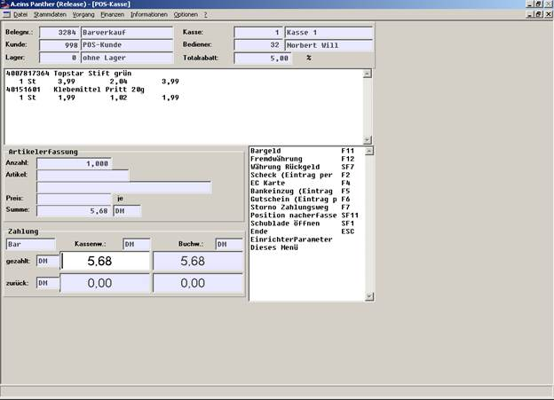
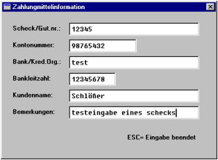
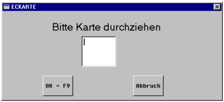
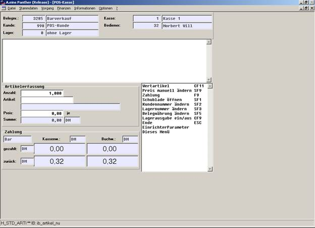
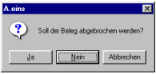
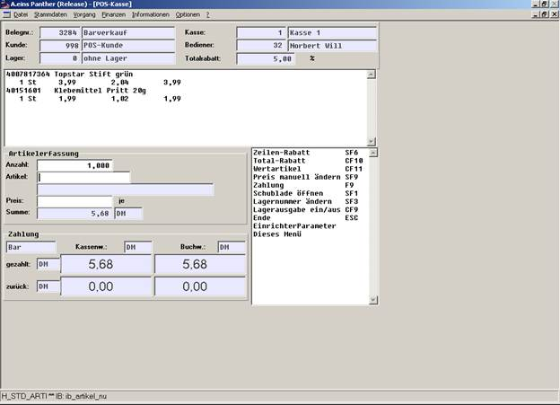
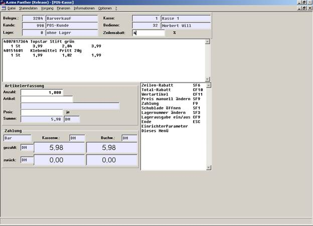
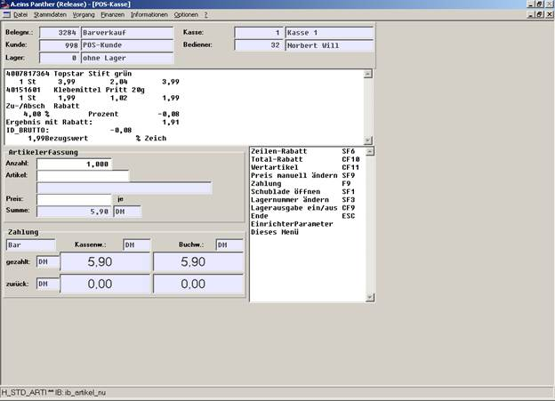

# Beschreibung der POS- Kassenfunktionen

<!-- source: https://amic.de/hilfe/beschreibungderposkassenfunkti.htm -->

Innerhalb eines POS- Erfassungsvorgang stehen weniger Funktionalitäten/Module als bei der Tresenkasse zur Verfügung.

Das Modul selbst befindet sich im Hauptauswahlmenü: Warenwirtschaftssystem/Barvorgänge/POS-Kasse.

Die Funktionen zur Bearbeitung stehen in der Option Box zur Verfügung.

Hier werden abhängig vom Fortgang der Vorgangsbearbeitung die Funktionen unterdrückt oder angezeigt.

So kann es vorkommen, dass nicht alle Funktionen, die unten beschrieben werden, auch aktuell auf Ihrem Bildschirm angezeigt werden.

Kundennummer ändern (SF2),

d.h. es ist zu Beginn eines Vorgangs möglich, diesen Vorgang verschiedenen Kunden zuzuordnen. Standardmäßig wird der Barverkaufskunde vorbelegt (dieser ist in den Kasseneinstellungen hinterlegt).

Belegwährung ändern (SF5),

d.h. es ist möglich, zu Beginn eines Vorgangs die Währung festzulegen, in der die Positionen erfasst werden sollen. Diese ist standardmäßig mit der Währung des Kunden identisch.  
Die Belegnummer wird automatisch aus dem Barverkaufsnummernkreis vorbelegt und kann nicht manuell geändert werden.  
    

Lagernummer ändern (SF3),

d.h. es kann vor der Erfassung eines Artikels festgelegt werden, aus welchem Lager der Artikel stammen soll, dabei wird zu Beginn eines Vorgangs die Lagernummer gemäß Eintrag in den Vorgangskonstanten (VKONS) genommen. Diese Vorbelegung gilt auch für den nächsten Vorgang, wenn die Lagernummer während des letzten Vorgangs über SF3 geändert wurde, d.h. diese Lagernummeränderung ist nur temporär, eine ständige Änderung sollte über die Vorgangskonstanten eingetragen werden.  
    

Preis manuell ändern (SF9),

siehe Einrichterparameter Soll ein gefundener Preis bestätigt werden.  
    

Mengenvorbelegung

Die Menge ist standardmäßig mit 1 vorbelegt, sie muss nur verändert werden, wenn größere Einheiten eines Artikels verkauft werden (um in dieses Feld zu kommen, muss vor der Erfassung des Artikels die Richtungstaste nach oben betätigt werden). Auch Gebinde werden standardmäßig mit 1 gemäß Einheit der Grundmengeneinheit vorbelegt. Es gibt allerdings den EPA **Soll im Artikelfeld begonnen werden.** Ist dieser auf Nein gesetzt, beginnt man jede Erfassung im Mengenfeld.

    
Um **den letzten erfassten Artikel noch mal** zu **erfassen**, muss nur durch Return der noch im Artikeleingabefenster befindliche Artikel bestätigt werden; um dieses Feature zu nutzen, ist der Einrichterparameter **Soll die letzte erfasste Position stehen bleiben** auf **Ja** zu stellen (wenn der EPA zur Bestätigung des Preises eingeschaltet ist, ist auch noch der Preis durch Return zu bestätigen). Ansonsten wird die Vorbelegung gelöscht.

Wertartikel CF 11,

mit CF11 kann man dem System mitteilen, dass der nächste Artikel als Wertartikel erfasst werden soll, d.h. der Artikel, der als nächstes erfasst wird, ändert den Bestand nicht. Diese Eigenschaft gilt für jeweils einen Artikel, d.h. beim Erfassen des nächsten Artikels handelt es sich defaultmäßig um keinen Wertartikel. Wenn diese Funktion ausgeführt wurde, ist die Artikelauswahl größer, da jetzt auch Artikel in der F3-Box erscheinen, die nur als Wertartikel erfasst werden dürfen (vgl. auch die Einstellung beim SPA **Dienstleistungen nur als Wertartikel**).

Das **Löschen/Stornieren einer erfassten Position** ist nur möglich, indem man die Erfassung des zu stornierenden Artikels mit negativer Menge wiederholt; es wird dann dieser Artikel dementsprechend gedruckt.  
    

Zahlung (F9),

d.h. durch Betätigen dieser Taste wird dem System mitgeteilt, dass die Artikelerfassung abgeschlossen ist. Es wird dann automatisch in den Bezahlmodus umgeschaltet. In diesem Modus kann man den Betrag in dem dann freigeschalteten Feld eingeben. Standardmäßig befindet man sich in der Zahlungsart bar, wo auch der vom Kunden noch zu zahlende Betrag in Kassenwährung eingetragen ist. Diese Funktion ist nur dann aktiv, wenn die letzte Position komplett erfasst ist (z.B. ist sie inaktiv, wenn man sich im Preisfeld befindet, um einen gefundenen Preis manuell nachzubearbeiten).

Schublade öffnen (SF1),

d.h. durch Betätigen dieser Taste kann zu jeder Zeit die Schublade geöffnet werden, wenn man sich auf dieser Maske befindet. Standardmäßig wird sie beim Umschalten von der Artikelerfassung in den Bezahlmodus über F9 geöffnet.

Bargeld (F11),

d.h. man schaltet die Zahlungsart bar ein, die beim Wechsel in den Bezahlmodus ja automatisch vorbelegt ist.  
    

Fremdwährung (F12),

d.h. durch Betätigung dieser Taste kann man sich die Währung auswählen, in welcher der folgende Zahlungsverkehr durchgeführt werden soll.  
    

Position Nacherfassen (SF11),

d.h. durch die Betätigung dieser Taste gelangt man ohne den Vorgang abzuschließen in den Artikelerfassungsbereich zurück, so dass man die Möglichkeit besitzt, nach Bekanntgabe des Zahlungsbetrages Artikel zurückzugeben bzw. weitere Artikel nachzuerfassen, solange nicht der vollständige Betrag validiert wurde. Ebenso besteht jetzt auch noch die Möglichkeit einen Totalrabatt zu gewähren.  
Bisher eingegebene Teilzahlungen werden zurückgesetzt.

****

Scheck (F2),

d.h. wenn man sich im Feld zur Eingabe des Zahlungsbetrages befindet, kann man durch **F2** eine Maske aufrufen, in die zusätzliche Informationen über den Scheck erfasst werden kann, die nach Fertigstellen des Paralleldrucks auf einem Scheckformular auf dem unter DRZ Druckerzuordnung eingestellten Drucker ausgedruckt werden kann. Wenn die draufgeladene Maske mit den Zusatzinformationen über ESC verlassen wurde, ist der Betrag des Schecks im Bezahlfeld einzugeben.

Kreditkarte (F4),

es können Kreditkarteninformationen erfasst werden.

Zu diesem Zeitpunkt kann eine EC_Karte durch das der Tastatur vorgeschaltete Lesegerät durchgezogen werden. Dabei wird die EC_Karten-Information ausgelesen und automatisch im System abgelegt. Dabei wird der gesamte Restzahlungsbetrag als bezahlt angesehen. Wenn diese Maske ohne Eingabe durch ESC verlassen wurde, gelangt man in dieselbe Maske wie bei der Scheckerfassung, wo man manuelle Information eingeben kann. Die erste Maske fürs Einlesen kann in den Kasseneinstellungen Allgemein, 1 „EC-Karte manuell erfassen“ an- bzw. ausgestellt werden. Wenn die Einstellung dort auf „Ja“ gestellt ist, gelangt man sofort in den manuellen Erfassungsmodus für die Kreditkarteninformation.  
    

Bankeinzug (F5),

es kann Information über den Bankeinzug eingegeben werden.  
    

Gutschein (F6),

es kann Gutscheininformation eingegeben werden.  
    

Storno Zahlungsweg (F7),

diese Funktion setzt den letzten eingegebenen Zahlungsweg zurück.  
    

Währung Rückgeld (SF7),

durch diese Funktion besitzt man die Möglichkeit, die Währung, in der das Rückgeld angezeigt werden soll, zu bestimmen. Die Voreinstellung ist über EPA wählbar (siehe auch unter EPAs, Rückgeld in Kassenwährung).

Bei Überzahlung/ausreichender Zahlung des Zahlungsbetrages wird der Rückgeldbetrag errechnet und neben „zurück“ angezeigt. Außerdem wird der Vorgang abgeschlossen, die Rückgeldanzeige bleibt noch bis zur Erfassung der ersten Position des nächsten Vorgangs stehen. Ebenso wird der Anzeigebildschirm auf der Maske gelöscht

Wenn innerhalb eines Vorgangs schon Positionen erfasst und damit auch parallel gedruckt worden sind, wird durch Betätigen von ESC eine Abfrage bzgl. Belegabbruch geschaltet, dessen Bestätigung das Verlassen der Maske auslöst und den bisher erfassten Vorgang verwirft.

Außerdem wird auf dem parallel gedruckten Beleg ein Text ausgegeben, der diesen Beleg als Stornobeleg kennzeichnet. Außerdem wird dieser Abbruch des Vorgangs auch auf dem Display angezeigt. Wenn innerhalb der Zahlungsroutine abgebrochen wird, werden die erfassten Zahlungssätze ebenfalls zurückgesetzt. In beiden Fällen wird die Anzahl der Abbrüche innerhalb dieser Sitzung dieser Kasse in KsiAbbruchAnz in der Relation AcashBelgKsiz erhöht. Wenn der letzte Vorgang ordnungsgemäß abgeschlossen wurde, kann man ohne obigen Nachlauf über ESC aus der Maske aussteigen. (Bei der Tresenkasse wird die Anzahl der Abbrüche in KsiStornoAnz der Relation AcashBelgKsiz pro Sitzung und Kasse erhöht, wenn nach Bestätigen des Zahlungsbetrages der laufende Vorgang z.B. über F10 abgebrochen wird oder wenn nach Bestätigen des Zahlungsbetrages noch Positionen nacherfasst werden, so dass die Zahlungsroutine ein zweites Mal durchlaufen wird. Wenn allerdings der Zahlungsbetrag nicht bestätigt wurde, wird KsiStornoAnz nicht verändert).

Totalrabatt (CF 10)

Es ist möglich, an der POS-Kasse einmalig einen Totalrabatt zu gewähren. Dieser ist nur an entsprechenden Stellen während der Erfassung in der Option-Box aktiv (CF10). Er kann noch solange gewährt werden wie der Vorgang nicht abgeschlossen ist, allerdings muss man sich im Artikelerfassungsmodus befinden (evtl. muss die Funktion SF11 Position nacherfassen genutzt werden). Der Totalrabatt wird nicht sofort gedruckt, sondern erst zusammen mit dem Fuß, der Prozentsatz wird jedoch auf der Maske oben rechts angezeigt (solange kein Zeilenrabatt auf eine Position gegeben wird). Der Totalrabatt bezieht sich auf alle erfassten Positionen, wobei die üblichen Sperren ausgewertet werden. Wird ein zweites Mal über diese Funktion ein Rabattsatz erfasst, verhält sich diese Eingabe korrigierend auf den zuerst eingegebenen Rabattsatz. Im Formular sind die Formularbereiche für Gruppenrabatt entsprechend zu versorgen.

POS-Kasse: Automatikrabatt...

In den Steuer-Parametern der Gruppe Kasse/Barverkauf gibt es 3 SPA mit denen man die automatischen Rabatte, Zu-/Abschläge und Frachten nur für Kassenvorgänge abschalten kann. Das Abschalten wurde bisher nur bei der Tresenkasse durchgeführt. Diese Automatiken durch Setzen der SPA werden jetzt auch bei der POS-Kasse durchgeführt.

POS-Kasse: Preisfindung

Wenn durch entsprechende SPA-Einstellung automatische Rabatte zugelassen wurden, wird im Feld Preis bei der POS-Kasse der um die automatischen Rabatte,... verminderte Preis angezeigt. Wenn dieser Preis jetzt validiert wurde, wurde erneut rabattiert. Dieser Fehler ist behoben: Wenn man den Preis manuell ändert, werden auf den veränderten Preis die automatischen Rabatte gezogen; wenn der Preis beibehalten wird, wird nicht erneut rabattiert, es handelt sich bei dem angezeigten Preis nämlich um den um automatische Rabatte verminderten Preis.

POS-Kasse: Zeilenrabatt

Auf der POS-Kasse ist es möglich, einen Zeilenrabatt für den letzten erfassten Artikel über SF6 zu gewähren.

Danach wird die Rabattzeile gemäß Formulareinrichtung sofort auf den angeschlossenen Drucker gedruckt.

Die Funktion Zeilenrabatt ist nur direkt nach der Erfassung eines Artikels freigeschaltet; außerdem wird die Funktion erst aktiviert, wenn der zugehörige EPA auf der Maske diese Funktion freischaltet.

So ist es möglich, die Funktion nur für gewisse Bedienerklassen zuzulassen.

Lagerabholschein, POS-Kasse

Analog zur Funktion in der Tresenkasse ist es auch in der POS-Kasse möglich, Artikel als Lagerartikel zu kennzeichnen.

Das separate Formular ist dann in der entsprechenden Vorgangsdruckklasse einzutragen (mit Effektsteuerung auf Lagerabholschein) und wird nach Abschluss des parallelen Drucks auf dem zugeordneten Drucker gedruckt, wenn mindestens ein Artikel diese Eigenschaft hat.
