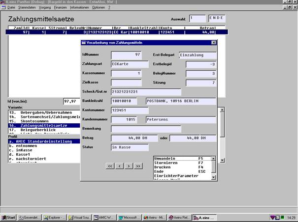

# Stornierung von Zahlungsmitteln

<!-- source: https://amic.de/hilfe/stornierungvonzahlungsmitteln.htm -->

In der AW Gesamtbarverkauf unter Warenwirtschaftssystem/Barvorgänge gibt es die Möglichkeit, Zahlungsmittel nachträglich zu bearbeiten:

Dabei besteht die Möglichkeit des Stornieren, Umwandeln und Drucken (bei Zahlungsmittel Scheck kann auch ein Scheck erneut gedruckt werden).

Diese Bearbeitung ist in den Varianten ...Überblick des entsprechenden Zahlungsmittel sowie in der Variante Zahlungsmittelsätze möglich.

1\. Stornieren:

Ein Stornieren eines Zahlungsmittels mit dem Status ‚inKasse’ (d.h. das Zahlungsmittel ist physikalisch noch in der Kasse) bewirkt:

a) Das Zahlungsmittel bekommt ein Stornokennzeichen „storniert“.

b) Es gibt einen Eintrag in ein Zahlungsmittel-Stornierungsprotokoll (AcashStoZamiProto).

c) Die Bestände des Zahlungsmittels in dieser Kasse werden vermindert.

d) Wenn der SPA 51 "Automatische Buchung der Zahlungsmittel in FiBu" gesetzt ist, wird von dem Zahlungsmittelkonto auf ein Stornokonto gebucht.

e) Über diesen Vorgang wird ein Beleg gedruckt. Hierbei besteht die Möglichkeit, durch EPA-Umstellung "Soll auf den Schacht gedruckt werden", sich selbst ein Formular zu definieren (s.u.). Ansonsten wird ein festes Formular auf dem Bon ausgedruckt.

2\. Nachstornieren:

Ein Stornieren eines Zahlungsmittels mit dem Status ‚entnommen’ (d.h. das Zahlungsmittel ist physikalisch schon entnommen) bewirkt:

a) Das Zahlungsmittel bekommt das Stornokennzeichen „nachstorniert“.

b) Es gibt einen Eintrag in ein Zahlungsmittelstornierungsprotokoll (AcashStoZamiProto).

c) Die Stornosumme/Anzahl des Zahlungsmittels wird in die Relation AcashStoKsiz aufaddiert, die alle Nachstornierungen auf allen Kassen je Barverkaufssystemsitzung aufkumuliert.

d) Wenn der SPA 51 "Automatische Buchung der Zahlungsmittel in FiBu" gesetzt ist, wird von dem Zahlungsmittelkonto auf ein Stornokonto gebucht.

e) Über diesen Vorgang wird ein Beleg gedruckt.

3\. Drucken:

Es besteht die Möglichkeit, für obige Vorgänge ein entsprechendes Formular zu entwickeln, das dann gedruckt wird, wenn auf der Maske der EPA "Soll auf den Schacht gedruckt werden" auf ja gesetzt ist. Hierzu ist ein Formular mit der Nummer 55 vorgesehen, wo folgende Felder versorgt werden:

Kopfteil:

\- in der Textvariablen Kennzeichen steht entweder der Text "Stornierung"/"Nachstornierung" bzw. "Umwandlung", "Nachumwandlung"

\- in der ZahlVariablen ZamiNr steht die Identnummer des Zahlungsmittels

\- in der TextVariablen ZahlArt steht die Zahlungsart des Zahlungsmittels

\- in der TextVariablen kurz steht bei Umwandlung der Text "aus" (wird nur bei Umwandlung versorgt)

\- in der TextVariablen Zamialt steht bei Umwandlung die Zahlungsart des Zahlungsmittels vor der Umwandlung

\- in der DatumsVariablen BelegDatum steht das Tagesdatum der Umwandlung

\- in der TextVariablen FilialBezeich steht die Filialbezeichnung gemäß LDB_FILIALE

\- in der TextVariablen FilialStrasse steht die Filialstrasse gemäß LDB_FILIALE

\- in der TextVariablen FilialPLZ steht die Postleitzahl gemäß LDB_FILIALE

\- in der TextVariablen FilalOrt steht der Ort gemäß LDB_Filiale

Positionsteil:

\- in der TextVariablen ScheckNr steht die Schecknummer

\- in der TextVariablen BLZ steht die Bankleitzahl

\- in der TextVariablen Bem steht Bemerkungstext

\- in der ZahlVariablen Summe steht der zu diesem Zahlungsmittel gehörige Betrag

Diese Druckmöglichkeit kann auch genutzt werden, um nur gewissen Zahlungsmittel-Information auszudrucken.
