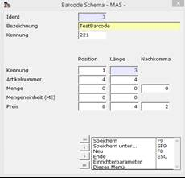
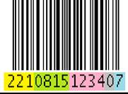

# Barcode-Schema-Einrichter

<!-- source: https://amic.de/hilfe/kommandobarcodes.htm -->

Barvorgänge > Stammdaten > Barcode Schema

oder Direktsprung [BCS]

| Feld | Inhalt |
| --- | --- |
| Ident | Interne laufende Nummer der Definition |
| Bezeichnung | Bezeichnung dieser Barcode-Schema-Definition |
| Kennung | Präfix des Barcodes. Dieser muss mit 2 beginnen und kann zwischen 1 und 3 Ziffern lang sein. Bitte beachten Sie, dass es keine Überschneidungen geben darf. Richten Sie ausschließlich zweistellige Kennungen ein, so sind maximal 10 Kombinationen möglich.  
Die Position der Kennung sollte immer 1 sein. |
| Artikelnummer | Geben Sie hier die Position und die Länge der Artikelnummer ein. |
| Menge | Geben Sie hier die Position, die Länge und die Anzahl der darin enthaltenen Nachkommastellen der Menge an. |
| Mengeneinheit | Geben Sie hier die Position und die Länge der Mengeneinheit an. |
| Preis | Geben Sie hier die Position, die Länge und die Anzahl der darin enthaltenen Nachkommastellen des Preises an. |
| Kommando | Geben Sie hier die Position und die Länge eines Kommandocodes ein. Dieser Code kann in einem Makro interpretiert und der restliche Barcode zu einem Funktionsaufruf gewandelt werden.  
Diese Barcodes können nur in der Marktkasse ausgewertet werden.  
Siehe auch [Kommandos in Barcodes](./barcode_schema_einrichter.md#Einrichten_Barcodes_Kommandos). |

Wenn Sie eine Angabe nicht machen wollen, so setzen Sie bitte die zugehörigen Werte auf 0.

Beispiel für einen Barcode, der eine vierstellige Artikelnummer, einen vierstelligen Preis mit 2 Nachkommastellen enthält:

<table class="AMIC-Tabelle" style="WIDTH: 100%; BORDER-COLLAPSE: collapse" cellspacing="0" cellpadding="0" width="100%" border="0"><tbody><tr><td style="WIDTH: 50.18%; BACKGROUND: #005d5b; PADDING-BOTTOM: 0pt; PADDING-TOP: 0pt; PADDING-LEFT: 5.4pt; PADDING-RIGHT: 5.4pt" width="50%">

</td><td style="WIDTH: 49.82%; BACKGROUND: #005d5b; PADDING-BOTTOM: 0pt; PADDING-TOP: 0pt; PADDING-LEFT: 5.4pt; PADDING-RIGHT: 5.4pt" width="49%">

<table class="MsoNormalTable" style="BORDER-TOP: medium none; BORDER-RIGHT: medium none; BORDER-COLLAPSE: collapse; BORDER-BOTTOM: medium none; BORDER-LEFT: medium none" cellspacing="0" cellpadding="0" border="1"><tbody><tr><td style="BORDER-TOP: black 1pt solid; BORDER-RIGHT: black 1pt solid; WIDTH: 94.7pt; BORDER-BOTTOM: black 1pt solid; PADDING-BOTTOM: 0pt; PADDING-TOP: 0pt; PADDING-LEFT: 5.4pt; BORDER-LEFT: black 1pt solid; PADDING-RIGHT: 5.4pt" valign="top" width="126">Kennung</td><td style="BORDER-TOP: black 1pt solid; BORDER-RIGHT: black 1pt solid; WIDTH: 132pt; BORDER-BOTTOM: black 1pt solid; PADDING-BOTTOM: 0pt; PADDING-TOP: 0pt; PADDING-LEFT: 5.4pt; BORDER-LEFT: medium none; PADDING-RIGHT: 5.4pt" valign="top" width="176">221</td></tr><tr><td style="BORDER-TOP: medium none; BORDER-RIGHT: black 1pt solid; WIDTH: 94.7pt; BORDER-BOTTOM: black 1pt solid; PADDING-BOTTOM: 0pt; PADDING-TOP: 0pt; PADDING-LEFT: 5.4pt; BORDER-LEFT: black 1pt solid; PADDING-RIGHT: 5.4pt" valign="top" width="126">Artikel</td><td style="BORDER-TOP: medium none; BORDER-RIGHT: black 1pt solid; WIDTH: 132pt; BORDER-BOTTOM: black 1pt solid; PADDING-BOTTOM: 0pt; PADDING-TOP: 0pt; PADDING-LEFT: 5.4pt; BORDER-LEFT: medium none; PADDING-RIGHT: 5.4pt" valign="top" width="176">0815</td></tr><tr><td style="BORDER-TOP: medium none; BORDER-RIGHT: black 1pt solid; WIDTH: 94.7pt; BORDER-BOTTOM: black 1pt solid; PADDING-BOTTOM: 0pt; PADDING-TOP: 0pt; PADDING-LEFT: 5.4pt; BORDER-LEFT: black 1pt solid; PADDING-RIGHT: 5.4pt" valign="top" width="126">Preis</td><td style="BORDER-TOP: medium none; BORDER-RIGHT: black 1pt solid; WIDTH: 132pt; BORDER-BOTTOM: black 1pt solid; PADDING-BOTTOM: 0pt; PADDING-TOP: 0pt; PADDING-LEFT: 5.4pt; BORDER-LEFT: medium none; PADDING-RIGHT: 5.4pt" valign="top" width="176">12,34</td></tr><tr><td style="BORDER-TOP: medium none; BORDER-RIGHT: black 1pt solid; WIDTH: 94.7pt; BORDER-BOTTOM: black 1pt solid; PADDING-BOTTOM: 0pt; PADDING-TOP: 0pt; PADDING-LEFT: 5.4pt; BORDER-LEFT: black 1pt solid; PADDING-RIGHT: 5.4pt" valign="top" width="126">Leerstelle</td><td style="BORDER-TOP: medium none; BORDER-RIGHT: black 1pt solid; WIDTH: 132pt; BORDER-BOTTOM: black 1pt solid; PADDING-BOTTOM: 0pt; PADDING-TOP: 0pt; PADDING-LEFT: 5.4pt; BORDER-LEFT: medium none; PADDING-RIGHT: 5.4pt" valign="top" width="176">0</td></tr><tr><td style="BORDER-TOP: medium none; BORDER-RIGHT: black 1pt solid; WIDTH: 94.7pt; BORDER-BOTTOM: black 1pt solid; PADDING-BOTTOM: 0pt; PADDING-TOP: 0pt; PADDING-LEFT: 5.4pt; BORDER-LEFT: black 1pt solid; PADDING-RIGHT: 5.4pt" valign="top" width="126">Prüfziffer</td><td style="BORDER-TOP: medium none; BORDER-RIGHT: black 1pt solid; WIDTH: 132pt; BORDER-BOTTOM: black 1pt solid; PADDING-BOTTOM: 0pt; PADDING-TOP: 0pt; PADDING-LEFT: 5.4pt; BORDER-LEFT: medium none; PADDING-RIGHT: 5.4pt" valign="top" width="176">7</td></tr></tbody></table></td></tr></tbody></table>

Kommandos in Barcodes

Barcodes mit Kommandos können nur in der Marktkasse ausgewertet werden!

Wenn ein Bandscanner in Betrieb ist, so ist es unter Umständen mühselig, diesen aus der Hand zu legen, um beispielsweise einen Rabatt von 3,5% zu erfassen. Für diesen Zweck gibt es Kommandobarcodes. Diese werden erkannt, wenn die Angabe der Position des Kommandos ungleich 0 und die Länge größer 0 ist.

Der Gesamte Barcode wird zur Abarbeitung an das Vorgangskontrollmakro weitergereicht, in dem die Auswertung stattfinden muss. Das Makro legt dann eine Funktion fest, die ausgeführt werden soll und gibt dieser u.U. Parameter aus dem Barcode mit. In dem Makro „AMIC_Kontrollmakromuster“ wird dies exemplarisch für einen Barcode für 3,5% Rabatt auf die aktuelle Position getan.

**Hinweis:**

Bitte beachten Sie, dass keine weiteren Angaben wie Artikelnummer, Preis o.ä. zulässig sind und auch nicht ausgewertet werden, wenn ein Barcodekommando eingerichtet ist.
