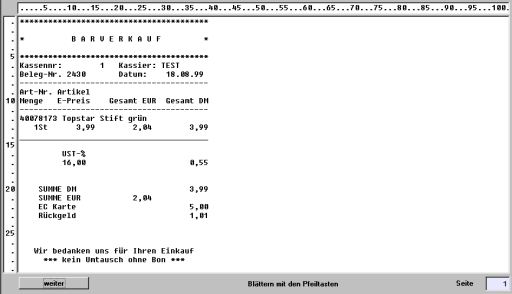

# Einrichtungsanweisungen

<!-- source: https://amic.de/hilfe/einrichtungsanweisungen.htm -->

Die Einstellungen in den Stammdatenpflegern Kassenverwaltung, Kassensystemverwaltung, Kasseneinstellungen werden für Erfassungen über POS gemäß Tresenkasse übernommen.

Außerdem werden auch alle Einrichtungen in Bezug auf Formulareinrichtung übernommen.

Zur Ansteuerung über Vorgangsdruckklassen:

Für den Barverkauf (Klasse: Rechnung, Unterklasse: Barverkauf erfassen) können mehrere Drucker und Formulare hinterlegt sein.

Für die Nutzung der POS-Kasse gilt folgende Konvention:

Auf dem ersten dort hinterlegten Formular wird parallel zur Artikelerfassung gedruckt, also sollte hier als erstes ein 40-Zeichen Formular hinterlegt sein, der die Bonrolle als Drucker auswählt; ein Mitdruck auf einem Journal ist durch die Steuersequenz 1B 7A 31 am Druck Anfang des zugeordneten Druckers in den Druckertypen gewährleistet (dieser Eintrag müsste bei Nutzung des entsprechenden Druckers für die Tresenkasse schon hinterlegt sein).

Achtung:

Bei anderen Druckern können diese Werte abweichen.

Wenn für verschiedene Kunden verschiedene Vorgangsdruckklassen eingerichtet sind, muss dafür gesorgt werden, dass für den Barverkaufsvorgang der Bondrucker mit zugehörigem Formular als erstes Formular in der Zuordnung steht, denn es wird ja nur das erste Formular während der POS-Erfassung gezogen.

Wenn in den Vorgangsdruckklassen kein spezielles Formular für den Barverkauf hinterlegt/eingerichtet ist, wird das in FRZ als Druckformular hinterlegte Formular auf dem in der Druckerzuordnung hinterlegten Drucker ausgedruckt. (wenn keine Druckerumleitung eingerichtet ist, auch keine LPT-Umleitung in der AHOI.INI).

In beiden Fällen wird der Positionsteil des Bildschirmformulars aus FRZ für die Anzeige der Artikel im Fenster der POS-Kasse herangezogen, allerdings ist dort die Breite auf 75 Zeichen beschränkt.

Hier ein Beispielformular:

**WICHTIG:**

Wie auch bei der Tresenkasse so muss auch jede aktivierte POS-Kasse mit einem in der Ahoi.ini in der Sektion ACASH[2] mit einer eigenen Nummer eingetragen werden.

Diese Nummer sollte identisch mit der Sysnr in der Kassensystemverwaltung sein.

Ein schon für eine Tresenkasse vorhandener Eintrag in der AHOI.ini kann für die POS-Kasse übernommen werden.

Siehe auch:

- [Allgemeine Bemerkungen](./allgemeine_bemerkungen.md)
