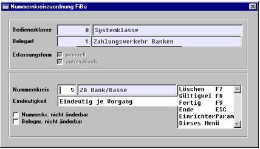

# FiBu

<!-- source: https://amic.de/hilfe/fibu.htm -->

Für Finanzvorgänge (Einzahlungen, Auszahlungen, ... auch Differenzen beim Kassenabschluss) muss pro Bedienerklasse, die Arbeiten an der Kasse durchführt, über [NKF] folgendes eingerichtet sein. (Direktverbuchung in die FiBu)

Existiert in der FiBu-Vorgangszuordnung für die Kassenbedienerklassen eine Nummernkreiszuordnung für Zahlungsverkehr Bank (für Geldeinzahlungen, Entnahmen und andere Zahlungen an der Kasse)?
