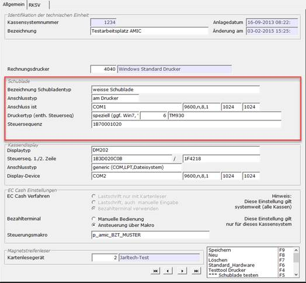
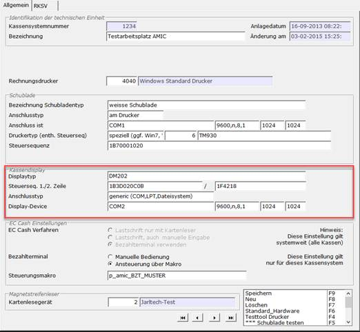
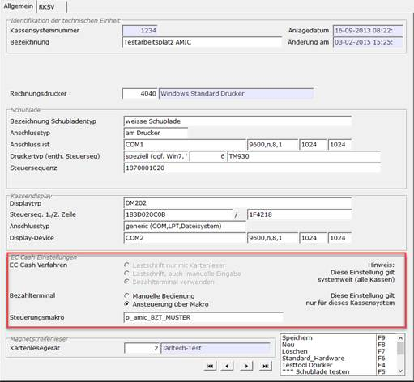

# Geräte einrichten

<!-- source: https://amic.de/hilfe/_ec_einrichtung.htm -->

<details>
<summary>Schritt 1: Schublade</summary>

Zuerst gibt man der Schublade eine Bezeichnung (z.B „Schublade Kasse 1“). Danach wählt man den Anschlusstyp. Hier ist wichtig, dass i.d.R die Schubladen über den Drucker angesteuert werden. Für so ein Setup wählt im Feld Anschlusstp „am Drucker“ aus. Im Feld Anschkluss ist muss man nun den Port eintragen, an welchen der Drucker hängt (z.B LPT/COM). Für die folgenden Einstellungen muss man in er Bedienungsanleitung des jeweiligen Gerätes gucken, welche Einstellungen richtig sind.Standard sind hier die Werte:

Baud: 9600, Parity: N, Data: 8, Stop: 1, Buffer In/Out: 1024

Sollten diese Werte abweichen, müssen die Einstellungen angepasst werden. Auch in Windows selbst können diese Einstellungen getätigt werden. Dazu „Windowstaste + R“, in das Feld „cmd“ eingeben und die Windows Konsole starten. In der Konsole nun folgenden Befehl eintragen:

```text
MODE COM1
BAUD=9600 DATA=8 PARITY=N STOP=1
```

(Im Fall, dass LPT genutzt wird auch folgenden Befehl ausführen)

```text
MODE
LPT1=COM1
```

Für den Druckertyp wählt man nun (Ab Windows 7) spziell aus. Mit F3 auf dem ID Feld wählt man den eingerichteten Drucker aus, an dem die Schublade angschlossen ist. Als letztes trägt man die Steuersequenz ein. Diese kann ebenfalls der Bedienungsanleitung entnommen werden.



</details>

<details>
<summary>Schritt 2: Kassendisplay</summary>

Zum einrichten des Kassen Displays muss zuerst der Displaytyp in das Feld eingetragen werden. Hier kann man z.B den Names des Herstelles o.ä eintragen. Als zweites muss die Steuersequenz eingetragen werden. Diese Parameter findet man i.d.R in der Bedienungsanleitung. Für den Anschlusstyp kann man wählen zwischen TCP/IP und Generic. Bei TCP/IP muss im Feld Display-Device lediglich die IP Adresse des Displays angegeben werden. Bei Generic muss man wie bei der Schublade Sowohl den Port angeben (z.B COM1), als auch die dazugehörigen Parameter).



</details>

<details>
<summary>Schritt 3: EC Gerät</summary>

Vorraussetzung:

Die Vorrausetzung, um ein EC-Gerät in A.eins einzubinden sind folgende:

\- Lan Anschluss / WLan

\- ZVT700 Protokoll unterstützung

\- Terminal hat eine Internetverbindung

\- Falls man das EC-Gerät sperat von A.eins nutzen möchte und die Summen bei erstellen der Rechnung selber eingeben möchte, stellt man den Parameter Bezahlterminal auf „Manuelle Bedienung“. Damit A.eins mit dem EC-Gerät kommuniziert, muss die ansteuerung über ein Makro passieren (amic_bzt_muster). In dem Makro müssen für den Betrieb im Verkauf noch einstellungen getätigt werden:

\- SimuationBZT(); muss ausommentiert werden

\- ZVT_700SYNC() muss entkommentiert werden

\- strCpy(Terminal, xxx) xxx muss mit, ja nach Gerät, THALES_0001 oder INGENICO_0001 ausgetauscht werden

\- strCpy(IP, xxx) xxx muss mit der IP Adresse des Gerätes ausgetauscht werden

\- strCpy(Port, xxx) xxx muss mit dem Port für das Gerät ausgetauscht werden

\- stryCpy(Password, xxx) xxx muss mit dem 6stelligen Passwort für das Gerät ausgetauscht werden

\- strCpy(ShowGui, 1) Hier kann mit 1 Der Status des Bezahlvorgangs angezeigt werden. (Zum ausblenden der Maske: diesen Code auskommentieren)

\- str(ShowAbort, 1) Zeigt an, wenn der Bezahlvorgang abgebrochen wurde. (Zum ausblenden der Maske: diesen Code auskommentieren)

Wenn alles eingetragen worden ist, trägt man das Makro in das Steuerungsmakro in der Kassensystemverwaltung ein.



</details>

<p class="siehe-auch">Siehe auch:</p>

- [Ethernet-(LAN-)COM-Ports](./ethernet_lan_com_ports.md)
