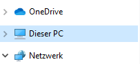
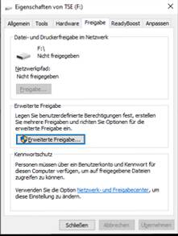
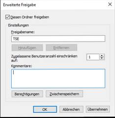
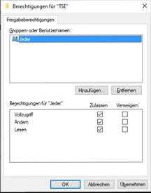
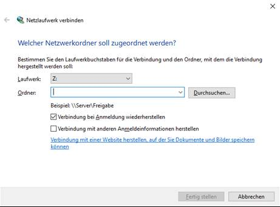

# TSE-Setup Schritt 1 Setup

<!-- source: https://amic.de/hilfe/_kassenSichVsfs1.htm -->

Schritt 1.1: TSE als Laufwerk

Um die TSE einzurichten, muss diese entweder bereits in dem Rechner eingesteckt sein, oder im Netzwerk eingebunden werden.

Schritt 1.2: TSE im Netzwerkrechner einrichten

(Man kann diesen Schritt überspringen, wenn die TSE über USB an Ihrem physischen Rechner angeschlossen ist)

Um die TSE als Netzwerklaufwerk einzurichten, muss man dies in Windows zuerst konfigurieren.

1. Zuerst das USB-Laufwerk am Netzwerkrechner freigeben.

2. Dafür am Netzwerkrechner in den Explorer navigieren und links an der Seite auf **Dieser PC** klicken.  
  
    

3. Die TSE auswählen und darauf rechtsklicken.

4. Unter **Eigenschaften** im Register **Freigabe** auf **Erweiterte Freigabe** klicken.  
  
    

5. **Diesen Ordner freigeben** aktivieren.

6. Den Freigabenamen mit **TSE** benennen.

7. Die **Zugelassene Benutzeranzahl** auf **1** setzen.  
  
    

8. Die Berechtigungen konfigurieren und gibt den Vollzugriff freigeben.  
  
    

9. Alle Einstellungen übernehmen.

Schritt 1.3: TSE im Rechner über Netzwerk einrichten.

(Man kann diesen Schritt überspringen, wenn die TSE über USB an Ihrem physischen Rechner angeschlossen ist)

Um die TSE als Netzwerklaufwerk einzurichten, muss man dies in Windows zuerst konfigurieren.

1. Den Windows Explorer öffnen.

2. Links an der Seite auf **Dieser PC** rechtsklicken

**3.** Auf **Netzwerklaufwerk verbinden** **klicken.**

Das Einrichtungsfenster öffnet sich.  
  
    

4. Im Einrichtungsfenster den Laufwerksbuchstaben auswählen.

5. In dem Textfeld **Ordner** nun in folgender Codierung den Netzwerkpfad eingeben:  
*„\\\\**\*die IP des Rechners mit der TSE (z. B 192.168.2.66) \***\\TSE“*.

6. **Verbindung bei Anmeldung wiederherstellen** aktivieren, falls deaktiviert.

7. Auf **Fertig stellen** klicken.  

[Weiter zu Schritt 2](./tse_setup_schritt_2_konfiguration.md)
