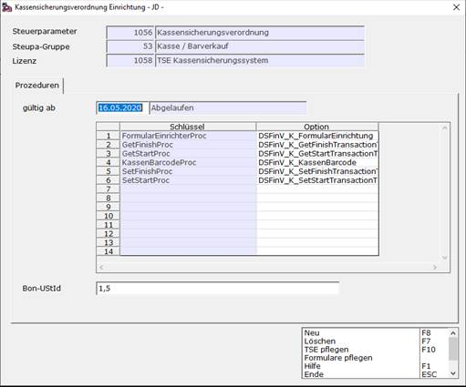
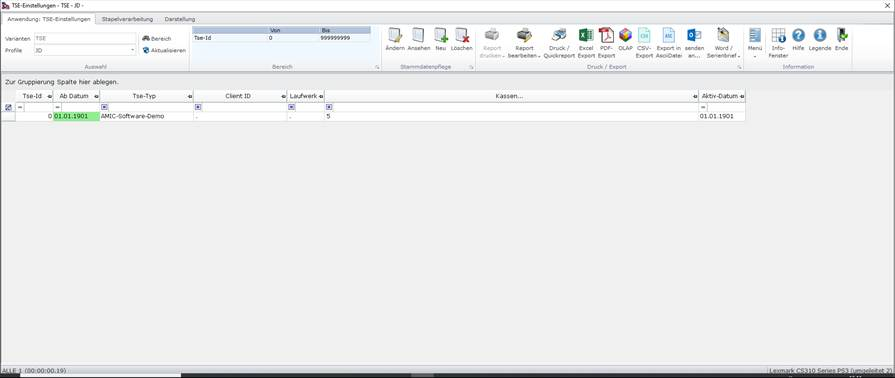
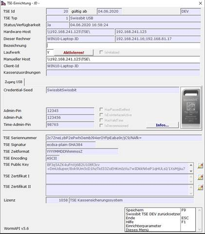

# TSE-Setup Schritt 2 Konfiguration

<!-- source: https://amic.de/hilfe/_kassenSichVsfs2.htm -->

Schritt 2.1: TSE in A.eins konfigurieren

Zu Hauptmenü > Barvorgänge > Stammdaten > Kassensicherungsverordnung Einrichtung navigieren.

Hier wird eingestellt, ab wann die Prozedur aktiv werden soll.

1. Dafür mit F3 in die jeweilige Prozedur.

2. Im Datumsfeld das passende Datum auswählen.

    

Schritt 2.2: TSE hinzufügen

Um die TSE in A.eins einzupflegen, wie folgt vorgehen:

1. Auf TSE pflegen (F10) klicken, um in die Auswahlliste der TSE zu gelangen.

**ODER:** Zu Hauptmenü > Barvorgänge > TSE Pflegen navigieren.

ODER: Direktsprung **[TSE]** wählen.

    

2. Um die TSE hinzuzufügen, entweder auf Neu oder F8 klicken.

Der Pfleger öffnet sich.  
Der große Vorteil an der TSE-Implementierung in A.eins ist, dass die TSE (wenn sie in Windows richtig eingebunden wurde) direkt erkannt wird.

Für den Fall, dass Sie mehrere TSE im Betrieb haben und nicht die Richtige erkannt wird, wechseln auf ein anderes Laufwerk.

3. Eine Bezeichnung für die TSE eintragen.

4. Auf Aktivieren! klicken.

5. Ein paar Sekunden warten.

Der Pfleger schließt sich mit einer Meldung, dass die TSE erfolgreich eingerichtet wurde.  

Schritt 2.3: TSE einer Kasse zuweisen

Um die TSE einer Kasse zuzuweisen, zu Hauptmenü > Barvorgänge > Kassenverwaltung navigieren.

1. Die zu bearbeitende Kasse auswählen.

2. Pfleger mit (F5) öffnen.

3. In dem Feld TSE-Id mit F3\-Auswahl die eingerichtete TSE auswählen.

[Weiter zu Schritt 3](./tse_setup_schritt_3_abschluss.md)
