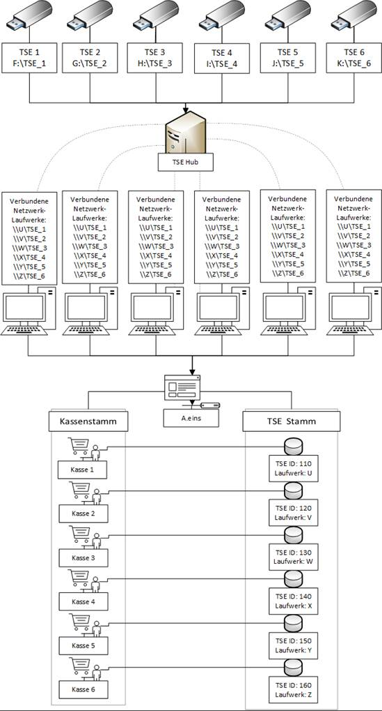

# TSE-Setup Schritt 3 Abschluss

<!-- source: https://amic.de/hilfe/_kassenSichVsfs3.htm -->

Schritt 3.1: Der Kasse eine TSE zuweisen

Um die TSE nun in Betrieb zu nehmen, müssen die Kassen die TSE hinzufügen.

Zu Hauptmenü > Barvorgänge > Stammdaten > Kassenverwaltung navigieren.

1. In der Auswahlliste der Kassen die gewünschte Kasse auswählen.

2. Kasse mit **F5** bearbeiten.

3. Im Feld TSE-ID mit **F3** die gewünschte TSE auswählen.

4. Einstellungen speichern.

Schritt 3.2: Anmerkung

Die Kasse kann jetzt wie gewohnt eröffnet werden.

Hinweis:

Beachten Sie, dass wir bis jetzt keine parallele Nutzung, von mehreren Clients auf einer TSE, supporten.

Beispiel des Aufbaus

Auf diesem Bild sehen Sie einen Beispielaufbau der TSE am Arbeitsplatz:  

