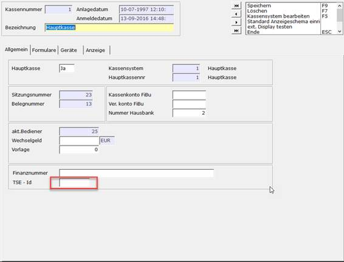

# TSE-Austausch Schritt 5-7

<!-- source: https://amic.de/hilfe/_kassenSichVsfs5B.htm -->

TSE-Austausch Schritt 5 TSE aktivieren

Hauptmenü > Barvorgänge > TSE Pflegen

Direktsprung [TSE]

TSE-Stick aktivieren

Um die TSE hinzufügen, wie folgt vorgehen:

1. Zum TSE-Pfleger [TSE] navigieren.

2. Mit Neu F8 neue TSE mit Bezeichnung anlegen.

  

3. Eine Bezeichnung für die TSE eintragen.

4. Laufwerkbuchstaben für den neuen Stick eintragen bzw. kontrollieren.

Hinweis!

Der große Vorteil an der TSE-Implementierung in A.eins ist, dass die TSE (wenn sie in Windows richtig eingebunden wurde) direkt erkannt wird.

Für den Fall, dass Sie mehrere TSE im Betrieb haben und nicht die Richtige erkannt wird, wechseln auf ein anderes Laufwerk.

5. Auf Aktivieren! klicken.

\-> Der TSE-Stick wurde aktiviert.

 

TSE-Austausch Schritt 6 TSE Kasse zuweisen

Hauptmenü > Barvorgänge > Kassenverwaltung

Direktsprung: [KA]

TSE einer Kasse ändern

1. Zur Kassenverwaltung [KA] navigieren.

2. Neue TSE-ID bzw. mit der Auswahl über F3 auswählen.

TSE-Austausch Schritt 7 Kasse eröffnen und testen

Hauptmenü > Barvorgänge > Stammdaten > Kasseneröffnung / Kassenabschluss

Die Kasse kann jetzt wie gewohnt eröffnet werden.

Um die Kasse zu eröffnen, wie folgt vorgehen:

1. Zu Barvorgänge > Stammdaten > Kasseneröffnung / Kassenabschluss navigieren.

2. Betreffende Kasse auswählen.

3. Kasse eröffnen.

4. Alle Funktionen der Kasse testen.

[Zurück](./tse_austausch_schritt_5_7.md#KassenSichV_sfs6B)
