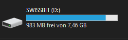
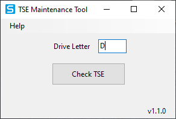
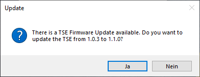
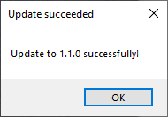

# Update/Fehlerbehebung der TSE (+TSE Maintenance Tool)

<!-- source: https://amic.de/hilfe/updatefehlerbehebungdertsetsem.htm -->

**Voraussetzungen:**

• Das TSE Maintenance Tool

• Die Admin-PIN.

(Einzusehen im TSE-Pfleger unter Tab: **Zugang USB ->** Feld: **Admin Pin**).

• TSE ist *lokal* am USB-Slot des PCs mit dem TSE Maintenance Tool eingesteckt (ein Update über *Netuse* bzw. *Netzwerklaufwerk* ist nicht möglich!).

**TSE Maintenance Tool:**

1. Das Maintenance-Tool unter: [https://www.swissbit.com/tse/maintenanceTool/setup.exe](https://www.swissbit.com/tse/maintenanceTool/setup.exe) herunterladen.

Tipp!

Im TSE-Maintenance-Tool gibt es unter der Funktion Help -> Documentation eine Anleitung zum Update der TSE.

In dieser Anleitung sind ebenfalls Hilfestellungen zur Fehlerbehebung der TSE.

Um das Update durchzuführen, wie folgt vorgehen:

2. Wenn der PC das die TSE als Speichermedium erkannt hat, den Laufwerksbuchstaben (in diesem Beispiel Laufwerk **D**) merken.

3. Das TSE Maintenance Tool starten

4. Den jeweiligen Laufwerksbuchstaben eintragen.

5. Die Funktion Check TSE ausführen.

4. Falls für die TSE ein Update vorhanden ist, kommt folgende Meldung (diese mit Ja bestätigen):

Nach der Bestätigung fragt das Tool nach der Admin Pin.

5. Die Pin in das Feld eintragen und mit Weiter bestätigen. (Dieser Vorgang kann mehrere Minuten dauern!)

Nachdem der Vorgang abgeschlossen ist, erscheint folgende Meldung:

è Damit ist die TSE erfolgreich geupdatet.

6. TSE Maintenance Tool nach dem Update beenden!

TSE-Fehlercodes:

**Fehlerbehebung:**

1. Sobald ein Fehler auftritt, einen Selbsttest der TSE durchführen:  
Zu Hauptmenü: Barverkauf -> Kassensicherungsverordnung Einrichtung -> TSE Pflegen (F10) -> Datensatz auswählen -> Funktion: Selbsttest… (F10) navigieren.

2. Alle Verbindungen prüfen (sowohl USB-Slot als auch Netzwerkkomponenten / Stabilität / Qualität).

3. Falls weiterhin Fehler auftreten, das TSE-Maintenance-Tool benutzen.

4. Falls auch danach immer noch Fehler auftreten, den AMIC-Support kontaktieren.

| Fehlercode | Beschreibung |
| --- | --- |
| 0 | Kein Error |
| 1 | Falscher Parameter |
| 2 | Keine TSE im angegebenen Pfad gefunden. |
| 3 | Zugriffsfehler bei der TSE |
| 4 | Operation-Timeout |
| 5 | Keine Speicherkapazität mehr |
| 6 | Falsche Antwort der TSE |
| 7 | Interner Speicher der TSE voll |
| 8 | Antwort der TSE fehlt. |
| 9 | TSE nicht initialisiert (Export). |
| 11 | Export fehlgeschlagen. |
| 12 | Inkrementeller Export: Falscher Status |
| 13 | Inkrementeller Export: Keine neuen Daten |
| 14 | Stromversorgungsproblem während der Befehlsausführung aufgetreten. |
| 15 | Fehler beim Starten eines Hintergrundprozesses, um die TSE-Kommunikation aufrecht zu erhalten. |
| 23 | Befehl kam in einem Moment, in der dieser von der Programm Umgebung nicht zugelassen wurde. |
| 25 | Falsche Parameter für den Export: die maximale Exportgröße unterschreitet die kleinste Größe, die exportiert werden kann. |
| 4096 | Niedrigster Fehler in Hierarchie, gemeldet von der TSE. |
| 4097 | Unspezifizierter interner Fehler |
| 4098 | Zeit nicht gesetzt. |
| 4100 | Keine Transaktion laufend. |
| 4101 | Falscher Befehl: Falsche Befehlslänge |
| 4102 | Nicht genug Daten während der Transaktion geschrieben. |
| 4103 | Ungültiger Parameter |
| 4104 | Die Transaktion wurde nicht gestartet. |
| 4105 | Die maximale Anzahl an parallellaufenden Vorgängen wurde erreicht(überschritten). |
| 4106 | Zertifikat ausgelaufen. |
| 4108 | Die letzte Transaktion ist nicht aufrufbar. |
| 4109 | Ausführung des Befehls im aktuellen Zustand nicht erlaubt. |
| 4110 | Anzahl der Signaturen überschritten. |
| 4111 | Nicht autorisiert für die Aktion |
| 4112 | Maximal Anzahl an registrieren Clients erreicht. |
| 4113 | Client nicht registriert. |
| 4114 | Fehler beim Löschen: Daten wurden nicht komplett exportiert. |
| 4115 | Fehler beim Abmelden: Client hat offene Transaktionen |
| 4116 | Fehler beim De-Kommissionieren: TSE hat offene Transaktionen |
| 4117 | Falscher Status: Es kommt keine Antwort beim Abrufen (der TSE-Daten) |
| 4118 | Falscher Status: Der aktuelle Export muss erst abgeschlossen sein. |
| 4119 | Ausführung fehlgeschlagen: TSE hat keine Speicherkapazität mehr für Operationen |
| 4176 | Falscher Status: Änderung des PUK notwendig |
| 4177 | Falscher Status: Änderung der PIN notwendig |
| 4179 | Falscher Status: Das CTSS-Interface muss gestartet sein. |
| 4180 | Falscher Status: Selbsttest benötigt. |
| 4181 | Falscher Status: Selbsttest benötigt. |
| 4349 | TSE bereits initialisiert. |
| 4350 | TSE dekommissioniert. |
| 4351 | TSE nicht initialisiert. |
| 4352 | Authentifizierung gescheitert. |
| 4609 | PIN ist blockiert. |
| 4610 | Angegebener Benutzer ist nicht authentifiziert. |
| 4864 | Selbsttest der Firmware fehlgeschlagen. |
| 4880 | Selbsttest des CSP fehlgeschlagen. |
| 4896 | Selbsttest der „Random Number Generation“ fehlgeschlagen. |
| 8193 | Gefilterter Export: Kein Export aktuell im Prozess |
| 8194 | Gefilterter Export: Keine neuen Daten, bitte erneut versuchen. |
| 8195 | Gefilterter Export: Keine Daten zu dem angegebenen Zeitraum verfügbar |
| 61440 | Befehl nicht gefunden. |
| 65280 | Signatur Erstellungsfehler |
| 65535 | Höchster Fehler in der Hierarchie, gemeldet von der TSE. |

