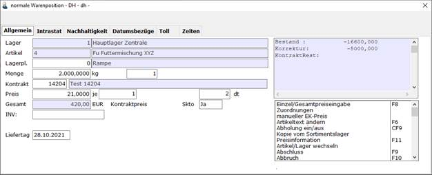
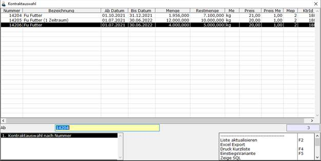
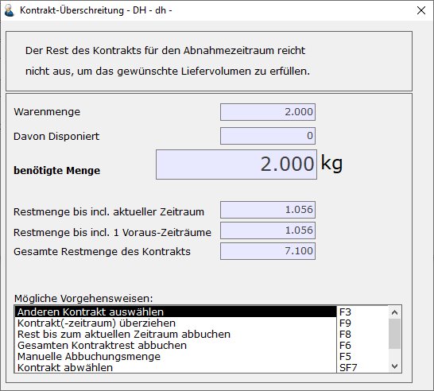
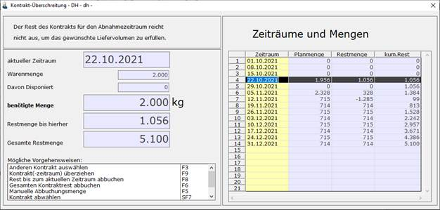
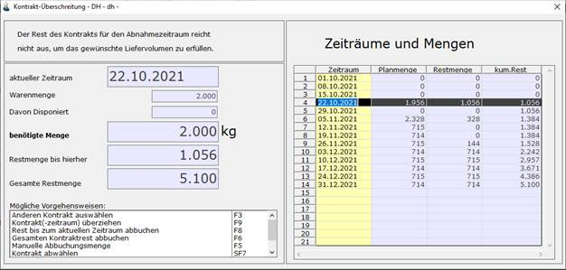

# Lieferscheinerfassung

<!-- source: https://amic.de/hilfe/_kontrakt_lieferscheinerfassung.htm -->

Bei angeschlossener Kontraktverwaltung werden die Kontraktbedingungen bei der Vorgangserfassung automatisch berücksichtigt. Mit Eingabe des Kunden, des Artikels und der Menge sind alle Informationen für die Preisfindung über den Kontrakt vorhanden.

Erfassung

Der Rechnungserfassungsbildschirm (wie auch alle anderen Vorgänge) hat dann zum Beispiel folgenden Aufbau:

Rechts neben dem Gesamtpreis wird angezeigt, dass es sich um einen Kontraktpreis handelt. In den beiden letzten Zeilen werden Kontraktnummer und -bezeichnung angezeigt

Über die Funktion ***Kontraktauswahl*** werden weitere Informationen über Laufzeit, Restmenge, etc. angezeigt.

Wenn mehr als ein zulässiger Kontrakt im Zeitraum zur Verfügung steht, zeigt A.eins, in Abhängigkeit von der Parametereinstellung und insbesondere bei Überziehung von vereinbarten Zeitraummengen, die Alternativen an:

Aus diesen Alternativen wird dann der gewünschte mittels Cursorpositionierung ausgewählt.

Ist im [Steuerungsparameter](../../firmenstamm/steuerparameter/kontraktwesen/ratierliche_einstellungen_spa_846.md)s **846 die Option** “Variable Kontraktzeitraumzuordnung“ mit dem Wert 1 eingestellt, so erscheint eine erweiterte Maske mit Darstellung der Zeiträume der Kontraktposition.

Hier kann auf der Zeitraumtabelle unabhängig vom Lieferdatum ein beliebiger Zeitraum durch Positionierung in der Zeitraum-Tabelle gewählt werden. Zu beachten ist, das bei Einstellung der Option „MENGEUEBER“ im [Steuerungsparameter](../../firmenstamm/steuerparameter/kontraktwesen/ratierliche_einstellungen_spa_846.md)s 846 mit dem Wert „1“ nicht die tatsächlichen Restmengen der einzelnen Zeiträume dargestellt werden. Stattdessen werden in einem Zeitraum auftretende negative Restmengen im jeweils folgenden Zeitraum verrechnet.

Die Handlungsalternativen werden angezeigt. Eine dieser Alternativen muss gewählt werden, da eine Übernahme von nicht möglichen Angaben nicht zugelassen wird.

Bei den Handlungsalternativen handelt es sich um die, die auch tatsächlich in diesem Augenblick bestehen. Wenn z.B. keine Restmenge mehr verfügbar ist, wird die Alternative „Rest bis zum aktuellen Zeitraum abbuchen“ nicht mehr angezeigt.

Die Restmenge wird sofort mit Erfassung der Artikelposition bei der Lieferschein-/Rechnungs-/Gutschrifterfassung in Ein- und Verkauf aktualisiert, ist also immer aktuell.

Die Handlungsalternative „Kontrakt(-zeitraum) überziehen“ ist auch dann zu wählen, wenn die Menge die im gewünschten Zeitraum zur Verfügung stehende Restmenge tatsächlich nicht überziehen würde.

Zu- und Abschläge aus Kontrakten in Vorgängen

Im Kontrakt definierte Zu-/Abschläge werden auch in der Vorgangsbearbeitung berücksichtigt, und zwar als „In-Zeile-Zu-/Abschläge”, die also nach außen unsichtbar den ausgewiesenen Einzelpreis verändern.

Es handelt sich hierbei um „Reports”, „Überschreitungs-Zuschläge” und „Paritäts-Zu-/ Abschläge”. Die beiden erstgenannten werden im Kontrakt direkt auf der ersten Seite eingegeben, der Report mit Anfangsdatum und Angabe der Periode in Tagen. Das Hinterlegen von Paritäts-Zu-/Abschlägen erfolgt je Parität auf einer speziellen Maske.

Wird eine Warenposition mit Kontraktbezug erfasst, so werden die hinterlegten Zu-/ Abschläge automatisch an die Warenposition angehängt, allerdings nur, wenn der aktivierende Steuerungsparameter (unter “Kontrakt...”) eingeschaltet wurde!

Der Report wird dabei automatisch mit der Anzahl multipliziert, wie oft das Lieferdatum um die angegebene Tagesanzahl hinter dem Bezugsdatum des Reports liegt. Hierbei gibt es zwei Sonderbehandlungen: 30 Tage werden automatisch zu vollen Monaten, 15 Tage zu halben Monaten gerechnet, was ja von Monat zu Monat geringe Abweichungen gegenüber dem rein rechnerischen Addieren von x mal 15 bzw. 30 Tagen ergibt.

Der Überziehungs-Zuschlag wird automatisch beim Überschreiten des Kontrakt-Enddatums berechnet.

Der Paritäts-Zu-/Abschlag wird dann aktiviert, wenn zu der im Vorgang eingetragenen Parität ein Zu-/Abschlag im Kontrakt hinterlegt wurde. Um die Paritätsnummer im Vorgang erfassen zu können, muss die Position im Vorgangskopf (per **[UFLD]**) in den variablen Eingabebereich der jeweiligen Vorgangsklasse eingebunden werden.

Ziehen von Kontrakten in Fremdwährungen

Mit der Behandlung von Fremdwährungen in der Vorgangsbearbeitung werden Kontrakte nur noch dann gezogen, wenn deren Währung mit der des Vorgangs übereinstimmt. Das führte aber dort zu negativen Überraschungseffekten, wo in den Kontrakten Währungsverweise informatorischen Charakters eingetragen worden waren, die Berechnung der Ware (und auch die Bepreisung der Kontrakte) aber in Standardwährung durchgeführt wird.

Jetzt wird hierbei der Steuerungsparameter für die Aktivierung von Währungen ausgewertet - ist er aktiv, so wird die Währung geprüft, ist er inaktiv, so erfolgt keine Währungsprüfung.
