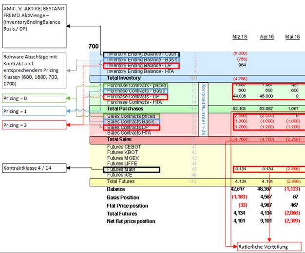
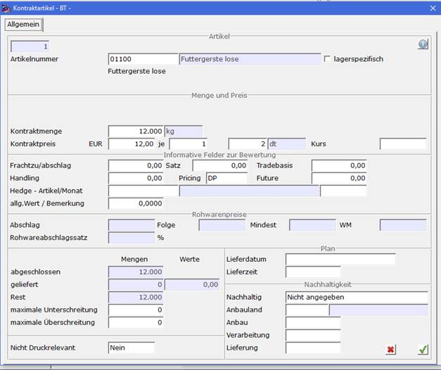
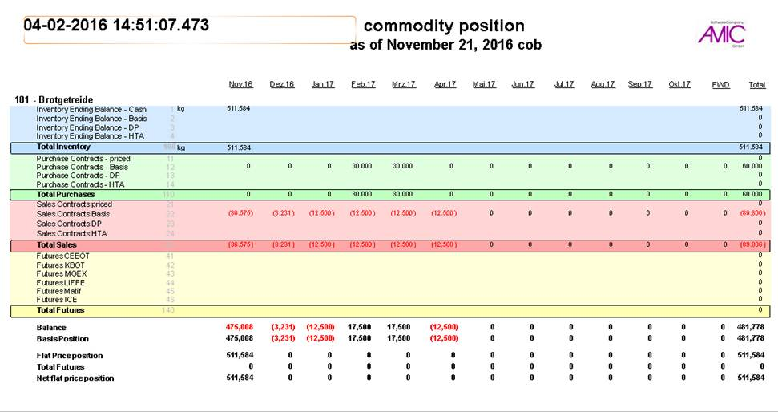

# Best Practice

<!-- source: https://amic.de/hilfe/bestpractice.htm -->

Hauptmenü > Kontraktverwaltung > Kontraktengagement

Die Anwendung zeigt in der ersten Ansicht die Übersicht der zuletzt gewählten und berechneten Position.

Vorbereitende Maßnahmen zu korrekten Darstellung sind [hier](./vorbereitende_massnahmen/index.md) beschrieben.

Die Darstellung wird per Standard auf Basis der Warengruppen jede Nacht aggregiert und zur Verfügung gestellt. Da die Datenzusammenstellung um 00:01 durchgeführt wird, bezieht sich der Stichtag immer auf die berechnete Position vom Vortag.

Als Darstellung können folgende System genutzt werden.

\- Auswahlliste

\- Reportsystem

In der Auswahlliste werden die Mengen, wie auch die Bewertungen dieser Mengen parallel angezeigt, im Report muss die Darstellung ausgewählt werden, eine gemeinsame Darstellung der Mengen und Werte wird nicht unterstützt.

In der Auswahlliste kann zusätzlich noch entschieden werden, ob alle nicht im Einsatz befindlichen Kontrakttypen ausgeblendet werden sollen und ob die Darstellung mit den Totalzeilen oder ohne (bei Nutzung eines Excel Interfaces sinnvoll) angezeigt werden sollen.

Das Auswahlkriterium Warengruppe erlaubt es hier auch eine Eingrenzung auf die Warengruppen, im Report wird pro Warengruppe eine einzelne Seite genutzt.

Der Aufbau wird durch ein fest vorgegebenes Korsett bestimmt, hierbei legt das Systemformat KTRPOSITION fest, welche Zeilen berechnet werden sollen. Bisher werden unterstützt:

\- Inventory, alle im Bestand liegende Ware dieser Warengruppe. Hierbei wird in dieser Version noch keine Bewertung vorgenommen:

o Inventory Cash (Merkmal A01):  
alle im Lager zu dieser Warengruppe vorhandenen Bestände minus der Bestände der unten aufgeführten Inventory Bereiche.

o Inventory Basis (Merkmal A02):  
alle im Lager eingelagerten Waren dieser Warengruppe (gekennzeichnet als Rohware (Unterklasse=9999)) unter Berücksichtigung des Pricing Kennzeichens im Kontrakt (alle Kontraktlieferungen deren Pricing-Kennzeichen=1 ist).

o Inventory DP (Merkmal A03):  
alle im Lager eingelagerten Waren dieser Warengruppe (gekennzeichnet als Rohware (Unterklasse=9999)) unter Berücksichtigung des Pricing Kennzeichens im Kontrakt (Pricing=2).

o Inventory HTA (Merkmal A04):  
alle im Lager eingelagerten Waren dieser Warengruppe (gekennzeichnet als Rohware (Unterklasse=9999)) unter Berücksichtigung des Pricing Kennzeichens im Kontrakt (Pricing=3).

o Inventory total (Merkmal A90):  
Summe über die oben genannten Inventory Bereiche.

\- Purchase, alle offenen Einkaufskontrakte (Ware wie auch Rohware), ratierlich nach Monaten verteilt und entsprechend der angelieferten Waren abgeschrieben:

o Purchase Contracts Priced (Merkmal B01):  
alle offenen (Merkmal Erledigungsstatus=0) deren Pricing-Kennzeichen = 0 gesetzt ist.

o Purchase Contracts Basis (Merkmal B02):  
alle offenen (Merkmal Erledigungsstatus=0) deren Pricing-Kennzeichen = 1 gesetzt ist.

o Purchase Contracts DP (Merkmal B03):  
alle offenen (Merkmal Erledigungsstatus=0) deren Pricing-Kennzeichen = 2 gesetzt ist.

o Purchase Contracts HTA (Merkmal B04):  
alle offenen (Merkmal Erledigungsstatus=0) deren Pricing-Kennzeichen = 3 gesetzt ist.

\- Sales, alle offenen Verkaufskontrakte (Ware wie auch Rohware), ratierlich nach Monaten verteilt und entsprechend der gelieferten Waren abgeschrieben:

o Sales Contracts Priced (Merkmal C01):  
alle offenen (Merkmal Erledigungsstatus=0) deren Pricing-Kennzeichen = 0 gesetzt ist.

o Sales Contracts Basis (Merkmal C02):  
alle offenen (Merkmal Erledigungsstatus=0) deren Pricing-Kennzeichen = 1 gesetzt ist.

o Sales Contracts DP (Merkmal C03):  
alle offenen (Merkmal Erledigungsstatus=0) deren Pricing-Kennzeichen = 2 gesetzt ist.

o Sales Contracts HTA (Merkmal C04):  
alle offenen (Merkmal Erledigungsstatus=0) deren Pricing-Kennzeichen = 3 gesetzt ist.

\- Future, alle als Kontraktklasse 4/14 eingetragenen zeitraumgesetzten Kontrakte, zugeordnet auf Basis eines Referenzartikels dieser Warengruppe (da die Warenterminbörsen nur die Warengruppen handeln), ratierlich den Börsenhandelstagen nach Monaten zugeordnet, mit der [Kundenkennzeichnung](../../kunden_und_lieferanten/kunden_und_lieferantenstamm/hauptmaske/index.md) („externe Nummer“=CBOT, NOBOT, MGEX, LIFFE, ICE; „externe Nummer“ ungleich eben genannte=MATIF):

o Futures CBOT (Chicago Board of Trade, Merkmal D01):  
alle offenen (Merkmal Erledigungsstatus=0) deren Kontraktklasse =4 oder 14 gesetzt ist und deren „externe Nummer“ des Kunden = CBOT enthält.

o Futures NOBOT (New Orleans Board of Trade, Merkmal D02):  
alle offenen (Merkmal Erledigungsstatus=0) deren Kontraktklasse =4 oder 14 gesetzt ist und deren „externe Nummer“ des Kunden = NOBOT enthält.

o Futures MGEX (Minnealopis Grain Exchange, Merkmal D03):  
alle offenen (Merkmal Erledigungsstatus=0) deren Kontraktklasse =4 oder 14 gesetzt ist und deren „externe Nummer“ des Kunden = MGEX enthält.

o Futures LIFFE (London International Financial Futures and Options Exchange, Merkmal D04):  
alle offenen (Merkmal Erledigungsstatus=0) deren Kontraktklasse =4 oder 14 gesetzt ist und deren „externe Nummer“ des Kunden = LIFFE enthält.

o Futures MATIF (Marché à Terme International de France Paris, Merkmal D05):  
alle offenen (Merkmal Erledigungsstatus=0) deren Kontraktklasse =4 oder 14 gesetzt ist und deren „externe Nummer“ des Kunden nicht CBOT, NOBOT, MGEX, LIFFE, ICE enthält.

o Futures ICE (InternationalExchange Atlanta, Merkmal D06):  
alle offenen (Merkmal Erledigungsstatus=0) deren Kontraktklasse =4 oder 14 gesetzt ist und deren „externe Nummer“ des Kunden = ICE enthält.

Die Wertgewichtung der Kontraktpositionen wird entweder nach dem zugeordneten Kontraktpreis vorgenommen oder aber bei Pricing – Kontrakten über den in der Marktpreis-Anwendung zum Stichtag erfassten artikelbezogenen Marktpreisen. Das Einspielen der Marktpreise erfolgt über den allgemeinen Programmpunkt EXCELI (Excelimport) mit einer vorbereiteten und ausgelieferten Exceldatei.

Die Ermittlung der Mengenspalten erfolgt über eine monatlich ratierlich aufgeteilte Menge bei nicht auf Basis von Mengenzeiträumen zugeordneten Mengen. Im Mengenzeitraumfall wird eine Anpassung der Menge auf Monatsgrenzen vorgenommen, wenn diese nicht schon monatlich verteilt sind. Alle Menge oberhalb des 12 Monatszeitraumes werden in die forward (FWD) Spalte gezählt.

Die Ermittlung des Wertes erfolgt über folgenden Mechanismus:

\- Bei vorhandenem Kontraktpreis wird dieser zur Bewertung der Menge gezogen, dabei wird der Frachtanteil und der Handlinganteil mit berücksichtigt. In die aktuelle Monatsspalte wird der ggf. auftretende Report eingerechnet. Eine Vorberechnung (oder direkte Eingabe) eines Kostenanteilskann aber auch im „Allgemeinen Wert“ angegeben werden, der aber auch durch eine feste Berechnungsformel direkt im Kontrakt ermittelt werden kann.

\- Bei nicht vorhandenem Kontraktpreis wird der „beste passende“ Marktpreis ermittelt (Stichtag gleich oder kleiner und Datum kleiner oder gleich. Bei der Marktpreisnutzung wird dann Fracht und Handling mit dazugerechnet, und bei Vorhandensein eines Uplift Faktors wird dieser als Prozentanteil auf den Marktpreis gerechnet. Marktpreis und Uplift werden in der beigefügten Exceltabelle gepflegt.

\- Ist in dem Kontraktartikel ein Hedgeartikel (Referenzartikel) gepflegt, so wird der Preis des Hedgeartiekls aus der Marktpreistabelle gelesen. Dabei wird der unter Basis eingegebene Abweichungswert zur Börse zugerechnet.  

Beispiel eine Auswertung:  

