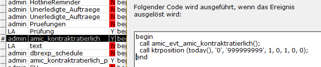

# Ratierliche Verteilung

<!-- source: https://amic.de/hilfe/ratierlicheverteilung.htm -->

Bei der ratierlichen Aufteilung von Kontrakten handelt es sich um eine statistische Aufteilung der Kontraktmenge auf eine festgelegte Anzahl von Monaten. Angezeigt werden die Werte in der [Kontraktauswahl](../kontraktstammdaten/index.md).

Die Verteilung erfolgt nicht für „Verkaufskontrakte Fremdware“ und „Einkaufskontrakte Fremdlager“.

<p class="just-emphasize">Aktivierung [](./index.md)</p>

Zum Aktivieren der ratierlichen Aufteilung muss der [Steuerparameter „701“](../../firmenstamm/steuerparameter/kontraktwesen/berechnung_fuer_ratierliche_kontraktmengen_aktiv_spa_701.md) auf „Ja“ gesetzt werden. Über folgenden Aufruf wird der Event zur Aufteilung der Mengen angelegt.

```text
call amic_evt_amic_kontraktratierlich(1)
```

Soll zusätzlich das tägliche Protokoll mitgeschrieben werden, kann der Event über folgenden Aufruf angelegt werden.

```text
call amic_evt_amic_kontraktratierlich_protokoll(1)
```

Wir eine zusätzliche Berechnung der Kontraktposition gewünscht, so ist diese im Event einzutragen:  
EVT:



Die Zeile  
call ktrposition ( today(), ‘0’, ‘999999999’, 1, 0, 1, 0, 0 )  
steht hierbei für die Warengruppenspezifische verarbeitung, wird  
call ktrposition ( today(), ‘0’, ‘999999999’, 1, 0, 1, 0, 1 )  
so wird die Kontraktposition bis auf den Artikel (ohne Lagerzuordnung) runtegebrochen.  
    

<p class="just-emphasize">Einstellungen [](./index.md)</p>

Einige Einstellungen müssen in den Steuerparametern hinterlegt werden.

- Vorausmonate ([Steuerparameter „698“](../../firmenstamm/steuerparameter/kontraktwesen/maximale_vorausmonate_fuer_ratierliche_kontraktmengen_spa_69.md))
- Mengeneinheit der Mengen ([Steuerparameter „815“](../../firmenstamm/steuerparameter/kontraktwesen/ratierliche_berechnung_in_lagermengeneinheit_des_ersten_arti.md))
- Enddatum der Berechnung ([Steuerparameter „798“](../../firmenstamm/steuerparameter/kontraktwesen/ratierliche_berechnung_mit_dem_kontraktlaufzeit_bis_datum_sp.md))

<p class="just-emphasize">Funktionen [](./index.md)</p>

In der [Kontraktauswahl](../kontraktstammdaten/index.md) gibt es zwei Funktionen mit denen das Protokoll und die Verteilung erneuert werden können.

| Funktion | Beschreibung |
| --- | --- |
| Ratierliches Protokoll erneuern | Für die markierten Kontrakte wird das gesamte Protokoll vom Anfang des Kontrakts bis heute erneuert. |
| Ratierliche Verteilung erneuern | Hiermit kann die ratierliche Verteilung der markierten Kontrakte erneuert werden. |
