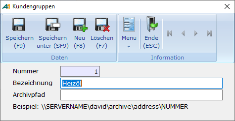

# Kundengruppen

<!-- source: https://amic.de/hilfe/_kundengruppen.htm -->

Hauptmenü > Stammdatenpflege \> Konstanten Kundenstamm > Kundengruppen

Direktsprung [KUG]

Hierbei handelt es sich um ein reines Selektionskriterium, das für Auswertungen etc. genutzt werden kann. Anzugeben sind die Gruppennummer und eine Bezeichnung. Die Gruppennummer wird direkt im Kundenstamm oder über den Anwahlpunkt "Kundengruppenzuordnung" dem Kundenstamm zugeordnet werden. Für eine bessere Übersicht über die Struktur von Forderungen und Verbindlichkeiten können den Kunden Gruppen zugeordnet werden. Dies kann z.B. **„Großkunden“, „Landwirte“, „Baustoffhändler“** etc. sein. Ausgewertet werden diese Informationen z.B. in speziellen Kundenlisten.

