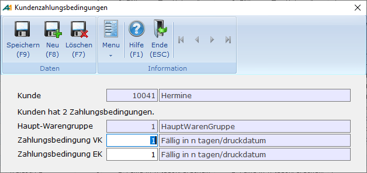

# Kundenzahlungsbedingungen

<!-- source: https://amic.de/hilfe/_kundenzahlungsbeding.htm -->

Hauptmenü > Stammdaten > Konstanten Kundenstamm > Kundenzahlungsbedingungen

Direktsprung [KUZB]

Der Zahlungsbedingungs-Stamm enthält alle notwendigen Informationen für Berech­nungen und Ausdruck der Zahlungsbedingungen. Normale Zahlungsbedingungenen kommen mit einem einzigen Satz aus, bei komplexen Bedingungen wird jeweils eine Folge-Zahlungsbedingung definiert. Die Art der Berechnung ergibt sich aus der Zahlungsbedingungsfolge.

**Kunde:**

Eingabe der entsprechenden Kundennummer

**Haupt-Warengruppe:**

Zahlungsbedingungen können pro Haupt-Waren­gruppen unterschiedlich sein. Bei der Umwandlung von Lieferscheinen in Rech­nungen wird dann immer eine Belegtrennung erfolgen. Für den Standardfall ist hier 0 = keine unterschiedliche Behandlung einzutragen.

**Zahlungsbedingung VK** und **Zahlungsbedingung EK:**

Eingabe der Zahlungsbedingungsnummer. Eine Auswahl aus den bestehenden Zahlungsbedingungen ist mit F3 möglich.
