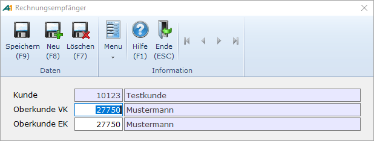

# Oberkunden

<!-- source: https://amic.de/hilfe/_oberkunden.htm -->

Hauptmenü > Stammdatenpflege > Konstanten Kundenstamm > Oberkunden

oder Direktsprung [KUOB]

In einigen Branchen ist es üblich, dass der Warenempfänger nicht gleichzeitig der Rechnungsempfänger ist. Es bestehen so genannte Verrechnungsketten. An die Verwaltung / EDV sind daher bestimmte Voraussetzungen geknüpft:

Der Lieferschein soll über den Unterkunden lauten, die Rechnung muss über den Oberkunden ausgestellt werden. Das heißt, die Verbuchung im Rechnungsausgangsbuch und in der Fibu erfolgt über den Oberkunden. Die Verbuchung im Waren­buch erfolgt über den Unterkunden.

Wenn gewünscht wird, Statistiken an Lieferanschriften zu binden, so ist es sinnvoll, im Kundenstamm mit Oberkundenbeziehungen zu arbeiten.

Folgende Eintragungen sind erforderlich:

Mit diesen Eingaben werden über den Kunden „Testkunde“ erfasste Lieferscheine bei der Umwandlung in Rechnungen mit der Anschrift „Mustermann“ versehen. Alle Statistiken verbleiben jedoch bei „Testkunde“.

Hinsichtlich der Finanzbuchhaltungsbuchung hat sich mit diesen Eintragungen auch noch nichts geändert. Um hier die Umlenkung auf „Mustermann“ zu erreichen, ist eine Eintragung unter „Zahlungspflichtiger“ erforderlich.
