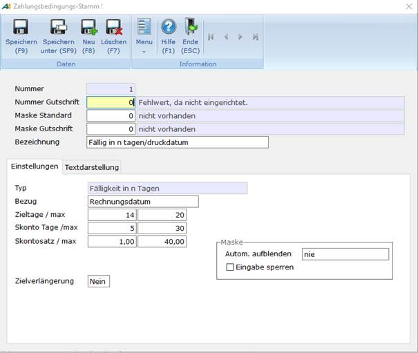

# Zahlungsbedingungen

<!-- source: https://amic.de/hilfe/_zahlungsbedingungen.htm -->

Hauptmenü > Stammdatenpflege \> Konstanten Kundenstamm > Zahlungsbedingung

Direktsprung [ZB]

In der Eingabemaske Zahlungsbedingungen bestehen folgende Eingabemöglichkeiten.

[Kopfdaten](./index.md#zabed_maske_kopfdaten)

[Einstellung](./index.md#zabed_maske_einstellung)

[Textdarstellung](./index.md#zabed_maske_textdarstellung)

 

Kopfdaten

| Feldname | Beschreibung |
| --- | --- |
| Nummer | Nummer der Zahlungsbedingung, die bei der Vorgangserfassung eingegeben wird bzw. im Kundenstamm abgelegt ist. |
| Nummer Gutschrift | Nummer der Zahlungsbedingung, die bei der Vorgangserfassung im Falle einer Gut­schrift gezogen werden soll. |
| Maske Standard | Nummer der Aufbereitungsmaske für die Zahlungsbedingung. |
| Maske Gutschrift | Nummer der Aufbereitungsmaske für den Fall der Gutschrift. |
| Bezeichnung | Beschreibung der Zahlungsbedingung. |

Einstellungen

**Die Änderung des Typs einer Zahlungsbedingung ist nicht unkritisch. Sofern diese Zahlungsbedingung bereits verwendet wurde, können sich daraus falsche Datumsangaben entwickeln.**

**Um dieses zu verhindern, kann mit Hilfe des** [Steuerparameters 951 - Zahlungsbedingung - Typ ändern](../../../firmenstamm/steuerparameter/allgemeine_programmsteuerung/zahlungsbedingung_typ_aendern_spa_951.md) **die Änderung des Typs von verwendeten Zahlungsbedingungen unterbunden werden bzw. es wird vor den Folgen gewarnt.**

| Feldname | Beschreibung |
| --- | --- |
| Typ | Art und Weise, wie die Zahlungsbedingung fälligkeitsseitig berechnet wird. (Format „[Typ](./formate_der_zahlungsbedingungen.md#zabed_format_typ)“) |
| Bezug | Berechnung des Bezugsdatums der Zahlungsbedingung. (Format „[Bezug](./formate_der_zahlungsbedingungen.md#zabed_format_bezug)“) |
| Valutabestimmung | (Format „[Valutabestimmung](./formate_der_zahlungsbedingungen.md#zabed_format_valutabestimmung)“) |
| Zieltage / max. | Zahlungsziel, in Abhängigkeit vom vorher gewählten Zahlungstyp. Bei manuellen Än­de­rungen während der Vorgangserfassung kann der Maximalwert nicht über­schritten werden. |
| Skontotage / max. | Zieltage bei Skontoabzug.  
Bei manuellen Änderungen während der Vorgangserfassung kann der Maximalwert nicht überschritten werden.  
Wird das Skontodatum aus dem Fälligkeitsdatum berechnet, so werden diese Tage vom Fälligkeitsdatum rückwärts gerechnet und die Max-Eingabe ist nicht möglich. |
| Skontosatz / max. | Skonto Satz bei Skontoabzug. Bei manuellen Änderungen während der Vorgangserfassung kann der Maximalbetrag nicht überschritten werden. |
| Festes Datum | Festes Stichtagsdatum an der die Zahlung fällig ist. |
| Zielverlängerung | Wird der Wert auf „Ja“ gesetzt, erscheint beim Erfassen der Zahlungsbedingung eines Vorgangs (Ware) ein Feld für Zielverlängerungstage. |
| Automatisch aufblenden | Bei der Vorgangserfassung kann die Zahlungsbedingungsmaske automatisch aufgeblendet werden. (Format „[Automatisch aufblenden](./formate_der_zahlungsbedingungen.md#zabed_format_auto_aufblenden)“) |
| Eingabe sperren | Die Zahlungsbedingung kann gegen Eingaben bei der Vorgangserfassung gesperrt werden. |

Textdarstellung

Hier wird die Einrichtung der optischen Aufbereitung für den Ausdruck der Zahlungsbedingung vorgenommen. Sie besteht aus Texten und Platzhaltern für Parameter und errechnete Werte. Der Ausgabetext kann für Rechnung und Gutschrift unterschiedlich gestaltet werden.

Der hier eingegebene Text ist nur wirksam, wenn für die Felder Maske Standard oder Maske Gutschrift 0 angegeben ist. Man kann andere Texte für weitere Masken unter Masken für [Zahlungsbedingungen [ZBM]](../masken_fuer_zahlungsbedingungen.md) hinterlegen.

**Aktuell existieren folgende** [Platzhalter](../platzhalter_fuer_zahlungsbedingungen.md)**.**

Siehe auch:

- [Formate der Zahlungsbedingungen](./formate_der_zahlungsbedingungen.md)
