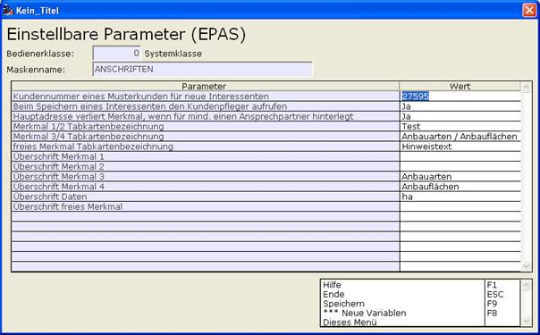

# Neuer Interessent SF8

<!-- source: https://amic.de/hilfe/_neuerinteressentsf8.htm -->

Die Funktion Neuer Interessent SHIFT+F8 öffnet die Anschriftenmaske für eine neue Kunden-Hauptanschrift eines Interessenten. Das Feld Vererben wird dabei mit Ja vorbelegt (siehe auch [Vererbung](./vererbung_f4.md))

Nach Eingabe der Daten wird beim Speichern der Anschrift im Hintergrund der dazugehörige Kundendatensatz (Typ 4/Interessenten) angelegt. Dieser ist entweder eine Kopie des zuletzt angelegten Kunden oder eines Musterkunden. Die Kundennummer des Musterkunden kann im EPA „Kundennummer eines Musterkunden für neue Interessenten“ hinterlegt werden. Erfolgt dort keine Eingabe, wird automatisch eine Kopie des zuletzt angelegten Kunden erstellt. Die Kundennummer für den neuen Kundendatensatz wird aus dem Nummernkreis für Interessenten im Mandantenstamm geholt. Das Feld Kunde auf der Anschriftenmaske wird beim Öffnen damit vorbelegt.

Ist kein Nummernkreis für Interessenten hinterlegt, muss eine neue Kundennummer im Feld Kunde eingegeben werden.

Soll nach dem Abspeichern der neu angelegte Kundendatensatz zum Bearbeiten geöffnet werden (z.B. für den Eintrag der Vertretergruppe), ist es ratsam, den EPA „Beim Speichern eines Interessenten den Kundenpfleger aufrufen“ auf ‚JA’ zu setzen, um dann direkt den entsprechenden Kundenstamm zu öffnen (Vorbelegung ist ‚JA’).

