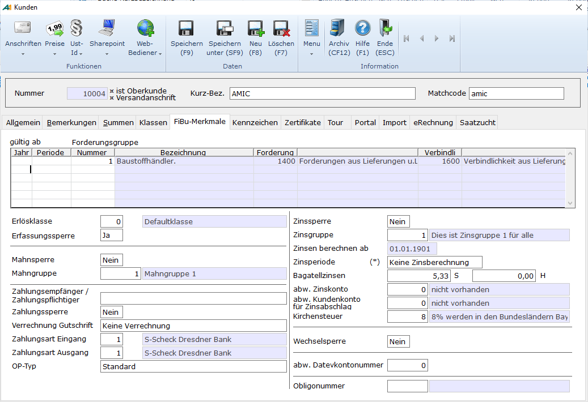

# FIBU – Merkmale

<!-- source: https://amic.de/hilfe/_fibumerkmale.htm -->

Hier werden die erforderlichen Parameter zur Behandlung des Kunden in der Finanzbuchhaltung gepflegt.

Verbuchungsmerkmale

| | Beschreibung |
| --- | --- |
| Forderungsgruppe  
 | Die [Forderungsgruppe](../../finanzbuchhaltung/stammdaten_der_fibu/forderungsgruppen.md), so wie sie in den Stammdaten hinterlegt wurde. In der ersten Zeile steht die Forderungsgruppe, wie sie allgemein für dieses Konto gültig ist. Sobald für dieses Konto Belege in endgültig abgeschlossen Perioden existieren ist diese Forderungsgruppe nicht mehr änderbar. Man muss dann in der Folgezeile eine neue Forderungsgruppe angeben. Dabei werden Jahr und Periode abgefragt, die angeben ab wann die neue Forderungsgruppe gültig ist.  
   
Der Bestimmung der Forderungsgruppe eines Personenkontos hat mit der Funktion „getForGrupNummer“ zu geschehen. Diese Funktion hat als ersten Parameter die Kontonummer. Gibt man keinen weiteren Parameter an, wird die zum Tagesdatum gültige Forderungsgruppe geliefert. Der zweite und dritte Parameter ist optional. Es sind die Jahrnummer und Periode. Folgender Aufruf liefert die Forderungsgruppe, die in der Periode 1/2015 gültig ist:  
   
   
Beim Ändern der Forderungsgruppe ist immer zu beachten, dass die diesem Personenkonto zugeordneten Werte vor dem Zeitpunkt auf den „alten“ Forderungs-/Verbindlichkeitskonten bleiben. Es erfolgt keine automatische Umbuchung. Erst beim Jahreswechsel der Sachkonten werden die Umbuchungen auf den Forderungs- und Verbindlichkeitskonten durchgeführt. Dazu muss die letzte Normalperiode offen sein. Diese Mechanik kann mit dem Steuerungsparameter 968 („Forderungskonten umbuchen“) deaktiviert werden.  
 |
| Erlösklasse  
 | Es besteht die Möglichkeit, die Erlöse einer bestimmten Klasse von Kunden auf speziellen Erlöskonten zu buchen (z.B. Erlöse Inland auf 8100, Erlöse Ausland auf 8200). Hier ist die Erlösklasse einzutragen. In der Erlöskennziffer Kontozuordnung **[EKZZ]** wird dann die Erlösklasse den Erlöskennziffern und Konten zugeordnet.  
 |
| Erfassungssperre  
 | Man kann in der Belegerfassung der Finanzbuchhaltung nicht mehr auf diesen Kunden/Lieferanten zugreifen. In der Konteninformation, dem Fibuübertrag, der OP-Verwaltung und in sonstigen Anwendungen kann jedoch weiterhin auf den Kunden zugegriffen werden. Eine Weiterverarbeitung – z.B. Auszifferung oder Jahreswechsel – ist nach wie vor möglich.  
 |

Merkmale des Mahnwesens

| | Beschreibung |
| --- | --- |
| Mahnsperre  
 | Mit **Ja** ist der Kunde für Mahnungen gesperrt. Er wird dann nicht zu den Mahnvorschlägen herangezogen, Mahnvorschläge, in denen er evtl. bereits vorhanden war, werden nicht mehr freigegeben und bereits freigegebene Mahnungen können dann nicht mehr gedruckt werden.  
 |
| Mahngruppe  
 | Die Steuerung des automatischen Mahnwesens **(Mahnabstand, Mahntexte, etc.)** kann sich für unterschiedliche Kundengruppen unterscheiden. Man trägt hier die [Mahngruppe](../../finanzbuchhaltung/mahnwesen/mahngruppen.md) ein, die in den Stammdaten der Finanzbuchhaltung gepflegt wird.  
 |

Merkmale des Zahlungsverkehrs

| | Beschreibung |
| --- | --- |
| **Zahlungsempfänger/  
Zahlungspflichtiger**  
 | Beim automatischen Zahlungsverkehr wird der Name des Zahlungspflichtigen bzw. des Zahlungsempfängers benötig. Hierbei gilt folgende Regel.  
    
    
1) Ist in der Kundenbank ein Empfänger eingetragen, so wird dieser verwendet und sofort in den Zahlungsvorschlägen vermerkt.  
2) Ist der Empfänger in den Kundenbanken leer, dann wird dieses Feld verwendet. Die Bestimmung erfolgt erst beim DTA.  
3) Ist dieses Feld Leer, dann wird die Kundenbezeichnung verwendet. |
| Zahlungssperre  
 | Mit **Ja** ist der Kunde für Zahlungen gesperrt.  
 |
| Verrechnung Gutschriften  
 | Für die Erstellung von Zahlvorschlägen kann mit diesem Kennzeichen bestimmt werden, ob debitorische und kreditorische Vorgänge miteinander verrechnet werden sollen:  
• Keine Verrechnung: Es erfolgt auch dann eine Zahlung, wenn der Kunde einen negativen Saldo hat  
• Alle Belegarten: Es wird nur der Saldo zur Zahlung gestellt  
• Trennung Ein- und Verkauf: Es wird der Saldo aus den Einkäufen zur Zahlung gestellt  
 |
| Zahlungsart Eingang (Debitor)  
 | Die Standardzahlungsart, wenn der Kunde bezahlt:  
• Scheck  
• Datenträgeraustausch  
    
Die Zahlungsart kann bei der Vorgangserfassung für den konkreten Vorgang überschrieben werden.  
 |
| Zahlungsart Ausgang (Kreditor)  
 | Die Standardzahlungsart, wenn an den Kreditor bezahlt wird:  
• Scheck  
• Datenträgeraustausch  
    
Die Zahlungsart kann bei der Vorgangserfassung für den konkreten Vorgang überschrieben werden.  
 |
| OP-Typ | Der OP-Typ hat drei Ausprägungen  
• Standard hat keine Besonderheiten.  
• OP-Raffung bei Kokoreerstellung: Bei der Erstellung des Kokores werden alle offenen Posten, die in dem Kokore aufgelistet werden, zu einem Restposten zusammengefasst. Als Auszifferungsdatum wird das Kontoblattdatum und als Belegdatum das Datum, welches bei „Bis Belegdatum“ eingegeben wurde, verwendet.  
• Automatik bei DTA-Import gesperrt: Im Modul e-Clearing wird dieser Kunde nicht automatisch ausgeziffert.  
 |

Merkmale Zinsabwicklung

A.eins stellt ein Verfahren zur banküblichen [Verzinsung der Personenkonten](../../finanzbuchhaltung/zinswesen/stammdaten_zinswesen/zinsmerkmale_im_kundenstamm.md) zur Verfügung.

Weitere Merkmale

| | Beschreibung |
| --- | --- |
| Wechselsperre | Wird hier **Ja** eingetragen, so ist dieser Kunde für die [Wechselbuchhaltung](../../finanzbuchhaltung/wechselbuchhaltung/index.md) gesperrt.  
 |
| Abweichende Datevkontonummer | Die DATEV hat bestimmte Vorgaben, was die Vergabe von Kontonummern betrifft. Hat man seine Konten anders strukturiert, als es von der DATEV erwartet wird, so kann man hier eine Kontonummer hinterlegen, die den Vorgaben der DATEV entspricht. Diese wird dann anstelle der eigentlichen Kontonummer beim [Datevübertrag](../../finanzbuchhaltung/fibu_schnittstellen/exportverfahren_der_finanzbuchhaltung/export_diamant_finanzbuchhaltung.md) verwendet.  
 |
| Obligonummer | Kunden können in Gruppen zusammengefasst werden. Dabei wird hier der Haupt- (Obligo-) Kunde eingetragen. In der OP-Verwaltung und der Konteninformation werden dann bei Eingabe eines Kontos, immer alle Konten zu Auswahl angeboten, die die gleiche Obligokontonummer eingetragen haben.  
 |
