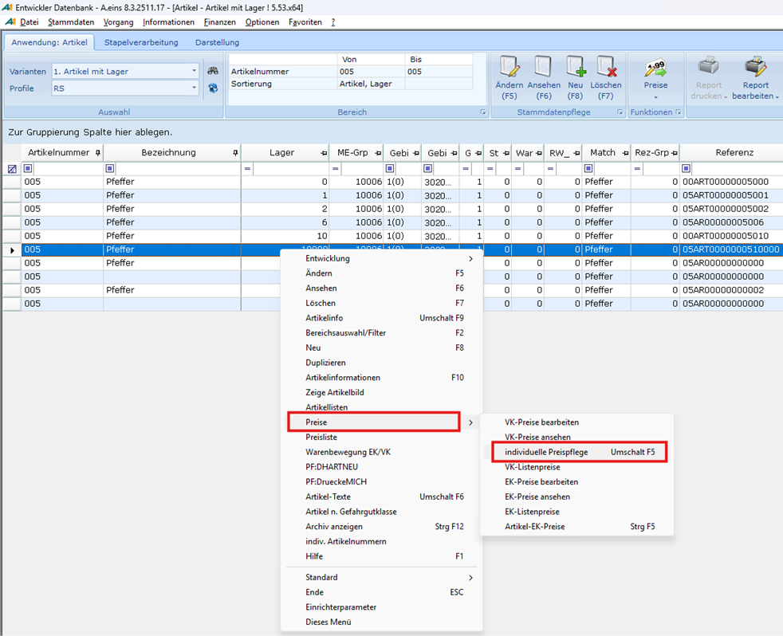
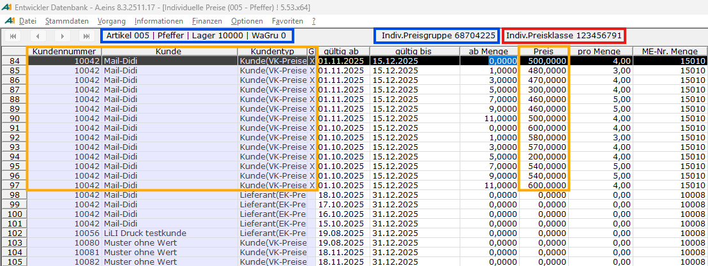
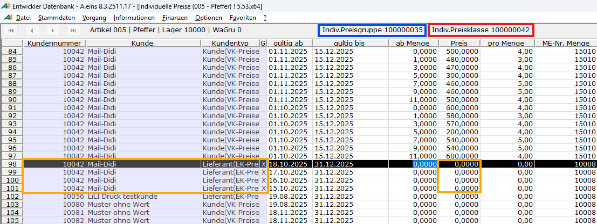

# Aufruf aus Artikel [AR]

<!-- source: https://amic.de/hilfe/aufrufausartikelar.htm -->

Nach Auswahl eines Artikels kann der Preisstapelpfleger über das Kontextmenü, Menüpunkt „Preise à individuelle Preispflege“, oder mit der Tastenkombination Umschalt F5 gestartet werden:

Wie bereits erwähnt, erfolgt die Datenbereitstellung über die Ladeprozedur **HoleIndividuellePreiseArtikel**. Die Ergebnismenge wird entsprechend in einem Gitter dargestellt:

Gezeigt werden die Daten des zuvor ausgewählten Artikels „005“ mit den Attributen Lager und Warengruppe wie oben dargestellt. Dargestellt werden ferner alle Kunden, ausgedrückt über ihre individuelle Preisklasse, zu denen individuelle Preise vorliegen. Hier im Beispiel wurde die individuelle Preisklasse „123456791“ zugewiesen. Da der Kunde 10042 als Kontokorrentkunde angelegt wurde, besitz er neben Verkaufs- auch Einkaufspreise. Die entsprechenden Preisgruppen/Preisklassen werden nach Verschieben des Cursors im Preisstapelpfleger aktualisiert:

Da nun Einkaufspreise gezeigt werden, ändern sich auch die zugrundeliegende Preisgruppe für den Artikel auf „100000035“ und die individuelle Preisklasse auf „100000042“ für die Einkaufsseite. Zusammenhängende Einträge sollen durch eine Markierung „X“ in der Spalte „Gruppierung“ gezeigt werden. Am Kreuzungspunkt dieser Dimensionen stehen die eigentlichen individuellen Preisdaten, sortiert nach „gültig ab“, „gültig bis“ und der „ab Menge“. Beim Aufrufen der Anwendung Individuelle Preise über die Auswahlliste Artikel [AR] ist aktuell ein [Standardprofil](../preis_profile.md) vorgesehen, welches nicht verändert werden kann, für die gängigen Anwendungsfälle aber völlig ausreichend ist. Dieses Standardprofil unterstützt keine diskreten Preispunkte, sondern zeigt lediglich eine Ab-Menge und eine Preisinformation für den Gültigkeitszeitraum „gültig ab“ und „gültig bis“. ACHTUNG: von der Ladeprozedur **HoleIndividuellePreiseArtikel** werden grundsätzlich die **heute** gültigen Einträge bereitgestellt. Ihr gültig-ab Datum ist **kleiner oder gleich** dem heutigen Tagesdatum und ihr gültig-bis Datum ist **größer oder gleich** dem heutigen Tagesdatum.

Siehe auch:

- [Umfang der bereitgestellten Daten](./umfang_der_bereitgestellten_daten.md)
- [Hinzufügen eines Kunden](./hinzufuegen_eines_kunden.md)
- [Weitere Funktionen des Stapelpflegers aus Artikelsicht](./weitere_funktionen_des_stapelpflegers_aus_artikelsicht.md)
