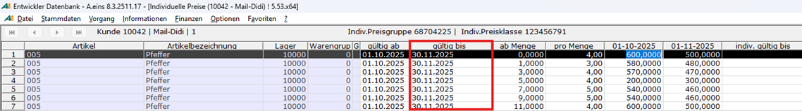
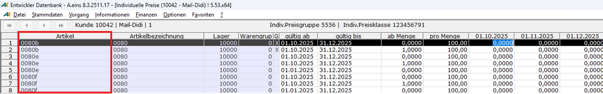
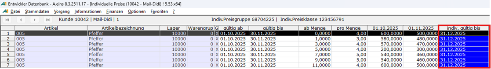
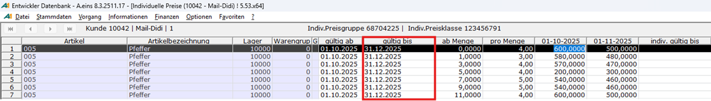
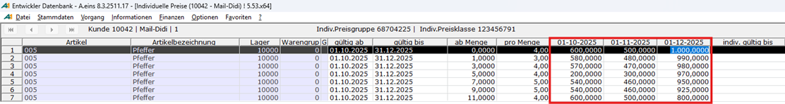

# Bedeutung des indiv. Gültig-bis-Feldes

<!-- source: https://amic.de/hilfe/bedeutungdesindivgltigbisfelde.htm -->

Ausgangssituation: Anwender arbeitet mit zwei Preispunkten 01.10.2025 und 01.11.2025. Für das gültig-bis Datum wurde der 30.11.2025 gewählt: der Preisstapelpfleger funktioniert noch wie gewünscht: Preispunkte können gepflegt werden. Von der Datenstruktur her wird das Datum 30.11.2025 an die Preisdatensätze geschrieben – **das gültig-bis Feld kann nicht leer sein**!

Nun wird über das Profil (Funktionstaste F6) ein weiterer Preispunkt aktiviert: 01.12.2025. ACHTUNG: der eben gezeigte Artikel 005 FEHLT nun in der Ergebnismenge, es gibt keine Preisbänder die an ALLEN Preispunkten gültig sind à Einträge mit gültig-bis 30.11.2025 fehlen, da sie zum 01.12.2025 nicht mehr gültig sind, wir diesen Preispunkt aber zusätzlich aktiviert haben!

Die Lösung ist nun, über das Feld „indiv. Gültig-bis“ die Gültigkeit des Preisbandes zu erweitern, **BEVOR** ein Preispunkt aktiviert wird, welcher zeitlich **NACH** dem letzten Preispunkt liegt.

In der Zeile für ab-Menge „0“ den 31.12.2025 in der Spalte indiv. Gültig-bis eintragen und mit der Eingabetaste bestätigen: Die Eingabe wird vom System in alle relevanten Zeilen kopiert:

Dann den aktuellen Stapelpfleger mit Taste F9 speichern: das gültig-bis Datum wird so aktualisiert und gespeichert:

Wird nun das zusätzliche Preisband ab dem 01.12.2025 aktiviert, können Preise über den 30.11.2025 hinaus für alle drei Preisbänder erfasst und gespeichert werden:

Alternativ hierzu könnte man von Anfang an mit Gültigkeiten bis zum **Jahresultimo** arbeiten, so dass alle nachgelagerten Preispunkte immer in den Gültigkeitszeitraum fallen und bearbeitet werden können! Möchte man hingegen mit diskreten, überschneidungsfreien Preisbändern arbeiten, muss man sich stets oben beschriebener Problematik bewusst sein.
