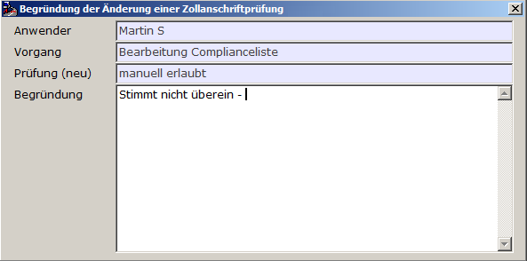

# Begründung

<!-- source: https://amic.de/hilfe/_begrndung.htm -->

Diese Begründung wird gespeichert. Sie ist auch einsehbar, wenn Sie eine Anschrift auswählen und die Funktion Ausnahmebegründung ansehen auswählen.

Diese Begründung dient der Dokumentation der Prüfung und damit letztlich dem Schutz Ihres Unternehmens vor Strafen. Dokumentieren Sie also hier genau, welche Prüfungen Sie vorgenommen und welche Entschlüsse Sie gemäß Ihren Arbeitsanweisungen getroffen haben.
