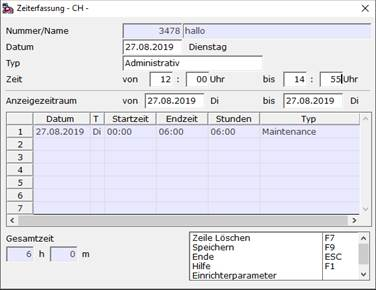
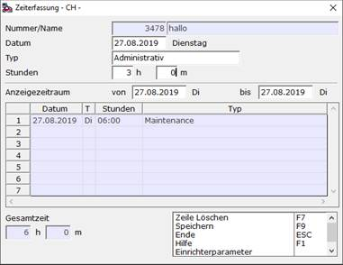

# Zeiterfassung

<!-- source: https://amic.de/hilfe/_zeiterfassung.htm -->

Hauptmenü > Stammdatenpflege > Kunden-/Lieferanten > Zeiterfassung

oder Direktsprung **[KU]/****[LF]** \> Zeiterfassung

**Vorbereitung:**

Zunächst muss entschieden werden ob bei der Zeiterfassung nur eine Zeitspanne angegeben werden soll oder man genaue Uhrzeiten für Anfangs- und Endzeit angeben möchte. Die Einstellung findet sich im Steuerparameter „Uhrzeitorientierte Zeiterfassung“ ([SPA_1049](../firmenstamm/steuerparameter/uhrzeitorientierte_zeiterfassung_spa_1049.md)).

*Uhrzeiterfassung*

 

*Stundenerfassung*

**Erfassung:**

In beiden Fällen lässt sich das Datum und der Typ pflegen. Der Typ kann im Anwenderformat „AF_Zeiterfas“ individuell eingerichtet werden. Nach Eingabe der Uhrzeiten bzw. der Zeitspanne kann die Zeiterfassung gespeichert werden.

Bei der Uhrzeiterfassung sorgt eine größere Start- als Endzeit dafür das die Zeit auf den angegebenen und den darauffolgenden Tag aufgeteilt wird.

**Anzeige:**

In der Datentabelle werden alle Datensätze zum ausgewählten Kunden/Lieferanten angezeigt, welche im ausgewählten Anzeigezeitraum liegen. Die eingeblendete Gesamtzeit bezieht sich ebenfalls auf diesen Zeitraum.

**Löschen:**

Mit einem Klick in das Datum-Feld der Datentabelle kann ein Datensatz ausgewählt werden. Mit der Funktion „Zeile Löschen“ wird der Datensatz gelöscht.

**EPA:**

Im [EPA](../firmenstamm/einrichterparameter/zeiterfassung_epa_zeiterfassung.md) „Bediener_Zeiterfassung“ kann eine Funktion hinterlegt werden, welche eine KundId sucht, falls diese nicht mitgegeben wird. So könnte beispielsweise bei einem Direktsprung auf die Maske eine KundId in Abhängigkeit des Users gezogen werden.
