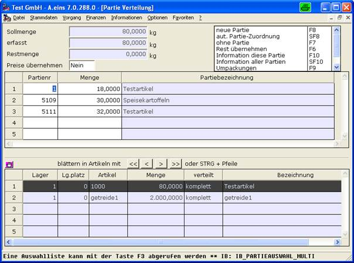

# Partiezuordnung im Positionsteil

<!-- source: https://amic.de/hilfe/_partiezuordnungimpos.htm -->

Im Positionsteil der Warenbelegerfassung lassen sich Partien artikelübergreifend zuordnen. Die hierbei benutzte Dialogmaske wird (mit einigen kleinen Unterschieden) auch in folgenden Bereichen eingesetzt:

• Erfassung von Produktionen (Komponentenpartien / Produktpartien)

• Bei Umbuchungen

• Rohware (zurzeit nur mit einer Partie pro Position!!)

• Lieferscheinschnellkorrektur

• Partien nachtragen (auch in abgeschlossenen Vorgängen)

In im unteren Bereich werden die aktuellen Warenpositionen angezeigt. Es kann sowohl mit der Maus als auch (praktischer) mit den Pfeiltasten in Verbindung mit der Strg-Taste von Artikel zu Artikel positioniert werden. Im oberen Bereich wird ähnlich wie bei der Warenerfassung die Partiezuordnung vorgenommen. Allerdings stehen hier mehr Funktionen in der Optionbox zur Verfügung:

• F8 = Partie neu erfassen

• SH8 = Falls eine automatische Partiezuordnung eingerichtet, wird diese manuell gestartet

• F7 = Löschen der gesamten Partiezuordnung

• F6 = Den noch verbleiben Rest übernehmen

• F10 = startet einen Übersichtdialog zu der aktuellen Partie

• SF10 = Übersichtdialog für alle in diesem Belege angesprochenen Partien

• F9 Umpacken: Ein Spezialmodul zur Umlagerung von Partien

Der Schalter ‚Partiepreise übernehmen’ regelt an dieser Stelle, ob durch geänderte Partiezuordnungen nochmalig die Preisbestimmung überprüft werden soll.

ACHTUNG: Durch Veränderung des Preisgefüges werden unter Umständen auch andere Daten des Beleges angepasst und es können schon geänderte, manuelle Einstellungen wieder auf den Standardwert gesetzt werden!!

**Wichtiger Hinweis zur Restbestandsanzeige in der F3 Box bei der Partienummer**:

*Es wird hier der Bestand angezeigt, der schon alle Partien vor dem Öffnen dieses Dialoges berücksichtigt (die Partien wurden also schon abgebucht / zugebucht). Während der Veränderung der Partiezuordnung kann die Restbestandsanzeige nicht aktualisiert werden. Es wird allerdings beim Abschluss des Dialoges eine genaue Bestandüberprüfung durchführt (sofern in FRZ eingestellt!).*

*Bei der Warenerfassung wird in der F3 Box stets der Partiestand **ohne** die aktuelle erfasste Warenposition ausgewiesen!*
